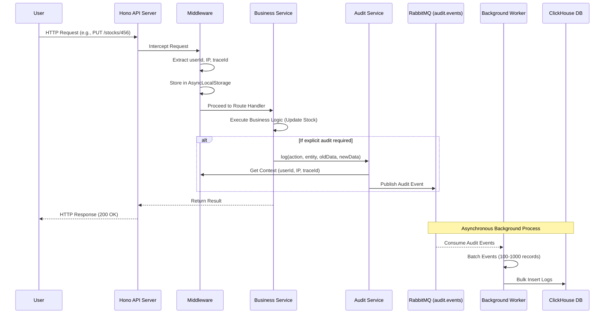

# Audit Trail Implementation Plan

**Status**: Approved  
**Date**: February 26, 2026  
**Author**: Platform Architecture Team  
**Version**: 1.0

## Executive Summary

This document outlines the implementation plan for a comprehensive audit trail system in the SMILE platform backend. The system will track all user actions, maintain detailed logs for compliance and security, and enable detection of unusual activities through a scalable, non-blocking architecture.

## 1. Architecture Decision

### Database Selection: ClickHouse

**Decision**: Use ClickHouse as the primary audit log storage.

**Rationale**:
- Already installed in the platform (`@clickhouse/client`)
- Columnar database optimized for append-only, time-series data
- Excellent compression ratios (10-100x)
- Fast aggregations for anomaly detection
- Superior performance for high-volume write operations

### Message Queue: RabbitMQ

**Decision**: Use RabbitMQ for asynchronous audit event processing.

**Rationale**:
- Already integrated (`amqplib`)
- Decouples audit logging from request lifecycle
- Prevents audit logging from impacting API response times
- Enables batch processing for efficiency
- Provides reliability and message persistence

### Context Propagation: AsyncLocalStorage

**Decision**: Use Node.js/Bun native `AsyncLocalStorage` for context propagation.

**Rationale**:
- Native feature, no additional dependencies
- Automatically propagates user context through async call chains
- Eliminates need to pass `userId`, `ipAddress`, `traceId` as function parameters
- Clean separation of concerns

## 2. System Architecture

### Data Flow



### Component Breakdown

1. **Hono Middleware (Coarse-grained)**
   - Captures all HTTP requests
   - Extracts: method, path, status code, user agent, IP
   - Stores context in AsyncLocalStorage
   - Logs generic access patterns

2. **Service-Level Logging (Fine-grained)**
   - Explicit audit calls for critical operations
   - Captures: entity type, entity ID, old values, new values
   - Business-specific context and metadata

3. **Audit Service**
   - Retrieves context from AsyncLocalStorage
   - Constructs audit event payload
   - Publishes to RabbitMQ queue

4. **Background Worker**
   - Consumes events from RabbitMQ
   - Batches events (configurable batch size)
   - Bulk inserts into ClickHouse
   - Handles retry logic and error recovery

## 3. Implementation Action Items

### Infrastructure Setup
- [ ] Create ClickHouse database and table schema
- [ ] Set up RabbitMQ queue (`audit.events`)
- [ ] Implement AsyncLocalStorage context manager
- [ ] Create base audit service infrastructure

### Core Audit Module
- [ ] Create `apps/main/src/modules/audit-trail/` module
- [ ] Implement audit schema with Zod validation
- [ ] Build audit controller with Hono routing
- [ ] Create audit repository for ClickHouse queries
- [ ] Implement audit publisher for RabbitMQ

### Middleware Integration
- [ ] Create global Hono middleware for request tracking
- [ ] Implement AsyncLocalStorage context injection
- [ ] Add middleware to main server configuration
- [ ] Test context propagation across async boundaries

### Background Worker
- [ ] Create audit worker consumer
- [ ] Implement batch processing logic
- [ ] Add error handling and retry mechanisms
- [ ] Configure worker in existing worker infrastructure

### Service Integration
- [ ] Identify critical operations to audit
- [ ] Add explicit audit calls to services
- [ ] Implement change tracking (old vs new values)
- [ ] Test audit coverage

### Query & Analytics
- [ ] Implement audit log query endpoints
- [ ] Add filtering capabilities (user, date, action, entity)
- [ ] Create anomaly detection queries
- [ ] Build audit dashboard API

### Testing & Documentation
- [ ] Unit tests for all components
- [ ] Integration tests for end-to-end flow
- [ ] Performance testing (load testing)
- [ ] Documentation and runbooks

## 4. Database Schema

### ClickHouse Table Structure

```sql
CREATE TABLE IF NOT EXISTS audit_logs (
    id UUID DEFAULT generateUUIDv4(),
    timestamp DateTime64(3) DEFAULT now64(3),
    trace_id String,
    user_id UInt32,
    user_name String,
    ip_address String,
    user_agent String,
    
    -- Request details
    request_method String,
    request_path String,
    request_query String,
    request_body String,
    
    -- Action details
    action String,
    entity String,
    entity_id UInt32,
    
    -- Changes
    old_data String,  -- JSON
    new_data String,  -- JSON
    changes String,   -- JSON diff
    
    -- Response
    status_code UInt16,
    response_time_ms UInt32,
    
    -- Metadata
    program_id Nullable(UInt32),
    activity_id Nullable(UInt32),
    error_message Nullable(String),
    
    INDEX idx_timestamp timestamp TYPE minmax GRANULARITY 1,
    INDEX idx_user_id user_id TYPE set(100) GRANULARITY 1,
    INDEX idx_action action TYPE set(100) GRANULARITY 1,
    INDEX idx_entity entity TYPE set(100) GRANULARITY 1
) ENGINE = MergeTree()
PARTITION BY toYYYYMM(timestamp)
ORDER BY (timestamp, user_id, action);
```

> **Note**: This schema is an example and should be adjusted based on your specific requirements. Consider adding TTL (Time To Live) for data retention policies, additional indexes for query optimization, and partitioning strategies based on your data volume and access patterns.

## 5. API Specification

### Module Structure

Following the existing platform pattern (`apps/main/src/modules`):

```
audit-trail/
├── audit.controller.ts
├── audit.module.ts
├── audit.repository.ts
├── audit.schema.ts
├── audit.service.ts
├── audit.publisher.ts
└── audit.worker.ts
```

### Schema Definition

```typescript
import { PaginationQueriesSchema } from "@smile/lib/types/paginate.js"
import { OptionalIdSchema } from "@smile/lib/types/param.js"
import z from "zod"

export const GetAuditLogsQueriesSchema = PaginationQueriesSchema.extend({
  user_id: OptionalIdSchema.nullish(),
  entity_id: OptionalIdSchema.nullish(),
  action: z.string().nullish(),
  entity: z.string().nullish(),
  start_date: z.string().datetime().nullish(),
  end_date: z.string().datetime().nullish()
})

export type GetAuditLogsQueries = z.infer<typeof GetAuditLogsQueriesSchema>
```

### API Endpoints

#### GET /audit-logs
Query audit logs with filtering and pagination.

**Query Parameters**:
- `page`: Page number (default: 1)
- `paginate`: Items per page (10, 25, 50, 100)
- `user_id`: Filter by user ID
- `entity_id`: Filter by entity ID
- `action`: Filter by action type
- `entity`: Filter by entity type
- `start_date`: Start date (ISO 8601)
- `end_date`: End date (ISO 8601)

**Response**:
```json
{
  "page": 1,
  "item_per_page": 50,
  "total_item": 1050,
  "total_page": 21,
  "list_pagination": [10, 25, 50, 100],
  "data": [
    {
      "id": "uuid-1234",
      "timestamp": "2024-03-24T14:30:22.123Z",
      "user_id": 123,
      "user_name": "John Doe",
      "action": "UPDATE_STOCK",
      "entity": "Stock",
      "entity_id": 456,
      "ip_address": "192.168.1.1",
      "user_agent": "Mozilla/5.0...",
      "request_method": "PUT",
      "request_path": "/stocks/456",
      "status_code": 200,
      "changes": {
        "quantity": { "old": 10, "new": 50 }
      }
    }
  ]
}
```

## 6. Integration Points

### Code Examples

#### Example 1: Stock Module Integration

```typescript
// apps/main/src/modules/stock/stock.module.ts
import { AuditService } from '../audit-trail/audit.service.js'

export class StockModule extends BaseModule {
  constructor(
    private readonly stockRepo: StockRepository,
    private readonly auditService: AuditService,
    // ... other dependencies
  ) {
    super()
  }

  async updateStock(c: Context, stockId: number, data: UpdateStockDTO) {
    const oldStock = await this.stockRepo.findById(stockId)
    
    const updatedStock = await this.stockRepo.update(stockId, data)
    
    // Explicit audit log
    await this.auditService.log({
      action: 'UPDATE_STOCK',
      entity: 'Stock',
      entity_id: stockId,
      old_data: oldStock,
      new_data: updatedStock
    })
    
    return updatedStock
  }
}
```

#### Example 2: User Module Integration

```typescript
// apps/main/src/modules/user/user.module.ts
import { AuditService } from '../audit-trail/audit.service.js'

export class UserModule extends BaseModule {
  constructor(
    private readonly userRepo: UserRepository,
    private readonly auditService: AuditService,
    // ... other dependencies
  ) {
    super()
  }

  async updateUser(c: Context, userId: number, data: UpdateUserDTO) {
    const oldUser = await this.userRepo.findById(userId)
    
    const updatedUser = await this.userRepo.update(userId, data)
    
    await this.auditService.log({
      action: 'UPDATE_USER',
      entity: 'User',
      entity_id: userId,
      old_data: {
        name: oldUser.name,
        email: oldUser.email,
        role_id: oldUser.role_id
      },
      new_data: {
        name: updatedUser.name,
        email: updatedUser.email,
        role_id: updatedUser.role_id
      }
    })
    
    return updatedUser
  }

  async deleteUser(c: Context, userId: number) {
    const user = await this.userRepo.findById(userId)
    
    await this.userRepo.delete(userId)
    
    await this.auditService.log({
      action: 'DELETE_USER',
      entity: 'User',
      entity_id: userId,
      old_data: user
    })
  }
}
```

## 7. Security & Compliance

### Data Protection

- **Sensitive Data**: Hash or encrypt PII in audit logs
- **Access Control**: Restrict audit log access to authorized users only
- **Immutability**: Audit logs cannot be modified or deleted
- **Retention**: Configurable retention period (default: 2 years)

### Compliance Requirements

- **GDPR**: Support for data subject access requests
- **SOC 2**: Complete audit trail for all system changes
- **ISO 27001**: Security event logging and monitoring

## 8. Risks & Mitigation

| Risk | Impact | Probability | Mitigation |
|------|--------|-------------|------------|
| Performance degradation | High | Low | Async processing, monitoring |
| Data loss | High | Low | RabbitMQ persistence, retry logic |
| Storage growth | Medium | High | Partitioning, TTL, compression |
| Integration complexity | Medium | Medium | Phased rollout, clear patterns |
| Privacy concerns | High | Low | Data masking, access controls |

## 9. References

- [ClickHouse Documentation](https://clickhouse.com/docs)
- [RabbitMQ Best Practices](https://www.rabbitmq.com/best-practices.html)
- [AsyncLocalStorage API](https://nodejs.org/api/async_context.html)
- Platform Architecture Overview: `PLATFORM_ARCHITECTURE_OVERVIEW.md`
- Infrastructure Monitoring: `INFRASTRUCTURE_MONITORING.md`

---

**Document Owner**: Platform Architecture Team  
**Last Updated**: February 26, 2026  
**Next Review**: March 26, 2026
