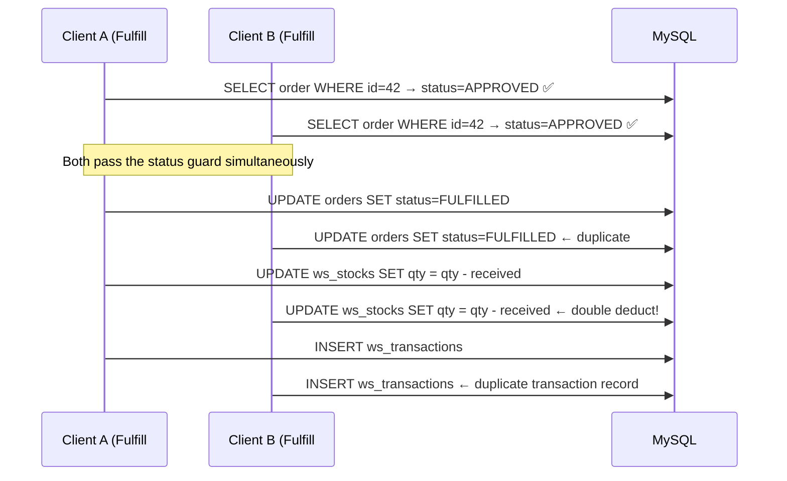
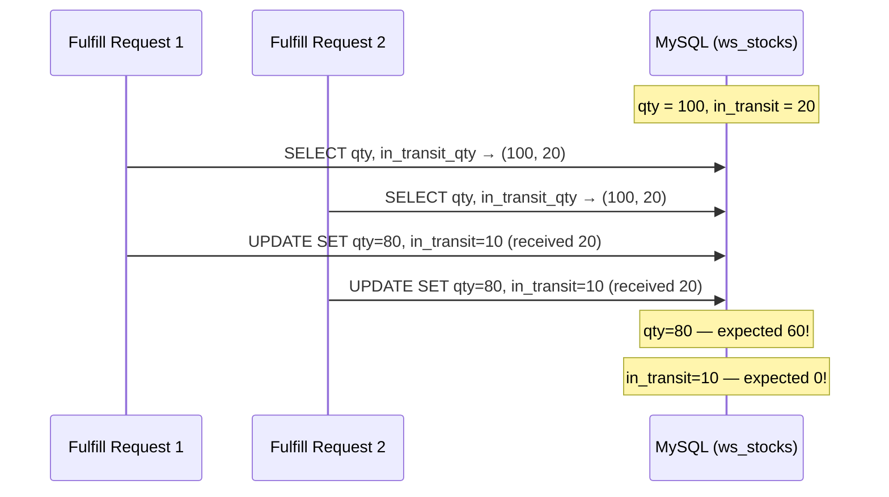
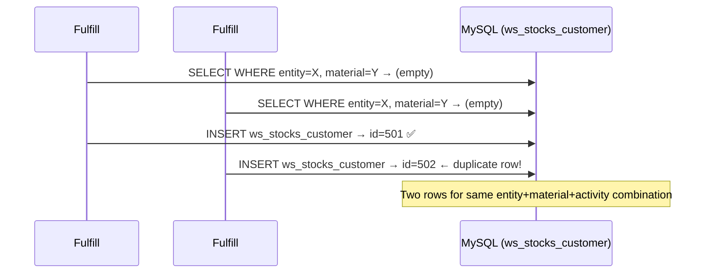
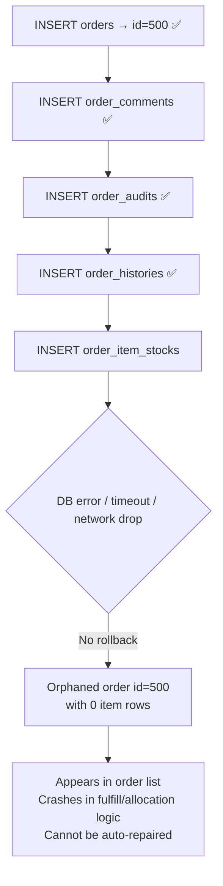
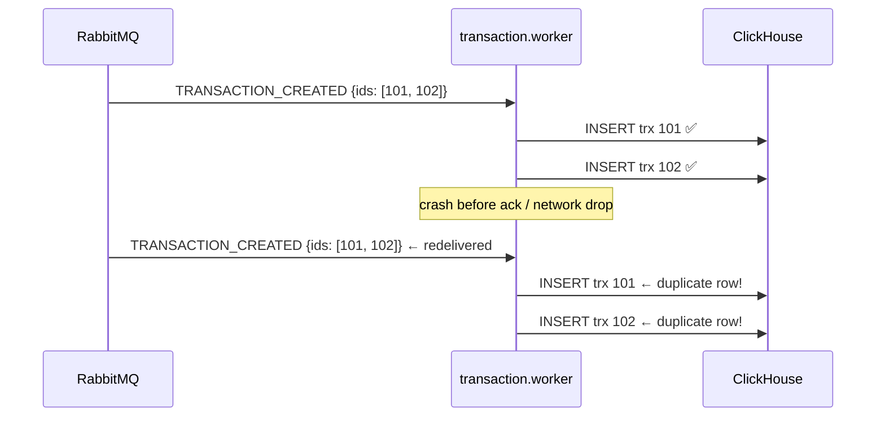

# Race Condition Analysis — `apps/main` Backend

**Date:** 2026-04-28  
**Scope:** `apps/main/src/modules/`  
**Severity legend:** 🔴 Critical · 🟠 High · 🟡 Medium

---

## Summary

| # | Module | Severity | Type |
|---|--------|----------|------|
| [RC-001](#rc-001-order-status-fulfilled--cancel--missing-db-transaction) | order-status-fulfilled / cancel | 🔴 Critical | Missing DB transaction |
| [RC-002](#rc-002-stock-read-modify-write-outside-transaction) | order-status-fulfilled | 🔴 Critical | Read-modify-write race |
| [RC-003](#rc-003-duplicate-customer-stock-row-creation) | order-status-fulfilled | 🟠 High | Check-then-act / TOCTOU |
| [RC-004](#rc-004-order-create--no-transaction-across-5-tables) | order | 🟠 High | Partial write / no transaction |
| [RC-005](#rc-005-rabbitmq-redelivery--no-idempotency-on-clickhouse-sync) | transaction.worker | 🟡 Medium | Non-idempotent consumer |

---

## RC-001: Order Status (Fulfilled / Cancel) — Missing DB Transaction

**File:** [`order-status-fulfilled.module.ts:96–108`](../../apps/main/src/modules/order-status/order-status-fulfilled/order-status-fulfilled.module.ts#L96)  
**File:** [`order-status-cancel.module.ts`](../../apps/main/src/modules/order-status/order-status-cancel/order-status-cancel.module.ts)  
**Severity:** 🔴 Critical

### What happens

Both `update()` methods collect DB writes into a `promises[]` array and execute with `Promise.all()`. The writes span multiple tables:

- `orders` (status update)
- `order_histories` (new record)
- `order_audits` (timestamps)
- `order_item_stocks` (quantities)
- `ws_stocks` (`qty`, `in_transit_qty`, `allocated_qty`)
- `ws_transactions` (new records)

None of these writes are wrapped in a `db.transaction()`, so they are independent SQL statements with no atomicity guarantee.

### Race Condition Diagram



### How to Reproduce

1. Create an order in `APPROVED` status.
2. Send two simultaneous `PATCH /orders/:id/fulfill` requests.
3. Observe: `ws_stocks.qty` decremented twice; two `ws_transactions` rows for the same fulfillment.

```bash
curl -X PATCH http://localhost:8080/orders/42/fulfill -H "Authorization: Bearer $TOKEN" -d '{...}' &
curl -X PATCH http://localhost:8080/orders/42/fulfill -H "Authorization: Bearer $TOKEN" -d '{...}' &
wait
```

### Fix

Wrap the entire `update()` body in a Kysely transaction. Pass the transaction object (`trx`) to all repository calls instead of the Hono context `c`:

```typescript
async update(c: CustomContext<DB>, payload: FulfillOrderDTO) {
  return await db.transaction().execute(async (trx) => {
    // Status check and all mutations are now atomic
    const order = await this.repository.getOrderById(trx, orderId)
    if (order.status !== ORDER_STATUS.APPROVED) throw new ConflictError(...)

    await this.repository.update(trx, orderData, { id: orderId })
    await this.repository.createOrderHistoryFulfilled(trx, orderHistoryData)
    await this.repository.updateOrderAuditFulfilledByOrderId(trx, orderId, orderAuditData)
    // ... all other writes using `trx`
  })
}
```

MySQL's default `REPEATABLE READ` isolation prevents a concurrent transaction from reading the pre-update status once the first transaction acquires its write lock.

---

## RC-002: Stock Read-Modify-Write Outside Transaction

**File:** [`order-status-fulfilled.module.ts:174–200`](../../apps/main/src/modules/order-status/order-status-fulfilled/order-status-fulfilled.module.ts#L174)  
**Severity:** 🔴 Critical

### What happens

Stock quantities are read into application memory, new values are computed in TypeScript, then written back — all without a row lock or transaction:

```typescript
// Line 174 — reads current qty and in_transit_qty
const stocks = await this.repository.getStockByIds(c, stocksIds)

// Lines 188–191 — snapshots values into JS memory
stock_qty: updatedOrderItemStock!.qty,
stock_in_transit_qty: updatedOrderItemStock!.in_transit_qty,

// Later — writes derived values back (stale snapshot!)
UPDATE ws_stocks SET qty = <snapshot + delta> WHERE id = ...
```

Between the `SELECT` and the `UPDATE`, another request can modify the same row, making the snapshot stale.

### Race Condition Diagram



### How to Reproduce

1. Warehouse stock: `qty = 100`, `in_transit_qty = 20`.
2. Two separate orders each fulfilling 20 units against the same stock row.
3. Trigger both fulfillments simultaneously.
4. Expected final `qty`: 60. Actual: 80 (one update silently lost).

### Fix

**Option A — `SELECT FOR UPDATE` inside the wrapping transaction (RC-001):**

```typescript
// In StockRepository
async getStockByIdsForUpdate(trx: Transaction<DB>, ids: number[]) {
  return trx
    .selectFrom('ws_stocks')
    .selectAll()
    .where('id', 'in', ids)
    .forUpdate()   // acquires exclusive row lock
    .execute()
}
```

**Option B — Atomic SQL increments (avoids the application-layer read entirely):**

```typescript
await trx
  .updateTable('ws_stocks')
  .set((eb) => ({
    qty: eb('qty', '-', receivedQty),
    in_transit_qty: eb('in_transit_qty', '-', receivedQty),
  }))
  .where('id', '=', stockId)
  .execute()
```

Option B is simpler and preferred when the delta is available at write time.

---

## RC-003: Duplicate Customer Stock Row Creation

**File:** [`order-status-fulfilled.module.ts:548–605`](../../apps/main/src/modules/order-status/order-status-fulfilled/order-status-fulfilled.module.ts#L548) (`setNewOrderItemStocks`)  
**Severity:** 🟠 High

### What happens

The code checks if a customer stock row exists in an in-memory array snapshot, then creates one if absent. This is a TOCTOU (Time-of-Check Time-of-Use) bug — the snapshot was taken before the concurrent request inserted its row.

```typescript
// Lines 549–564: check against in-memory snapshot (stale!)
const findStockCustomer = stockCustomers.find(
  (sc) => sc.entity_id === order.customer_id && ...
) || undefined

// Lines 586–605: insert if not found — no DB-level guard
if (!group.existingCustomer) {
  const create = await this.repository.createStockCustomerFulfilled(c, { ... })
}
```

### Race Condition Diagram



### How to Reproduce

1. Customer X has no existing stock for material Y.
2. An order fulfillment for customer X / material Y.
3. Trigger two fulfill requests simultaneously.
4. Observe: two rows in `ws_stocks_customer` for the same composite key.

### Fix

**Option A — Database unique constraint + upsert (recommended):**

```sql
-- Migration
ALTER TABLE ws_stocks_customer
  ADD UNIQUE KEY uq_entity_activity_material_batch
  (entity_id, activity_id, material_id, batch_id, manufacture_id);
```

```typescript
// Repository — use upsert instead of insert
await trx.insertInto('ws_stocks_customer')
  .values(data)
  .onDuplicateKeyUpdate({
    unreceived_qty: sql`unreceived_qty + ${data.unreceived_qty}`,
    updated_at: new Date(),
  })
  .execute()
```

**Option B — `SELECT FOR UPDATE` inside the wrapping transaction:**

```typescript
const existing = await trx
  .selectFrom('ws_stocks_customer')
  .selectAll()
  .where('entity_id', '=', customerId)
  .where('material_id', '=', materialId)
  .where('activity_id', '=', activityId)
  .forUpdate()   // locks the gap; concurrent insert will block
  .executeTakeFirst()

if (!existing) {
  await trx.insertInto('ws_stocks_customer').values(data).execute()
}
```

---

## RC-004: Order Create — No Transaction Across 5 Tables

**File:** [`order.module.ts:293–342`](../../apps/main/src/modules/order/order.module.ts#L293)  
**Severity:** 🟠 High

### What happens

`create()` performs sequential `await` calls across 5 separate repositories with no wrapping transaction. A DB error or timeout partway through leaves a partially-written order with no rollback:

```typescript
// Line 293
const createdOrder = await this.repo.create(c, orderData)
// Line 305
await this.orderCommentRepo.create(c, orderCommentData)
// Line 314
await this.orderAuditRepo.create(c, orderAuditData)
// Line 324
await this.orderHistoryRepo.create(c, orderHistoryData)
// Line 339
await this.orderItemStockRepo.create(c, orderItemData)  ← fails here
// orders row exists but has no item rows
```

### Failure Scenario



### Fix

```typescript
async create(c: CustomContext<DB>, payload: CreateOrderDTO) {
  return await db.transaction().execute(async (trx) => {
    const createdOrder = await this.repo.create(trx, orderData)
    const createdOrderId = Number(createdOrder.insertId)

    if (order_comment) {
      await this.orderCommentRepo.create(trx, {
        ...orderCommentData,
        order_id: createdOrderId,
      })
    }

    await this.orderAuditRepo.create(trx, { ...orderAuditData, order_id: createdOrderId })
    await this.orderHistoryRepo.create(trx, { ...orderHistoryData, order_id: createdOrderId })

    for (const item of orderItemsData) {
      await this.orderItemStockRepo.create(trx, item)
    }

    return createdOrderId
  })
  // On any failure, MySQL rolls back all 5 writes automatically
}
```

---

## RC-005: RabbitMQ Redelivery — No Idempotency Guard on ClickHouse Sync

**File:** [`transaction.worker.ts:31–56`](../../apps/main/src/modules/transaction/transaction.worker.ts#L31)  
**Severity:** 🟡 Medium

### What happens

The `TRANSACTION_CREATED` consumer calls `syncToClickhouse()` for each transaction with no check for prior processing. RabbitMQ guarantees **at-least-once delivery** — messages are redelivered on crash or ack failure.

```typescript
consumer.route(TOPIC.TRANSACTION_CREATED, async (c, msg) => {
  const { payload } = JSON.parse(msg ?? "{}") as { payload: PublishTrxDTO[] }
  // ...
  for (const trx of data) {
    await this.syncToClickhouse(c, trx)  // no idempotency check
  }
  // if crash happens here, message redelivers → duplicate ClickHouse rows
})
```

### Redelivery Scenario



### Fix

**Option A — Idempotency table in MySQL (track sync state before ack):**

```typescript
consumer.route(TOPIC.TRANSACTION_CREATED, async (c, msg) => {
  const { payload } = JSON.parse(msg ?? "{}") as { payload: PublishTrxDTO[] }
  const ids = payload.map((t) => t.id)

  const alreadySynced = await this.repo.getSyncedTransactionIds(c, ids)
  const toSync = payload.filter((t) => !alreadySynced.has(t.id))

  for (const trx of toSync) {
    await this.syncToClickhouse(c, trx)
    await this.repo.markTransactionSynced(c, trx.id)
  }
})
```

**Option B — ClickHouse `ReplacingMergeTree` + `FINAL` on reads:**

If the ClickHouse table already uses `ReplacingMergeTree(updated_at)`, duplicate rows are eventually merged. Force deduplication at query time:

```sql
SELECT * FROM transactions_clickhouse FINAL WHERE ...
```

**Option C — Unique constraint + `ON CONFLICT DO NOTHING` (if using ClickHouse `MergeTree` with unique key):**

```sql
INSERT INTO transactions_clickhouse ... ON CONFLICT (transaction_id) DO NOTHING
```

---

## Priority Remediation Order

```mermaid
gantt
    title Fix Priority (story points, not calendar days)
    dateFormat  X
    axisFormat sp%s

    section 🔴 Critical — Fix first
    RC-001 Wrap fulfilled+cancel in db.transaction() :crit, rc1, 0, 3
    RC-002 Add SELECT FOR UPDATE on stock reads      :crit, rc2, 0, 2

    section 🟠 High — Fix next sprint
    RC-004 Wrap order.create() in db.transaction()  :rc4, 3, 1
    RC-003 Unique constraint + ON DUPLICATE KEY      :rc3, 4, 2

    section 🟡 Medium — Backlog
    RC-005 Add idempotency to RabbitMQ consumer     :rc5, 6, 2
```



**Start with RC-001 + RC-002 together** — they share the same wrapping transaction scope; fixing one without the other is incomplete. RC-004 is a quick win (identical pattern, different module). RC-003 requires a schema migration coordinated with a deploy. RC-005 is lower urgency but causes silent analytics corruption over time.
