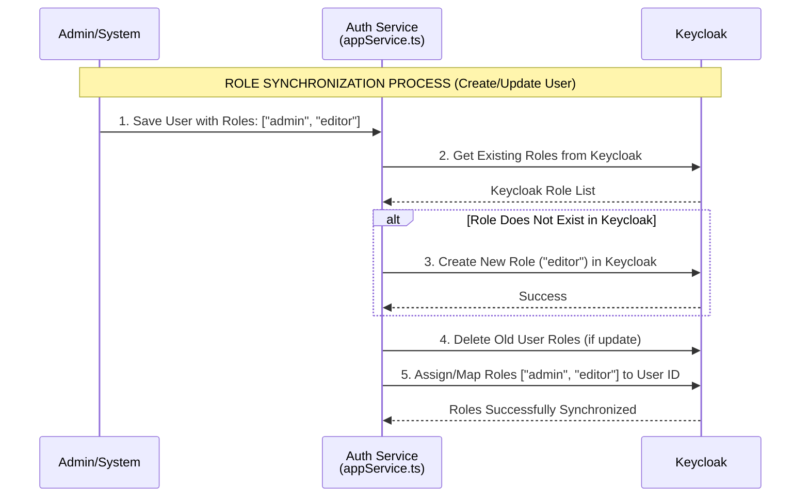
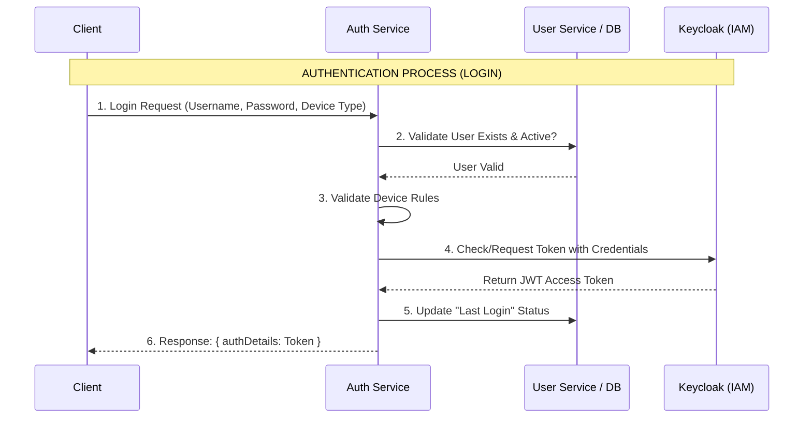
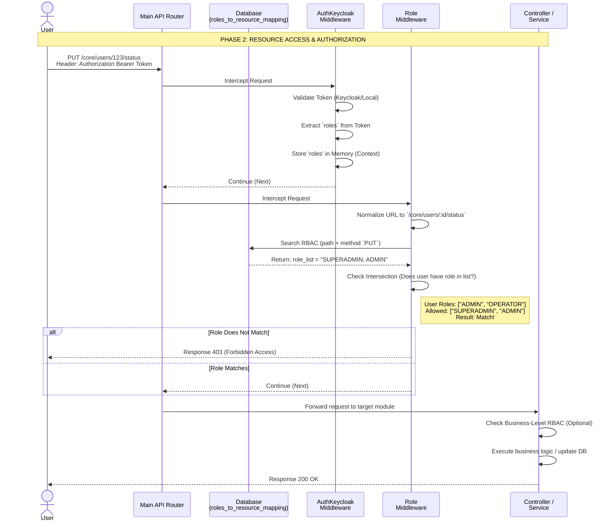

# Architecture Decision Record: Authentication and Authorization Management (RBAC)

## Context

This document explains the architecture, workflow, and implementation of the Authentication and Authorization system (Role-Based Access Control / RBAC) on the SMILE Backend Platform. The system uses a combination of Keycloak as the primary Identity and Access Management (IAM) and an internal database-based authorization mechanism.

The authorization system is distributed across several services, primarily in `auth-service` (for login and role synchronization) and `main` service (for API access validation).

## 1. Role Management Architecture (Keycloak Affiliation)

Role management in this system uses Keycloak as the primary source that is dynamically synchronized with the internal database. There are two main types of roles:

1.  **Realm Roles (Global):** Apply across the entire system (e.g., `superadmin`, `admin`, `operator`).
2.  **Client Roles (Application/Integration Specific):** Apply specifically to external clients or system integrations (e.g., `siha`, `sitb`, `din`).

### Role Synchronization Flow (Auto-Sync)

The `auth-service` acts as an automatic "bridge" to Keycloak (managed by `appService.ts`). When creating or updating a User:

1.  **Dynamic Check:** Auth Service retrieves the list of existing roles from Keycloak.
2.  **Auto-Create:** If the internal system wants to assign role "X" to a user, but role "X" **does not exist** in Keycloak, then `auth-service` will **automatically create that role in Keycloak**.
3.  **Assignment (Mapping):** Old roles on the user in Keycloak are deleted, then replaced with new role mappings synchronized with the internal database.

## 2. Authentication Flow (Login Process)

The authentication process occurs in `auth-service` when a user enters credentials.

1.  **Internal Database Check:** Validates whether the user exists and is active in the SMILE internal database (via `userServiceClient`).
2.  **Device Validation (Device Rule):** Validates based on role (e.g., *Operator* cannot login via Web, *Admin* cannot login via Mobile).
3.  **Keycloak Integration:** Checks user existence in Keycloak. If not found, the system calls *core service* to synchronize/create the user in Keycloak.
4.  **Token Issuance:** Verifies credentials with Keycloak and obtains a JWT Token.
5.  **Status Update:** Records the last login time.

## 3. Authorization Flow (RBAC)

Authorization ("who can do what") is controlled in a layered manner in the `main` service.

### Level 1: Token Middleware Validation (`auth.middleware.ts`)
There are two middleware check variants:
*   **`AuthMiddleware` (Internal/Fast Check):** Verifies JWT *signature* locally using `APP_KEY`, extracts the `x-program-id` header (workspace), and verifies workspace access from the token payload.
*   **`AuthKeycloakMiddleware` (Centralized Check):** Validates the token externally with Keycloak. Searches for the user based on Keycloak ID (`sub`), and extracts `realm_access.roles` (Global Roles) and `resource_access` (Client Roles) to store in Context.

### Level 2: API Endpoint Validation (`role-validation.middleware.ts`)
This middleware (`RoleMiddleware.handle`) is installed globally on all API *routes*.
1.  **URL Normalization:** Converts dynamic IDs to static parameters (e.g., `/users/123/status` becomes `/users/:id/status`).
2.  **Database Check:** Calls `RolesToResourceMappingRepository` to search for access rules in the `roles_to_resource_mapping` table based on URL and HTTP Method.
3.  **Validation:** Matches *User Role* from Context with the allowed role list (`role_list` column). If no match, returns `403 Forbidden`.

*(Note: There are also `allow()` and `allowWithDeviceType()` for hardcoded checks at the Route level).*

### Level 3: Module/Business Validation (Granular RBAC)
Additional checks at the service/module level. For example, in the Transaction Module (`transaction.middleware.ts`), the `#isMaterialHavePermission` function validates whether the user's *Role* and *Entity Type* have the right to process a specific *Material* (Item).

### Complete Flow: API Access

## 4. How to Add New RBAC Rules

The RBAC system is *Data-Driven*. To add new access rules for an endpoint:

1.  **Add Data to `roles_to_resource_mapping`:**
    *   `route_handler`: `/main/core/users/:id/status`
    *   `http_method`: `put`
    *   `role_list`: `SUPERADMIN, ADMIN` (Use `PUBLIC` if accessible to all roles).
    *   `status`: `1` (Active)
2.  **Create New Role (Optional):** If creating a new role (e.g., `AUDITOR`), add that role to users via the user management system. `Auth Service` will automatically synchronize it with Keycloak.
3.  **Hardcoded Guard (Optional):** Add the `allowWithDeviceType()` function to the router definition in code if you need validation for specific device and role combinations.
