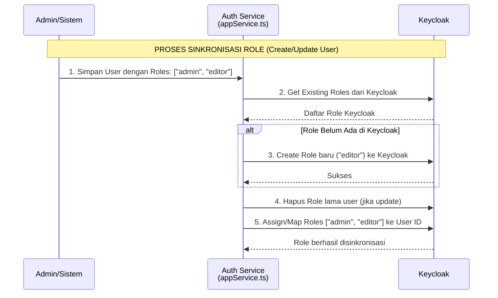
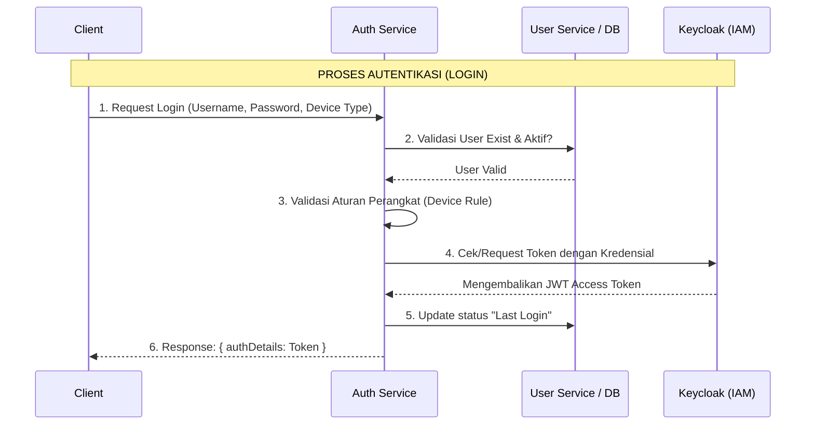
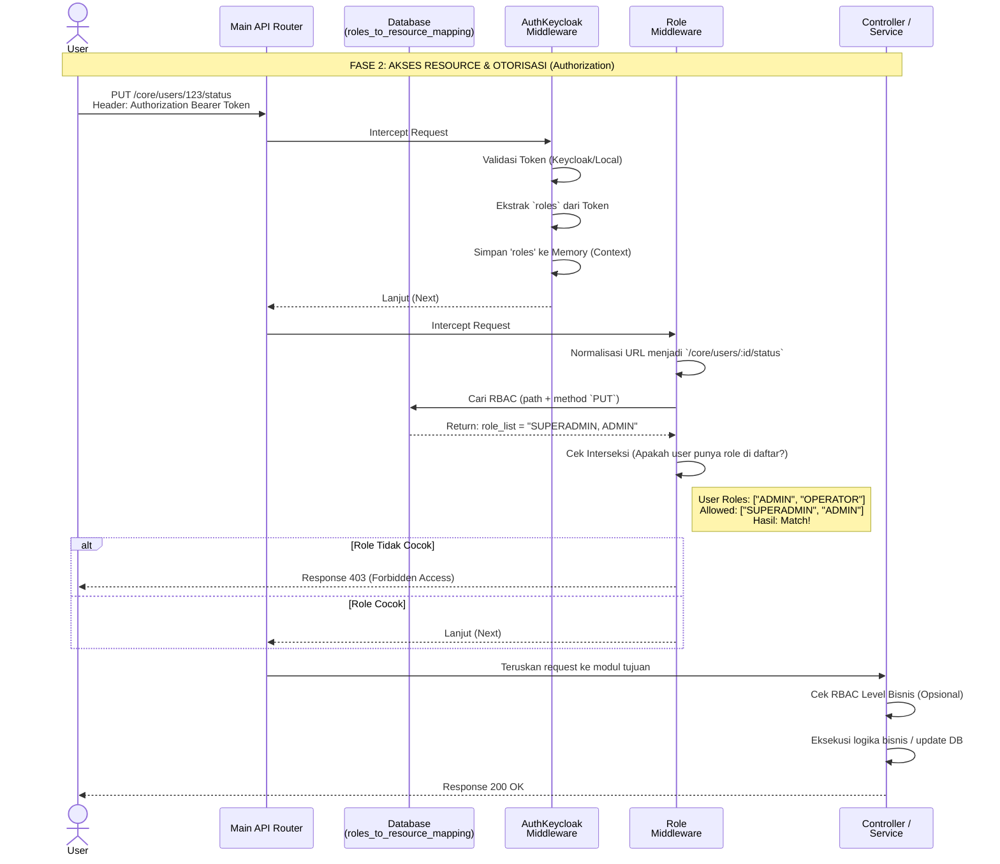

# Architecture Decision Record: Manajemen Autentikasi dan Otorisasi (RBAC)

## Konteks

Dokumen ini menjelaskan arsitektur, alur kerja, dan implementasi dari sistem Autentikasi dan Otorisasi (Role-Based Access Control / RBAC) pada Platform Backend SMILE. Sistem ini menggunakan kombinasi antara Keycloak sebagai Identity and Access Management (IAM) utama dan mekanisme otorisasi internal berbasis database.

Sistem otorisasi tersebar di beberapa layanan, terutama pada `auth-service` (untuk login dan sinkronisasi role) dan `main` service (untuk validasi akses API).

## 1. Arsitektur Manajemen Role (Afiliasi Keycloak)

Manajemen *role* pada sistem ini menggunakan Keycloak sebagai sumber utama yang disinkronkan secara dinamis dengan database internal. Terdapat dua jenis role utama:

1.  **Realm Roles (Global):** Berlaku di seluruh sistem (contoh: `superadmin`, `admin`, `operator`).
2.  **Client Roles (Spesifik Aplikasi/Integrasi):** Berlaku khusus untuk klien eksternal atau integrasi sistem tertentu (contoh: `siha`, `sitb`, `din`).

### Alur Sinkronisasi Role (Auto-Sync)

Sistem `auth-service` bertindak sebagai "jembatan" otomatis ke Keycloak (dikelola oleh `appService.ts`). Saat ada pembuatan atau pembaruan User:

1.  **Pengecekan Dinamis:** Auth Service menarik daftar role yang ada di Keycloak.
2.  **Auto-Create:** Jika sistem internal ingin memberikan role "X" kepada user, tetapi role "X" **belum ada** di Keycloak, maka `auth-service` akan **secara otomatis membuat role tersebut di Keycloak**.
3.  **Assignment (Pemetaan):** Role lama pada user di Keycloak dihapus, lalu diisi ulang dengan pemetaan role baru yang sinkron dengan database internal.

## 2. Alur Autentikasi (Proses Login)

Proses autentikasi terjadi pada `auth-service` saat user memasukkan kredensial.

1.  **Pengecekan Database Internal:** Memvalidasi apakah user tersebut ada dan statusnya aktif di database internal SMILE (via `userServiceClient`).
2.  **Validasi Perangkat (Device Rule):** Validasi berdasarkan peran (contoh: *Operator* dilarang login via Web, *Admin* dilarang login via Mobile).
3.  **Integrasi Keycloak:** Mengecek eksistensi user di Keycloak. Jika belum ada, sistem akan memanggil *core service* untuk menyinkronkan/membuat user di Keycloak.
4.  **Penerbitan Token:** Memverifikasi kredensial ke Keycloak dan mendapatkan JWT Token.
5.  **Pembaruan Status:** Mencatat waktu login terakhir (*last login*).

## 3. Alur Otorisasi (RBAC)

Otorisasi ("siapa boleh melakukan apa") dikendalikan secara berjenjang di `main` service.

### Level 1: Validasi Middleware Token (`auth.middleware.ts`)
Terdapat dua varian pengecekan middleware:
*   **`AuthMiddleware` (Pengecekan Internal/Cepat):** Memverifikasi *signature* JWT secara lokal menggunakan `APP_KEY`, mengekstrak header `x-program-id` (workspace), dan memverifikasi akses workspace dari payload token.
*   **`AuthKeycloakMiddleware` (Pengecekan Tersentralisasi):** Memvalidasi token secara eksternal ke Keycloak. Mencari user berdasarkan ID Keycloak (`sub`), dan mengekstrak `realm_access.roles` (Global Roles) serta `resource_access` (Client Roles) untuk disimpan ke dalam Context.

### Level 2: Validasi Endpoint API (`role-validation.middleware.ts`)
Middleware ini (`RoleMiddleware.handle`) dipasang secara global pada seluruh *route* API.
1.  **Normalisasi URL:** Mengubah ID dinamis menjadi parameter statis (contoh: `/users/123/status` menjadi `/users/:id/status`).
2.  **Pengecekan Database:** Memanggil `RolesToResourceMappingRepository` untuk mencari aturan akses pada tabel `roles_to_resource_mapping` berdasarkan URL dan HTTP Method.
3.  **Validasi:** Mencocokkan *Role User* dari Context dengan daftar role yang diizinkan (kolom `role_list`). Jika tidak cocok, kembalikan `403 Forbidden`.

*(Catatan: Terdapat juga `allow()` dan `allowWithDeviceType()` untuk pengecekan hardcode pada level Route).*

### Level 3: Validasi Modul/Bisnis (Granular RBAC)
Pengecekan tambahan di level layanan/modul. Contohnya pada Modul Transaksi (`transaction.middleware.ts`), fungsi `#isMaterialHavePermission` memvalidasi apakah *Role* dan *Entity Type* user berhak memproses *Material* (Barang) tertentu.

### Flow Lengkap: Akses API

## 4. Cara Menambahkan Aturan RBAC Baru

Sistem RBAC bersifat *Data-Driven*. Untuk menambahkan aturan akses baru pada suatu endpoint:

1.  **Tambahkan Data di `roles_to_resource_mapping`:**
    *   `route_handler`: `/main/core/users/:id/status`
    *   `http_method`: `put`
    *   `role_list`: `SUPERADMIN, ADMIN` (Gunakan `PUBLIC` jika bisa diakses semua role).
    *   `status`: `1` (Aktif)
2.  **Pembuatan Role Baru (Opsional):** Jika membuat role baru (misal: `AUDITOR`), tambahkan role tersebut ke user via sistem manajemen user. `Auth Service` akan menyinkronkannya dengan Keycloak secara otomatis.
3.  **Guard Hardcode (Opsional):** Tambahkan fungsi `allowWithDeviceType()` pada definisi router di kode jika membutuhkan validasi kombinasi perangkat dan role yang spesifik.
