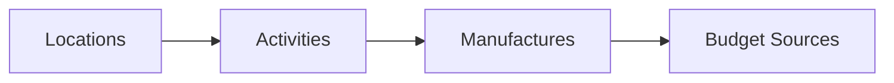
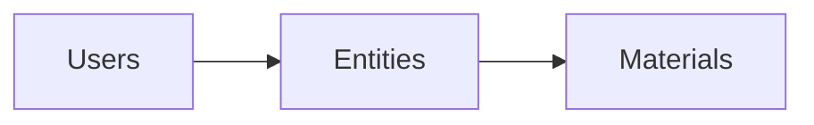
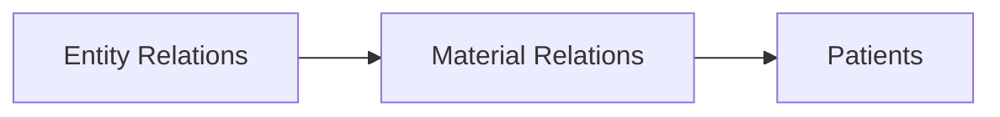
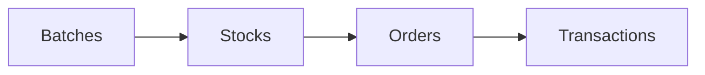
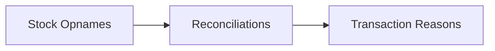

# SMILE 3.0 to 5.0 Data Migration Documentation

This directory contains comprehensive documentation for migrating data from SMILE 3.0 to SMILE 5.0 platform. The migration involves transforming legacy database structures into the new unified platform architecture.

## Overview

The SMILE platform migration is a complex process that involves:
- **17 migration scripts** organized in 5 phases
- **Global and workspace-specific** data transformations
- **Referential integrity** preservation
- **Batch processing** for performance optimization

## Quick Start

### Prerequisites
- SMILE 3.0 database access
- SMILE 5.0 platform database setup
- Redis instance for progress tracking
- Sufficient database permissions

### Execution Command
```bash
# Navigate to sync-service
cd apps/sync-service

# Run complete migration in order
npm run migrate:all

# Or run individual migrations
npm run migrate:location
npm run migrate:activity
# ... continue with other migrations
```

## Documentation Structure

### Core Documentation
- **[Migration Execution Order](./migration-execution-order.md)** - Complete execution strategy and dependencies
- **[Constants Mapping](./constants-mapping.md)** - Data mapping and transformation rules

### Global Migrations
Foundation data that applies across all workspaces:

| Script | Documentation | Purpose |
|--------|---------------|----------|
| `migrate-location.ts` | [Location Migration](./global/migrate-location.md) | Geographic hierarchy |
| `migrate-activity.ts` | [Activity Migration](./global/migrate-activity.md) | Program activities |
| `migrate-user-bulk.ts` | [User Migration](./global/migrate-user-bulk.md) | User accounts |
| `migrate-entity-bulk.ts` | [Entity Migration](./global/migrate-entity-bulk.md) | Business entities |
| `migrate-material.ts` | [Material Migration](./global/migrate-material.md) | Material catalog |
| `migrate-manufacture.ts` | [Manufacture Migration](./global/migrate-manufacture.md) | Manufacturer data |
| `migrate-budget-source.ts` | [Budget Source Migration](./global/migrate-budget-source.md) | Budget sources |

### Workspace Migrations
Program-specific data that varies by workspace:

| Script | Documentation | Purpose |
|--------|---------------|----------|
| `migrate-entity/*` | Entity Relations | Entity associations |
| `migrate-material/*` | Material Relations | Material associations |
| `migrate-order/*` | Order Data | Order management |
| `migrate-stock/*` | Stock Data | Inventory management |
| `migrate-transaction/*` | Transaction Data | Financial transactions |
| `migrate-patients.ts` | [Patient Migration](./workspace/migrate-patients.md) | Patient records |
| `migrate-batches.ts` | [Batch Migration](./workspace/migrate-batches.md) | Material batches |
| `migrate-stock-opnames.ts` | [Stock Opname Migration](./workspace/migrate-stock-opnames.md) | Inventory counts |
| `migrate-reconciliations.ts` | Reconciliation Data | Data reconciliation |
| `migrate-transaction-reasons.ts` | Transaction Reasons | Transaction metadata |

## Migration Phases

### Phase 1: Foundation Data (Global)


**Purpose**: Establish core reference data that other entities depend on.

### Phase 2: Core Entities


**Purpose**: Create primary business entities with proper relationships.

### Phase 3: Workspace Relations


**Purpose**: Establish workspace-specific associations and relationships.

### Phase 4: Operational Data


**Purpose**: Migrate business operations and transaction data.

### Phase 5: Supporting Data


**Purpose**: Complete audit trails and supporting documentation.

## Key Features

### Data Integrity
- **Foreign key preservation** across all migrations
- **Referential constraint validation** at each step
- **Data type transformation** with validation
- **Null value handling** and default assignments

### Performance Optimization
- **Batch processing** with configurable sizes
- **Progress tracking** using Redis
- **Memory management** for large datasets
- **Connection pooling** for database efficiency

### Error Handling
- **Rollback capabilities** for failed migrations
- **Resume functionality** from last successful batch
- **Detailed logging** for troubleshooting
- **Validation checks** at each phase

## Data Transformation Examples

### Location Hierarchy
```sql
-- SMILE 3.0 (Multiple Tables)
provinces: id, name, lat, lng
regencies: id, province_id, name, lat, lng
sub_districts: id, regency_id, name, lat, lng
villages: id, sub_district_id, name, lat, lng

-- SMILE 5.0 (Unified Table)
locations: id, name, lat, lng, level, parent_id
```

### Material Relationships
```sql
-- SMILE 3.0
master_materials: id, name, type, unit
material_activities: material_id, activity_id

-- SMILE 5.0
materials: id, name, type_id, unit_id
material_workspaces: material_id, program_id, activity_id
```

## Configuration

### Environment Variables
```env
# Source Database (SMILE 3.0)
MIGRATION_DB_HOST=localhost
MIGRATION_DB_USER=user
MIGRATION_DB_PASSWORD=password
MIGRATION_DB_NAME=smile3_db

# Target Database (SMILE 5.0)
PLATFORM_DB_HOST=localhost
PLATFORM_DB_USER=user
PLATFORM_DB_PASSWORD=password
PLATFORM_DB_NAME=smile5_platform

# Redis for Progress Tracking
REDIS_HOST=localhost
REDIS_PORT=6379
REDIS_PASSWORD=
```

### Batch Size Recommendations
| Data Type | Recommended Batch Size | Notes |
|-----------|----------------------|-------|
| Locations | 1000 | Small reference data |
| Users | 5000 | Medium complexity |
| Entities | 2000 | Complex relationships |
| Materials | 1000 | Hierarchical data |
| Stocks | 10000 | High volume |
| Transactions | 5000 | Complex business logic |

## Monitoring and Validation

### Progress Tracking
```bash
# Check migration progress
redis-cli get "current_user_id"
redis-cli get "current_entity_id"
redis-cli get "current_material_id"
```

### Data Validation
```sql
-- Verify record counts
SELECT 'users' as table_name, COUNT(*) as count FROM users
UNION ALL
SELECT 'entities', COUNT(*) FROM entities
UNION ALL
SELECT 'materials', COUNT(*) FROM materials;

-- Check foreign key integrity
SELECT COUNT(*) as orphaned_records 
FROM entities e 
LEFT JOIN users u ON e.created_by = u.id 
WHERE u.id IS NULL AND e.created_by IS NOT NULL;
```

## Troubleshooting

### Common Issues

1. **Memory Exhaustion**
   - Reduce batch size
   - Increase available memory
   - Monitor memory usage during migration

2. **Foreign Key Violations**
   - Verify migration order
   - Check data consistency in source
   - Validate mapping tables

3. **Performance Issues**
   - Add database indexes
   - Optimize query performance
   - Use connection pooling

4. **Data Inconsistencies**
   - Validate source data quality
   - Check transformation logic
   - Review mapping constants

### Recovery Procedures

1. **Resume Failed Migration**
   ```bash
   # Check last processed ID
   redis-cli get "current_batch_id"
   
   # Resume from specific batch
   npm run migrate:users -- --resume --batch=1500
   ```

2. **Rollback Migration**
   ```bash
   # Rollback specific migration
   npm run rollback:users
   
   # Full rollback
   npm run rollback:all
   ```

## Best Practices

### Before Migration
- [ ] Backup source and target databases
- [ ] Verify database connectivity
- [ ] Test migration on sample data
- [ ] Review and update mapping constants
- [ ] Ensure sufficient disk space

### During Migration
- [ ] Monitor system resources
- [ ] Track progress regularly
- [ ] Validate data at each phase
- [ ] Keep detailed logs
- [ ] Be prepared to pause/resume

### After Migration
- [ ] Perform comprehensive data validation
- [ ] Update application configurations
- [ ] Test application functionality
- [ ] Document any issues encountered
- [ ] Archive migration logs

## Support

For migration support:
- Review individual migration documentation
- Check troubleshooting guides
- Contact the platform team
- Submit issues with detailed logs

---

**Last Updated**: December 2024  
**Version**: 1.0  
**Maintainer**: Platform Team