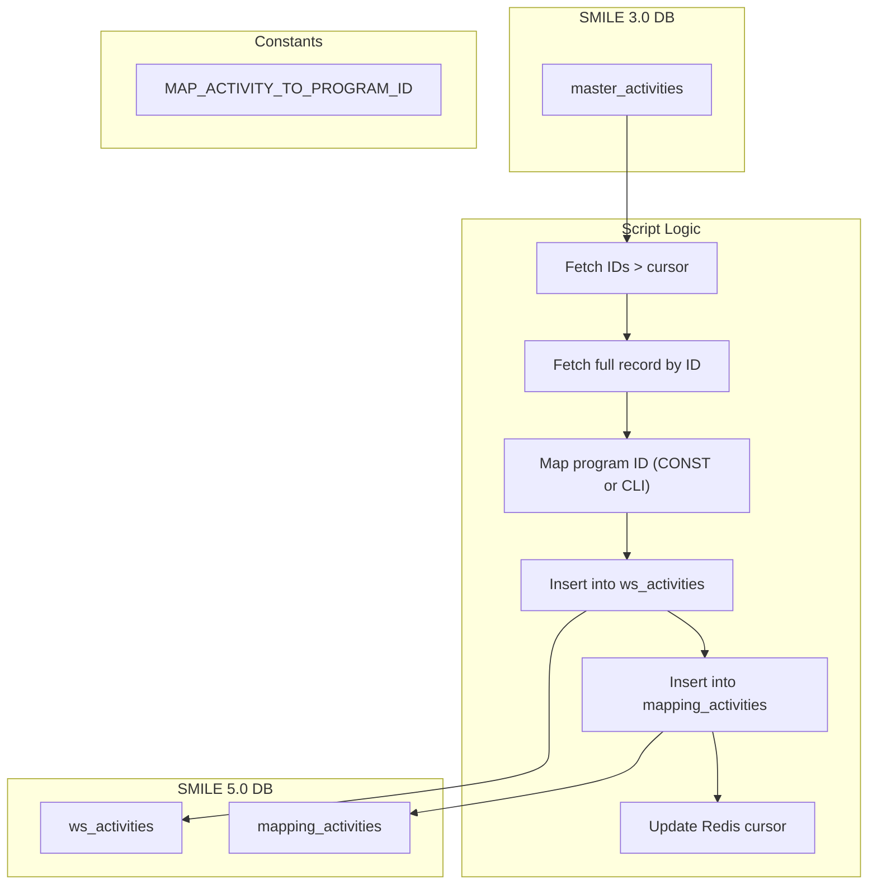

# migrate-activity.ts

**Purpose**  
Migrates core “activity” records from the SMILE 3.0 database (`master_activities`) into SMILE 5.0 workspace activities (`ws_activities`), and records ID mappings in `mapping_activities`.

**Associated CLI Command**

```bash
app-cli migrate-activity [--reset] [--limit <number>] [--programId <programId>]
```

---

## Source Table (Before – SMILE 3.0)

Table: `master_activities`

| Column                     | Notes                                               |
| -------------------------- | --------------------------------------------------- |
| `id`                       | Primary key of the source activity                  |
| `code`                     | Activity code used to infer default program mapping |
| `name`                     | Human-readable activity name                        |
| `is_ordered_purchase`      | Boolean flag                                        |
| `is_ordered_sales`         | Boolean flag                                        |
| `created_at`, `updated_at` | Timestamps                                          |
| `deleted_at`               | Null indicates active records                       |

---

## Target Table (After – SMILE 5.0)

1. **Workspace Activities**  
   Table: `ws_activities`

   | Column                     | Notes                                             |
   | -------------------------- | ------------------------------------------------- |
   | `insertId`                 | Auto-generated primary key (platform_activity_id) |
   | `name`                     | Migrated `name`                                   |
   | `program_id`               | Mapped program ID                                 |
   | `is_ordered_purchase`      | Migrated flag                                     |
   | `is_ordered_sales`         | Migrated flag                                     |
   | `created_at`, `updated_at` | Preserved timestamps                              |

2. **Activity Mapping**  
   Table: `mapping_activities`

   | Column                 | Notes                                     |
   | ---------------------- | ----------------------------------------- |
   | `existing_activity_id` | Original `master_activities.id`           |
   | `platform_activity_id` | New `ws_activities.insertId`              |
   | `program_id`           | Program under which activity was migrated |
   | `existing_program_id`  | Source program ID from SMILE 3.0          |

---

## Parameters & Options

- `--reset`: Clears Redis cursor (`current_activity_id`) before migration.
- `--limit <number>`: Maximum rows to migrate in this batch; default is all.
- `--programId <programId>`: Source SMILE 3.0 program ID; default = 1.

---

## Dependencies

- **Constants**:
  - `MAP_EXISTING_TO_PLATFORM` (for program IDs)
  - `MAP_EXISTING_ACTIVITY_IDS` (not used here, but available)
- **Helpers**:
  - `getMigrationDB(programId)` for source DB connection
  - `db` for target DB (`ws_activities` inserts)
  - `syncDB` for `mapping_activities` inserts
  - `redis` for cursor management

---

## Key Logic Summary

1. **Cursor Reset** (if `--reset`):  
   Clears Redis key `current_activity_id`.

2. **Fetch Batches**:

   - Reads next batch of IDs from `master_activities` where `id > current_cursor` and not deleted.
   - Applies `limit` if provided.

3. **Row-by-Row Migration**:  
   For each source row:

   - Fetch full record by `id`.
   - Determine `program_id`:
     - Use hard-coded `MAP_ACTIVITY_TO_PROGRAM_ID` map (per activity `code`) or CLI `programId`.
   - Insert into `ws_activities`, capturing new `insertId`.
   - Insert into `mapping_activities` to record ID mapping.
   - Update Redis cursor to `row.id`.

4. **Exit**:  
   Ends process after all rows or batch completed.

---

## Data Flow Diagram



---
