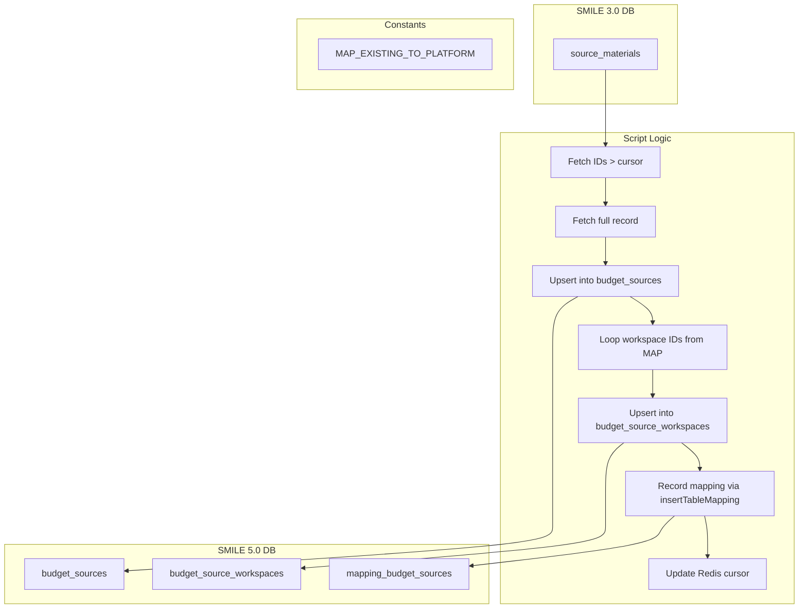

# migrate-budget-source.ts

**Purpose**  
Migrates budget-source data from the SMILE 3.0 `source_materials` table into SMILE 5.0 global and workspace budget sources, recording mappings for downstream processes.

**Associated CLI Command**

```bash
app-cli migrate-budget-source [--reset] [--limit <number>] [--programId <programId>]
```

---

## Source Table (Before – SMILE 3.0)

Table: `source_materials`

| Column        | Notes                                   |
| ------------- | --------------------------------------- |
| `id`          | Primary key of the source budget source |
| `name`        | Budget source name                      |
| `description` | Optional description                    |
| `created_at`  | Creation timestamp                      |
| `created_by`  | Creator user ID                         |
| `updated_at`  | Last update timestamp                   |
| `updated_by`  | Updater user ID                         |

---

## Target Tables (After – SMILE 5.0)

1. **Global Budget Sources**  
   Table: `budget_sources`

   | Column        | Notes                            |
   | ------------- | -------------------------------- |
   | `id`          | Auto-generated primary key       |
   | `name`        | Migrated `name`                  |
   | `description` | Migrated `description`           |
   | `created_at`  | Preserved timestamp              |
   | `created_by`  | Preserved creator ID             |
   | `updated_at`  | Preserved or defaulted timestamp |
   | `updated_by`  | Preserved updater ID             |

2. **Workspace Budget Sources**  
   Table: `budget_source_workspaces`

   | Column             | Notes                            |
   | ------------------ | -------------------------------- |
   | `id`               | Auto-generated primary key       |
   | `budget_source_id` | Reference to `budget_sources.id` |
   | `workspace_id`     | Target workspace (program) ID    |

3. **Mapping Table**  
   Utilizes helper `insertTableMapping("budget_sources", progId, { sourceId: wsId })`  
   Records mapping in the `mapping_budget_sources` table:

   | Column                      | Notes                                    |
   | --------------------------- | ---------------------------------------- |
   | `existing_budget_source_id` | Original SMILE 3.0 `source_materials.id` |
   | `platform_budget_source_id` | New `budget_source_workspaces.id`        |
   | `program_id`                | Target workspace ID                      |

---

## Parameters & Options

- `--reset`: Sets Redis key `current_budget_source_id` to 0 to restart from the first record.
- `--limit <number>`: Maximum number of rows to process in this invocation.
- `--programId <programId>`: Source SMILE 3.0 program ID (also drives workspace ID mapping); default = 1.

---

## Dependencies

- **Constants**:
  - `MAP_EXISTING_TO_PLATFORM` (maps source programId to array of target workspace IDs)
- **Helpers**:
  - `getMigrationDB(programId)` for source DB connection
  - `db` for inserts into platform tables
  - `redis` for cursor management (`current_budget_source_id`)
  - `insertTableMapping` to record ID mappings in `mapping_budget_sources`

---

## Key Logic Summary

1. **Cursor Reset** (if `--reset`):  
   Clears Redis cursor key to restart.

2. **Fetch Batch IDs**:  
   Queries `source_materials.id > current_cursor` ordered by `id`, applying `limit` if specified.

3. **Per-Row Processing**:

   - Fetch full `source_materials` record by `id`.
   - **Global Insert**:
     - If a `budget_sources` record with the same `name` exists, reuse its `id`; otherwise insert a new record and capture `insertId`.
   - **Workspace Inserts**:
     - For each target workspace ID from `MAP_EXISTING_TO_PLATFORM[programId]`:
       - If no `budget_source_workspaces` entry exists for `(budget_source_id, workspace_id)`, insert it and capture its `insertId`.
       - Call `insertTableMapping("budget_sources", workspaceId, { [sourceId]: wsId })`.
   - Update Redis cursor to the processed `id`.

4. **Completion**:  
   Logs finish and exits process.

---

## Data Flow Diagram



---
