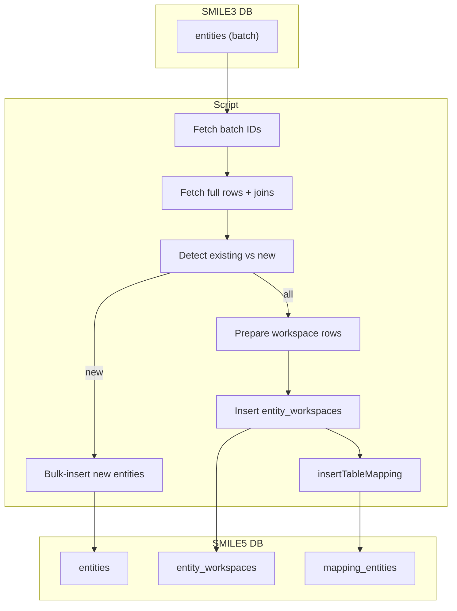

# migrate-entity-bulk.ts

**Purpose**  
Bulk-migrates “entity” records from SMILE 3.0 (`entities` table) into SMILE 5.0 global `entities` and workspace `entity_workspaces`, recording legacy-to-platform ID mappings.

**Associated CLI Command**

```bash
app-cli migrate-entity-bulk --batchSize <number> [--programId <programId>]
```

---

## Source Table (Before – SMILE 3.0)

Table: `entities` (aliased `e`)

| Column                                                       | Notes                       |
| ------------------------------------------------------------ | --------------------------- |
| `id`                                                         | Legacy entity primary key   |
| `code`                                                       | Unique entity code          |
| `id_satu_sehat`                                              | Alternate unique identifier |
| `type`, `status`                                             | Integer flags               |
| `name`                                                       | Entity name                 |
| `entity_tag_id`                                              | Foreign key to entity tags  |
| `address`, `country`                                         | Location info               |
| `province_id`, `regency_id`, `sub_district_id`, `village_id` | Location IDs                |
| `postal_code`                                                | Postal code                 |
| `lat`, `lng`                                                 | Coordinates                 |
| `is_puskesmas`, `is_vendor`                                  | Boolean flags               |
| `created_at`, `updated_at`                                   | Timestamps                  |
| `deleted_at`                                                 | Null = active               |

---

## Target Tables (After – SMILE 5.0)

1. **Global Entities**  
   Table: `entities`  
   Migrated columns:  
   `id_satu_sehat`, `code`, `type`, `status`, `name`, `entity_tag_id`, `address`, `country`, `province_id`, `regency_id`, `sub_district_id`, `village_id`, `postal_code`, `lat`, `lng`, `is_puskesmas`, `is_vendor`, `created_at`, `updated_at`

2. **Workspace Entities**  
   Table: `entity_workspaces`  
   Columns: `entity_id` (platform ID), `workspace_id`

3. **Mapping Table**  
   Uses helper `insertTableMapping("entities", progId, mapLegacyToPlatform)`  
   Records in `mapping_entities`:

   | Column                | Notes                      |
   | --------------------- | -------------------------- |
   | `id_entitas_smile`    | Legacy `entities.id`       |
   | `id_entitas_platform` | New platform `entities.id` |
   | `program_id`          | Source program ID          |

---

## Parameters & Options

- `--batchSize <number>`: Rows per transaction batch (required)
- `--programId <programId>`: Legacy program ID (default = 1)

---

## Dependencies

- **Constants**:
  - `MAP_EXISTING_TO_PLATFORM` (maps legacy program to platform workspaces)
- **Helpers & Libraries**:
  - `getMigrationDB(programId)`
  - `db.transaction()` (for atomic batch inserts)
  - `insertTableMapping`
  - `collect` (array helper)
  - `partition` (split new vs existing)

---

## Key Logic Summary

1. **Batch Loop**

   - Page through legacy IDs from `entities` in batches of `batchSize`.
   - Stops when no more rows.

2. **Per-Batch Transaction**

   - Fetch full rows plus any existing mapping (`mapping_entities`) and tags join.
   - **Detect Existing vs New**:
     - Query platform `entities` by matching `code` or `id_satu_sehat`.
     - Partition rows into `existingEntities` and `entities` (new).
   - **Insert New Globals**:
     - Bulk-insert new entity records into `entities`.
     - Compute new platform IDs from `insertId`.
   - **Collect Workspace Rows**:
     - For both existing and new, build `entity_workspaces` payloads.
   - **Insert Workspaces**:
     - For each platform workspace ID from `MAP_EXISTING_TO_PLATFORM[programId]`, bulk-insert into `entity_workspaces`.
     - Compute new workspace record IDs.
   - **Record Mappings**:
     - Build `legacyId → platformWorkspaceId` map and call `insertTableMapping`.

3. **Exit**  
   Logs and `process.exit(0)`.

---

## Data Flow Diagram



---

## Before & After Tables

| Stage             | Table               | Key Columns                                             |
| ----------------- | ------------------- | ------------------------------------------------------- |
| Before            | `entities`          | `id`, `code`, `id_satu_sehat`, ..., `updated_at`        |
| After (Global)    | `entities`          | `id`, `code`, `id_satu_sehat`, ..., `updated_at`        |
| After (Workspace) | `entity_workspaces` | `entity_id`, `workspace_id`                             |
| Mapping           | `mapping_entities`  | `id_entitas_smile`, `id_entitas_platform`, `program_id` |
