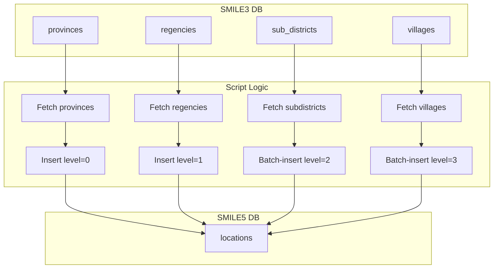

# migrate-location.ts

**Purpose**  
Migrates hierarchical geographic data (provinces, regencies, subdistricts, villages) from SMILE 3.0 into a unified `locations` table in SMILE 5.0.

**Associated CLI Command**

```bash
app-cli migrate-location
```

---

## Source Tables (Before – SMILE 3.0)

| Table           | Notes                                                              |
| --------------- | ------------------------------------------------------------------ |
| `provinces`     | Province-level records (skip `id = "00"`)                          |
| `regencies`     | Regency-level records                                              |
| `sub_districts` | Subdistrict records, filter `deleted_at IS NULL AND id > "731002"` |
| `villages`      | Village records                                                    |
| Common Columns  | `id`, `name`, `lat`, `lng`, `deleted_at`                           |

---

## Target Table (After – SMILE 5.0)

Table: `locations`

| Column       | Notes                                        |
| ------------ | -------------------------------------------- |
| `id`         | Integer ID preserving original `id`          |
| `name`       | Location name                                |
| `lat`, `lng` | Geolocation                                  |
| `level`      | 0=Province,1=Regency,2=Subdistrict,3=Village |
| `parent_id`  | FK to parent location (province→regency→…)   |

---

## Parameters & Options

This script has no CLI options. It runs in a single pass.

---

## Dependencies

- **Helpers**:
  - `getMigrationDB()` for source DB
  - `db.insertInto("locations")` for target
  - Internal `insertInBatches` function for bulk inserts

---

## Key Logic Summary

1. **Provinces**

   - Query `provinces WHERE id != "00" AND deleted_at IS NULL`.
   - Insert all rows into `locations` with `level = 0`.

2. **Regencies**

   - Query `regencies WHERE deleted_at IS NULL`.
   - Insert into `locations` with `level = 1` and `parent_id = province_id`.

3. **Subdistricts**

   - Query `sub_districts WHERE deleted_at IS NULL AND id > "731002"`.
   - Bulk-insert in batches with `level = 2`, `parent_id = regency_id`.

4. **Villages**

   - Query `villages WHERE deleted_at IS NULL`.
   - Bulk-insert in batches with `level = 3`, `parent_id = sub_district_id`.

5. **Exit**
   - Log completion and `process.exit(0)`.

---

## Data Flow Diagram



---

## Before & After Tables

| Stage  | Table           | Key Columns                                      |
| ------ | --------------- | ------------------------------------------------ |
| Before | `provinces`     | `id`, `name`, `lat`, `lng`                       |
| Before | `regencies`     | `id`, `name`, `province_id`                      |
| Before | `sub_districts` | `id`, `name`, `regency_id`                       |
| Before | `villages`      | `id`, `name`, `sub_district_id`                  |
| After  | `locations`     | `id`, `name`, `level`, `parent_id`, `lat`, `lng` |
