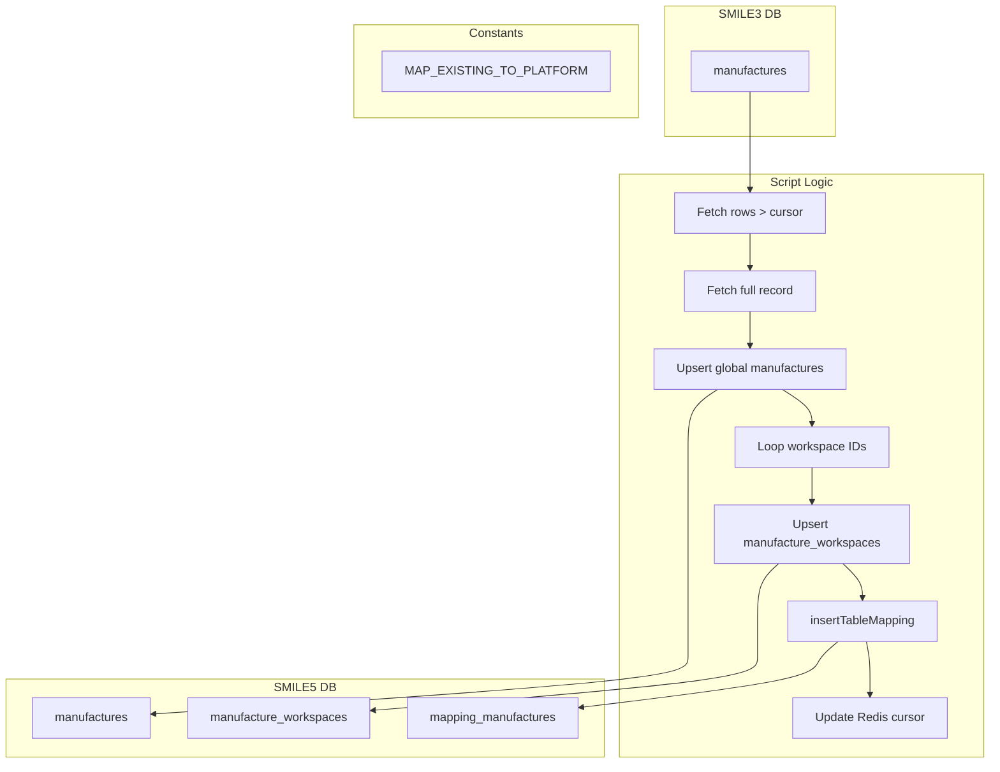

# migrate-manufacture.ts

**Purpose**  
Migrates “manufacture” records from SMILE 3.0 (`manufactures` table) into SMILE 5.0 global `manufactures` and workspace `manufacture_workspaces`, recording ID mappings.

**Associated CLI Command**

```bash
app-cli migrate-manufacture [--reset] [--limit <number>] [--programId <programId>]
```

---

## Source Table (Before – SMILE 3.0)

Table: `manufactures`

| Column                                   | Notes                          |
| ---------------------------------------- | ------------------------------ |
| `id`                                     | Legacy manufacture primary key |
| `name`                                   | Manufacture name               |
| `address`                                | Optional address               |
| `email`                                  | Contact email                  |
| `contact_name`                           | Contact person                 |
| `description`                            | Optional description           |
| `phone_number`                           | Contact phone number           |
| `reference_id`                           | Legacy reference identifier    |
| `status`, `type`                         | Integer flags                  |
| `created_at`, `updated_at`               | Timestamps                     |
| `created_by`, `deleted_by`, `updated_by` | User IDs                       |
| `deleted_at`                             | Null = active                  |

---

## Target Tables (After – SMILE 5.0)

1. **Global Manufactures**  
   Table: `manufactures`

   | Column                                   | Notes                      |
   | ---------------------------------------- | -------------------------- |
   | `id`                                     | Auto-generated primary key |
   | `name`                                   | Migrated name              |
   | `address`                                | Migrated                   |
   | `email`                                  | Migrated                   |
   | `contact_name`                           | Migrated                   |
   | `description`                            | Migrated                   |
   | `phone_number`                           | Migrated                   |
   | `reference_id`                           | Migrated                   |
   | `status`, `type`                         | Migrated                   |
   | `created_at`, `updated_at`               | Preserved                  |
   | `created_by`, `deleted_by`, `updated_by` | Preserved                  |

2. **Workspace Manufactures**  
   Table: `manufacture_workspaces`

   | Column           | Notes                          |
   | ---------------- | ------------------------------ |
   | `id`             | Auto-generated primary key     |
   | `manufacture_id` | Reference to `manufactures.id` |
   | `workspace_id`   | Target workspace (program) ID  |

3. **Mapping Table**  
   Uses helper `insertTableMapping("manufactures", progId, { legacyId: wsId })`

   | Column                    | Notes                           |
   | ------------------------- | ------------------------------- |
   | `existing_manufacture_id` | Legacy `manufactures.id`        |
   | `platform_manufacture_id` | New `manufacture_workspaces.id` |
   | `program_id`              | Target workspace (program) ID   |

---

## Parameters & Options

- `--reset`: Clears Redis key `current_manufacture_id` to restart from first record.
- `--limit <number>`: Max rows per migration batch.
- `--programId <programId>`: Legacy program ID (default = 1).

---

## Dependencies

- **Constants**:
  - `MAP_EXISTING_TO_PLATFORM` (maps legacy program to platform workspace IDs)
- **Helpers & Libraries**:
  - `getMigrationDB(programId)` for source DB
  - `db.transaction()` for transactional inserts
  - `insertTableMapping` for mapping table writes
  - `redis` for cursor management (`current_manufacture_id`)

---

## Key Logic Summary

1. **Cursor Reset** (if `--reset`):  
   Sets Redis key to 0.

2. **Transactional Batch**:

   - Fetch rows from `manufactures` where `id > cursor` and `deleted_at IS NULL`, limited if specified.
   - For each row:
     - Fetch full record by `id`.
     - **Global Upsert**:
       - If `manufactures.name` exists globally, reuse its `id`; otherwise insert a new record.
     - **Workspace Upsert**:
       - For each workspace ID in `MAP_EXISTING_TO_PLATFORM[programId]`:
         - If no `manufacture_workspaces` entry for `(manufacture_id, workspace_id)`, insert it.
         - Call `insertTableMapping` to record legacy→workspace mapping.
     - Update Redis cursor to processed `id`.

3. **Completion**:  
   Logs finish and exits; errors cause exit code 1.

---

## Data Flow Diagram



---

## Before & After Tables

| Stage             | Table                    | Key Columns                                                        |
| ----------------- | ------------------------ | ------------------------------------------------------------------ |
| Before            | `manufactures`           | `id`, `name`, `address`, ..., `updated_by`                         |
| After (Global)    | `manufactures`           | `id`, `name`, `address`, ..., `updated_by`                         |
| After (Workspace) | `manufacture_workspaces` | `manufacture_id`, `workspace_id`                                   |
| Mapping           | `mapping_manufactures`   | `existing_manufacture_id`, `platform_manufacture_id`, `program_id` |
