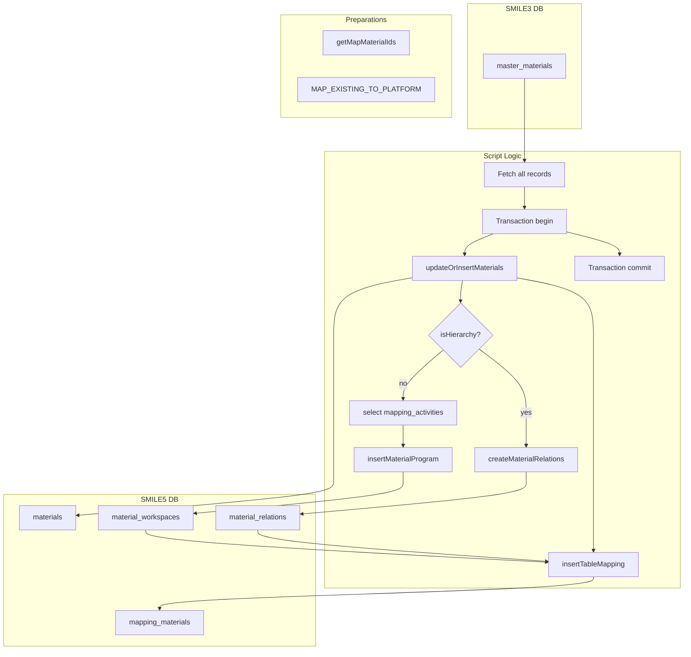

# migrate-material.ts

**Purpose**  
Migrates master material records (SMILE 3.0 `master_materials`) into SMILE 5.0 global `materials`, optionally establishes hierarchy relations, and populates workspace-specific `material_workspaces` and `material_relations`. Records all ID mappings.

**Associated CLI Command**

```bash
app-cli migrate-material [--is-hierarchy] [--programId <programId>]
```

---

## Source Table (Before – SMILE 3.0)

Table: `master_materials`

| Column                                                        | Notes                         |
| ------------------------------------------------------------- | ----------------------------- |
| `id`                                                          | Legacy material primary key   |
| `name`, `description`                                         | Material name and description |
| `kfa_level_id`, `kfa_code`                                    | Hierarchy level & code        |
| `code`                                                        | Material code                 |
| `unit`, `unit_of_distribution`, `pieces_per_unit`             | Unit fields                   |
| `temperature_sensitive`, `temperature_min`, `temperature_max` | Temp flags                    |
| `is_vaccine`, `is_openvial`, `managed_in_batch`               | Boolean flags                 |
| `status`, `type`                                              | Integer flags                 |
| `parent_id`                                                   | Legacy parent material ID     |
| `created_at`, `updated_at`, `deleted_at`                      | Timestamps                    |
| `created_by`, `updated_by`, `deleted_by`                      | User IDs                      |

---

## Target Tables (After – SMILE 5.0)

1. **Global Materials**  
   Table: `materials`  
   Migrated fields:  
   `name`, `description`, `material_level_id` (from `kfa_level_id`),  
   `code`, `hierarchy_code` (from `kfa_code`),  
   `unit_of_consumption_id`, `unit_of_distribution_id`,  
   `consumption_unit_per_distribution_unit`,  
   `is_temperature_sensitive`, `min_temperature`, `max_temperature`,  
   `material_type_id`, `is_managed_in_batch`, `status`,  
   `created_by`, `updated_by`, `deleted_by`, `created_at`, `updated_at`, `deleted_at`

2. **Workspace Materials**  
   Table: `material_workspaces`  
   Columns:  
   `material_id` (platform ID), `workspace_id`, `is_open_vial`, `created_by`, `updated_by`

3. **Material Relations** (hierarchy)  
   Table: `material_relations`  
   Columns:  
   `child_material_id`, `parent_material_id`

4. **Mapping Table**  
   Helper `insertTableMapping("materials", progId, { legacyId: workspaceId })` populates `mapping_materials`

---

## Parameters & Options

- `--is-hierarchy`:  
  Builds parent-child relations for materials with `parent_id`.
- `--programId <programId>`:  
  Legacy program ID (default = 1) to determine target workspaces.

---

## Dependencies

- **Constants**:
  - `MAP_EXISTING_TO_PLATFORM` (workspace IDs per program)
- **Helpers & Libraries**:
  - `getMigrationDB(programId)` for source DB
  - `db.transaction()` for atomic operations
  - `getMapMaterialIds()` to preload existing workspace IDs
  - `insertTableMapping` for mapping writes
  - `associateField`, `collect` (utility functions)
  - `updateOrInsertMaterials()`, `insertMaterialProgram()`, `createMaterialRelations()`

---

## Key Logic Summary

1. **Begin Transaction**  
   All work wrapped in a single Kysely transaction.

2. **Fetch All Active Records**  
   Query `master_materials WHERE deleted_at IS NULL ORDER BY id`.

3. **Preload Workspace Mappings**  
   Call `getMapMaterialIds` for target workspace IDs & legacy IDs.

4. **Per-Record Migration**  
   For each legacy material:

   - **Determine Material Type & Units**  
     Map `unit`, `is_vaccine` to platform IDs via lookup tables.
   - **Global Upsert**  
     Use `updateOrInsertMaterials()` to insert or update in `materials`.
   - **Hierarchy Relation** (if `--is-hierarchy`)  
     Read and create `material_relations` entries linking child→parent.
   - **Activities Relation** (if not hierarchy)  
     Lookup legacy activities for the material and determine target workspaces; call `insertMaterialProgram()`.
   - **Mapping Writes**  
     Throughout, use `insertTableMapping` to record legacy→platform workspace IDs.

5. **Commit & Exit**  
   On success, log finish and `process.exit(0)`; on error, log and exit with code 1.

---

## Data Flow Diagram



---

## Before & After Tables

| Stage             | Table                 | Key Columns                                                      |
| ----------------- | --------------------- | ---------------------------------------------------------------- |
| Before            | `master_materials`    | `id`, `name`, `unit`, `parent_id`, `kfa_code`, ..., `deleted_at` |
| After (Global)    | `materials`           | `id`, `name`, `code`, `hierarchy_code`, ..., `deleted_at`        |
| After (Workspace) | `material_workspaces` | `material_id`, `workspace_id`, `is_open_vial`                    |
| Hierarchy         | `material_relations`  | `child_material_id`, `parent_material_id`                        |
| Mapping           | `mapping_materials`   | Legacy→workspace ID mappings                                     |

---
