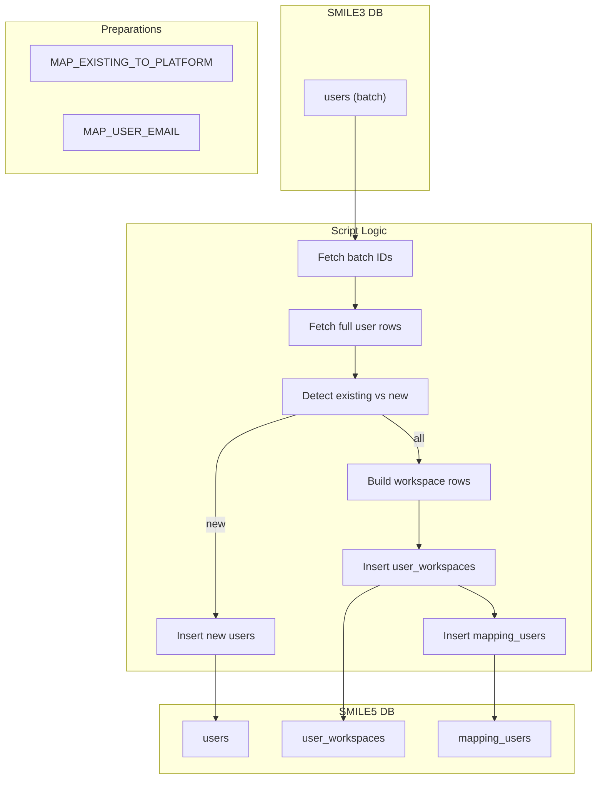

# migrate-user-bulk.ts

**Purpose**  
Bulk-migrates user accounts from SMILE 3.0 (`users` table) into SMILE 5.0 global `users`, populates workspace-specific `user_workspaces`, and records ID mappings in `mapping_users`.

**Associated CLI Command**

```bash
app-cli migrate-user-bulk --batchSize <number> [--programId <programId>]
```

---

## Source Table (Before – SMILE 3.0)

Table: `users` (aliased `e`)

| Column                      | Notes                                |
| --------------------------- | ------------------------------------ |
| `id`                        | Legacy user primary key              |
| `username`, `email`         | Login credentials                    |
| `firstname`, `lastname`     | Personal names                       |
| `date_of_birth`, `gender`   | Optional profile fields              |
| `mobile_phone`, `address`   | Contact info                         |
| `entity_id`                 | FK to `entities`                     |
| `role`, `status`            | Access flags                         |
| `timezone_id`, `village_id` | Optional IDs                         |
| `created_at`, `updated_at`  | Timestamps                           |
| `deleted_at`                | Null = active                        |
| Other metadata columns      | e.g., `password`, `permission`, etc. |

---

## Target Tables (After – SMILE 5.0)

1. **Global Users**  
   Table: `users`  
   Migrated fields include:  
   `username`, `email`, `firstname`, `lastname`, `date_of_birth`, `gender`,  
   `mobile_phone`, `address`, `entity_id` (mapped to platform entity_workspaces),  
   `role`, `status`, `timezone_id`, `village_id`, `password`, plus metadata timestamps.

2. **Workspace Users**  
   Table: `user_workspaces`  
   Columns:  
   `existing_user_id`, `user_id` (platform user ID), `workspace_id`, `status`

3. **Mapping Table**  
   Table: `mapping_users`  
   Records:  
   `program_id`, `platorm_user_id`, `existing_user_id`

---

## Parameters & Options

- `--batchSize <number>`: Rows per batch transaction.
- `--programId <programId>`: Legacy program ID (default = 1).

---

## Dependencies

- **Constants**:
  - `MAP_EXISTING_TO_PLATFORM` (maps legacy program to workspace IDs)
- **Helpers & Libraries**:
  - `getMigrationDB(programId)` for source DB
  - `db.transaction()` for batch operations
  - `collect`, `associateField`, `partition` (utility functions)
  - `getMapEntityIds()` to preload workspace entity IDs
  - `insertTableMapping()` for mapping writes
  - `syncDB` for final mapping insert into `mapping_users`

---

## Key Logic Summary

1. **Batch Loop**

   - Page through `users.id` in batches of `batchSize` until no more rows.

2. **Per-Batch Transaction**

   - Fetch full user rows by IDs.
   - **Detect Existing vs New**:
     - Query platform `users` by matching `username`.
     - Partition into `existingUsers` and `users` (new).
   - **Create Platform Users**:
     - Insert new `users` records and capture `insertId` range.
   - **Prepare Workspace Rows**:
     - For each new and existing user, determine target `workspace_id`s:
       - Use email-domain heuristics (`MAP_USER_EMAIL`) when applicable.
       - Otherwise apply `MAP_EXISTING_TO_PLATFORM[programId]`.
   - **Insert Workspace Entries**:
     - Bulk-insert `user_workspaces`.
     - Capture returned IDs.
   - **Record Mappings**:
     - Insert into `mapping_users` per row mapping `(program_id, platorm_user_id, existing_user_id)`.

3. **Exit**
   - Logs finish and `process.exit(0)`.

---

## Data Flow Diagram



---

## Before & After Tables

| Stage             | Table             | Key Columns                                             |
| ----------------- | ----------------- | ------------------------------------------------------- |
| Before            | `users`           | `id`, `username`, `entity_id`, `status`, ...            |
| After (Global)    | `users`           | `id`, `username`, `email`, `entity_id`, `status`, ...   |
| After (Workspace) | `user_workspaces` | `existing_user_id`, `user_id`, `workspace_id`, `status` |
| Mapping           | `mapping_users`   | `program_id`, `platorm_user_id`, `existing_user_id`     |
