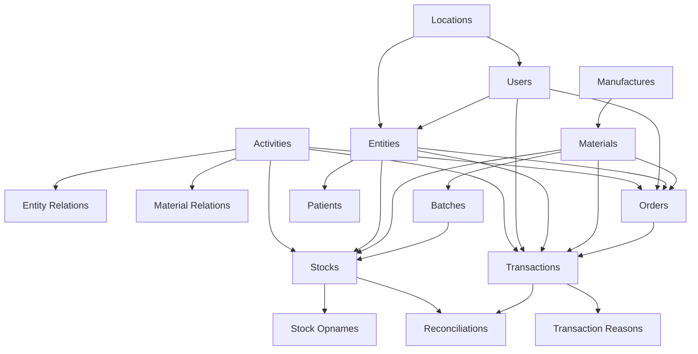

# SMILE 3.0 to 5.0 Data Migration Execution Order

**Purpose**  
This document defines the proper execution order for data migration scripts to ensure data integrity and maintain referential constraints during the migration from SMILE 3.0 to SMILE 5.0.

**Associated CLI Commands**

## IMPORTANT

Make sure your environment is correct

### Pre-requesites

1. You have SMILE 3.0 database
2. You have SMILE 5.0 database
3. You have SMILE 5.0 database mapping
4. Seed SMILE 5.0 `workspaces` table

```bash
# Complete Migration Execution Order
# Execute these commands in the exact order specified below

# ========================================
# PHASE 1: Foundation Data (Global)
# ========================================
npx bun ./src/cli.ts migrate-location --programId 2
npx bun ./src/cli.ts migrate-activity --reset --limit 1000 --programId 2
npx bun ./src/cli.ts migrate-manufacture --reset --limit 1000 --programId 2
npx bun ./src/cli.ts migrate-budget-source --programId 2

# ========================================
# PHASE 2: Core Entities
# ========================================
npx bun ./src/cli.ts migrate-material --is-hierarchy --programId 2
npx bun ./src/cli.ts migrate-entity-bulk --batchSize 1000 --programId 2
npx bun ./src/cli.ts migrate-user-bulk --batchSize 10000 --programId 2

# ========================================
# PHASE 3: Supporting Data
# ========================================
npx bun ./src/cli.ts migrate-ws-batch --programId 2
npx bun ./src/cli.ts migrate-ws-transaction-reasons --programId 2
npx bun ./src/cli.ts migrate-ws-patients --batchSize 1000 --programId 2

# ========================================
# PHASE 4: Workspace Relations
# ========================================
npx bun ./src/cli.ts migrate-ws-entity --batchSize 1000 --programId 2
npx bun ./src/cli.ts migrate-ws-material --batchSize 1000 --programId 2

# ========================================
# PHASE 5: Operational Data
# ========================================
npx bun ./src/cli.ts migrate-ws-stocks --batchSize 1000 --programId 2
npx bun ./src/cli.ts migrate-ws-orders --batchSize 1000 --programId 2
npx bun ./src/cli.ts migrate-ws-transactions --batchSize 1000 --programId 2

# ========================================
# PHASE 6: Additional
# ========================================
npx bun ./src/cli.ts migrate-ws-stock-opnames --batchSize 1000 --programId 2
npx bun ./src/cli.ts migrate-ws-reconciliations --batchSize 1000 --programId 2
npx bun ./src/cli.ts migrate-ws-disposal --batchSize 1000 --programId 2


# ========================================
# Alternative: Run All Migrations
# ========================================
# Execute all migrations in sequence (use with caution)
npm run migrate:all -- --sequential
```

## Migration Phases Overview

The migration is structured in 5 distinct phases to ensure proper dependency resolution:

1. **Foundation Data (Global)** - Core reference data
2. **Core Entities** - Primary business entities
3. **Workspace Relations** - Entity relationships and associations
4. **Operational Data** - Business transactions and operations
5. **Supporting Data** - Audit and reconciliation data

---

## Phase 1: Foundation Data (Global)

### 1. Location Migration

**Script**: `global/migrate-location.ts`  
**Dependencies**: None  
**Purpose**: Migrates hierarchical geographic data (provinces, regencies, subdistricts, villages)

```bash
npm run migrate:location
```

**Key Points**:

- Creates unified `locations` table with level-based hierarchy
- Required by users (timezone_id, village_id) and entities
- No foreign key dependencies

### 2. Activity Migration

**Script**: `global/migrate-activity.ts`  
**Dependencies**: None  
**Purpose**: Migrates master activities (malaria, TB, HIV, rabies, etc.)

```bash
npm run migrate:activity -- --reset --limit 1000
```

**Key Points**:

- Maps activity types to program IDs
- Required by all workspace-specific data
- Uses Redis for progress tracking

### 3. Manufacture Migration

**Script**: `global/migrate-manufacture.ts`  
**Dependencies**: None  
**Purpose**: Migrates manufacturer reference data

```bash
npm run migrate:manufacture -- --reset --limit 1000
```

**Key Points**:

- Required by materials
- Uses Redis for progress tracking
- Handles duplicate manufacturer names

### 4. Budget Source Migration

**Script**: `global/migrate-budget-source.ts`  
**Dependencies**: None  
**Purpose**: Migrates budget source reference data

```bash
npm run migrate:budget-source
```

---

## Phase 2: Core Entities

### 5. User Migration

**Script**: `global/migrate-user-bulk.ts`  
**Dependencies**: Locations  
**Purpose**: Migrates user accounts and authentication data

```bash
npm run migrate:user -- --batchSize 1000
```

**Key Points**:

- Depends on locations for timezone_id and village_id
- Required by all entities with created_by/updated_by fields
- Handles entity_id mapping

### 6. Entity Migration

**Script**: `global/migrate-entity-bulk.ts`  
**Dependencies**: Locations, Users  
**Purpose**: Migrates entities (customers, vendors, facilities)

```bash
npm run migrate:entity -- --batchSize 1000
```

**Key Points**:

- Depends on users and locations
- Required by orders, stocks, transactions, patients
- Creates entity type mappings

### 7. Material Migration

**Script**: `global/migrate-material.ts`  
**Dependencies**: Manufactures, Activities  
**Purpose**: Migrates master materials and material hierarchy

```bash
npm run migrate:material -- --hierarchy
```

**Key Points**:

- Depends on manufactures and activities
- Creates material type and unit mappings
- Handles hierarchical material relationships

---

## Phase 3: Workspace Relations

### 8. Entity Relations Migration

**Script**: `workspace/migrate-entity/index.ts`  
**Dependencies**: Entities, Activities, Materials  
**Purpose**: Migrates entity-activity relationships and customer-vendor associations

```bash
npm run migrate:entity-relations -- --batchSize 1000
```

**Includes**:

- Customer-vendor relationships
- Entity-activity associations
- Entity-material-activity mappings

### 9. Material Relations Migration

**Script**: `workspace/migrate-material/index.ts`  
**Dependencies**: Materials, Activities, Manufactures  
**Purpose**: Migrates material relationships and associations

```bash
npm run migrate:material-relations -- --batchSize 1000
```

**Includes**:

- Material-activity relationships
- Material companions
- Material conditions
- Material-manufacture associations

### 10. Patient Migration

**Script**: `workspace/migrate-patients.ts`  
**Dependencies**: Entities  
**Purpose**: Migrates patient data

```bash
npm run migrate:patients -- --batchSize 1000
```

---

## Phase 4: Operational Data

### 11. Batch Migration

**Script**: `workspace/migrate-batches.ts`  
**Dependencies**: Materials, Entities  
**Purpose**: Migrates batch information for materials

```bash
npm run migrate:batches -- --batchSize 1000
```

### 12. Stock Migration

**Script**: `workspace/migrate-stock/index.ts`  
**Dependencies**: Materials, Entities, Activities, Batches  
**Purpose**: Migrates stock data and stock exterminations

```bash
npm run migrate:stocks -- --batchSize 1000
```

**Includes**:

- Stock records
- Stock exterminations

### 13. Order Migration

**Script**: `workspace/migrate-order/index.ts`  
**Dependencies**: Entities, Activities, Materials, Users  
**Purpose**: Migrates orders and related data

```bash
npm run migrate:orders -- --batchSize 1000
```

**Includes**:

- Orders
- Order items
- Order histories
- Order comments
- Order item projection capacities

### 14. Transaction Migration

**Script**: `workspace/migrate-transaction/index.ts`  
**Dependencies**: Entities, Activities, Materials, Users, Stocks, Orders  
**Purpose**: Migrates transaction data

```bash
npm run migrate:transactions -- --batchSize 1000
```

**Includes**:

- Transactions
- Purchases
- Consumptions

---

## Phase 5: Supporting Data

### 15. Stock Opname Migration

**Script**: `workspace/migrate-stock-opnames.ts`  
**Dependencies**: Stocks, Materials, Entities  
**Purpose**: Migrates stock opname (inventory count) data

```bash
npm run migrate:stock-opnames -- --batchSize 1000
```

### 16. Reconciliation Migration

**Script**: `workspace/migrate-reconciliations.ts`  
**Dependencies**: Transactions, Stocks  
**Purpose**: Migrates reconciliation data

```bash
npm run migrate:reconciliations -- --batchSize 1000
```

### 17. Transaction Reasons Migration

**Script**: `workspace/migrate-transaction-reasons.ts`  
**Dependencies**: Transactions  
**Purpose**: Migrates transaction reason data

```bash
npm run migrate:transaction-reasons -- --batchSize 1000
```

---

## Critical Dependencies

### Foreign Key Relationships



### Execution Rules

1. **Sequential Execution**: Each phase must complete before the next begins
2. **Batch Processing**: Use appropriate batch sizes to manage memory and performance
3. **Error Handling**: Stop execution on any migration failure
4. **Progress Tracking**: Use Redis for tracking progress in long-running migrations
5. **Rollback Strategy**: Ensure each migration can be rolled back if needed

### Performance Considerations

- **Batch Size**: Recommended 1000-10000 records per batch depending on data complexity
- **Memory Management**: Monitor memory usage during large migrations
- **Database Connections**: Use connection pooling for concurrent operations
- **Indexing**: Ensure proper indexes exist before migration for performance

### Validation Steps

After each phase:

1. Verify record counts match between source and target
2. Validate foreign key constraints
3. Check data integrity and business rules
4. Perform sample data verification

---

## Troubleshooting

### Common Issues

1. **Foreign Key Violations**: Ensure dependencies are migrated first
2. **Duplicate Key Errors**: Check for existing data in target tables
3. **Memory Issues**: Reduce batch size for large datasets
4. **Timeout Errors**: Increase timeout settings for long-running operations

### Recovery Procedures

1. **Partial Failure**: Use Redis tracking to resume from last successful batch
2. **Data Corruption**: Rollback to previous state and restart migration
3. **Performance Issues**: Optimize queries and adjust batch sizes

---

## Quick Reference: Command Execution List

For quick copy-paste execution, use this condensed command list:

```bash
# Execute in order - DO NOT run commands in parallel
npm run migrate:location
npm run migrate:activity -- --reset --limit 1000
npm run migrate:manufacture -- --reset --limit 1000
npm run migrate:budget-source
npm run migrate:user -- --batchSize 1000
npm run migrate:entity -- --batchSize 1000
npm run migrate:material -- --hierarchy
npm run migrate:entity-relations -- --batchSize 1000
npm run migrate:material-relations -- --batchSize 1000
npm run migrate:patients -- --batchSize 1000
npm run migrate:batches -- --batchSize 1000
npm run migrate:stocks -- --batchSize 1000
npm run migrate:orders -- --batchSize 1000
npm run migrate:transactions -- --batchSize 1000
npm run migrate:stock-opnames -- --batchSize 1000
npm run migrate:reconciliations -- --batchSize 1000
npm run migrate:transaction-reasons -- --batchSize 1000
```

### Execution Notes:

- **Total Scripts**: 17 migration scripts
- **Estimated Time**: 2-6 hours depending on data volume
- **Prerequisites**: Ensure Redis is running for progress tracking
- **Monitoring**: Check logs after each command for errors
- **Recovery**: Use Redis keys to resume failed migrations

---

**Last Updated**: December 2024  
**Version**: 1.1  
**Maintainer**: Platform Team
