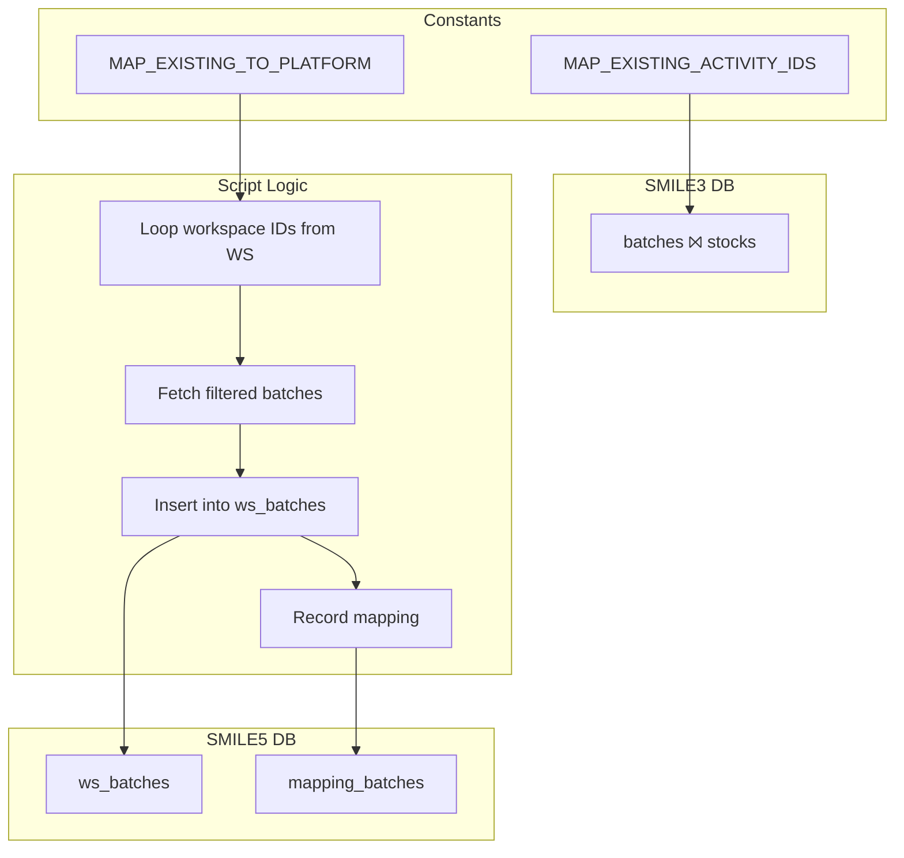

# migrate-batches.ts

**Purpose**  
Migrates batch metadata from SMILE 3.0 (`batches` joined with `stocks`) into SMILE 5.0 workspace batches (`ws_batches`) and records ID mappings.

**Associated CLI Command**

```bash
app-cli migrate-ws-batch --programId <programId>
```

---

## Source Tables (Before – SMILE 3.0)

1. **`batches`**  
   | Column | Notes |
   | ---------------- | ------------------------------ |
   | `id` | Batch primary key |
   | `manufacture_id` | FK to legacy manufacture |
   | `code` | Batch code |
   | `production_date`| Manufacture date |
   | `expired_date` | Expiration date |

2. **`stocks`** (joined)  
   | Column | Notes |
   | ------------- | ------------------------------------ |
   | `batch_id` | FK to `batches.id` |
   | `activity_id` | Filter: must belong to migrated activities |

---

## Target Table (After – SMILE 5.0)

1. **Workspace Batches**  
   Table: `ws_batches`  
   | Column | Notes |
   | ---------------- | ----------------------------- |
   | `id` | Auto-generated primary key |
   | `code` | Migrated `batches.code` |
   | `manufacture_id` | Platform manufacture ID |
   | `production_date`| Migrated date |
   | `expired_date` | Migrated date |

2. **Mapping Table**  
   Table: `mapping_batches` (via `insertTableMapping("batches", progId, map)`)  
   | Column | Notes |
   | ---------------------- | ---------------------------- |
   | `existing_batch_id` | Legacy `batches.id` |
   | `platform_batch_id` | New `ws_batches.id` |
   | `program_id` | Workspace/program ID |

---

## Parameters & Options

- `--programId <programId>`: Legacy program ID, determines which activities are considered via `MAP_EXISTING_ACTIVITY_IDS`.

---

## Dependencies

- **Constants**:
  - `MAP_EXISTING_ACTIVITY_IDS[programId]`: List of legacy activity IDs to filter batches.
  - `MAP_EXISTING_TO_PLATFORM[programId]`: Target workspace IDs.
- **Helpers & Libraries**:
  - `getMigrationDB(programId)` for source DB
  - `db.transaction()` for atomic insert
  - `insertTableMapping()` for mapping writes
  - `collect()` to extract legacy IDs

---

## Key Logic Summary

1. **Determine Workspaces**

   - Lookup `MAP_EXISTING_TO_PLATFORM[programId]` for target workspace IDs.

2. **Per-Workspace Transaction**  
   For each `workspaceId`:

   - **Fetch Batches**
     - Query distinct `batches` having at least one `stock.activity_id` in `MAP_EXISTING_ACTIVITY_IDS[programId]`.
   - **Insert ws_batches**
     - Bulk-insert batch records into `ws_batches`.
     - Capture returned IDs and map to legacy `batches.id`.
   - **Record Mappings**
     - Call `insertTableMapping("batches", workspaceId, mapLegacyToPlatform)`.

3. **Exit**
   - Log finish and `process.exit(0)`.

---

## Data Flow Diagram



---

## Before & After Tables

| Stage   | Table                | Key Columns                                                       |
| ------- | -------------------- | ----------------------------------------------------------------- |
| Before  | `batches` & `stocks` | `batches.id`, `code`, `manufacture_id`, …                         |
| After   | `ws_batches`         | `id`, `code`, `manufacture_id`, `production_date`, `expired_date` |
| Mapping | `mapping_batches`    | `existing_batch_id`, `platform_batch_id`, `program_id`            |
