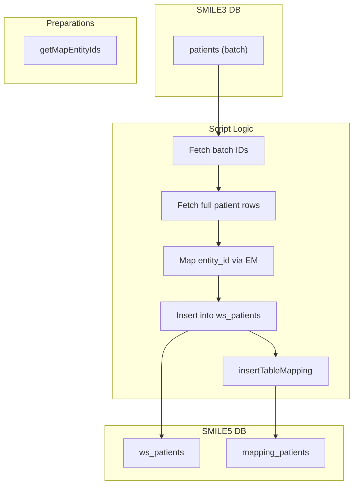

# migrate-patients.ts

**Purpose**  
Migrates patient records from SMILE 3.0 (`patients` table) into SMILE 5.0 workspace patients (`ws_patients`) and records ID mappings.

**Associated CLI Command**

```bash
app-cli migrate-ws-patients --batchSize <number> [--programId <programId>]
```

---

## Source Table (Before – SMILE 3.0)

Table: `patients` (aliased `p`)

| Column                                   | Notes                        |
| ---------------------------------------- | ---------------------------- |
| `id`                                     | Legacy patient primary key   |
| `entity_id`                              | FK to `entities`             |
| `nik`                                    | National ID                  |
| `vaccine_sequence`                       | Vaccination sequence number  |
| `last_vaccine_at`                        | Last vaccination timestamp   |
| `identity_type`                          | ID document type             |
| `preexposure_sequence`                   | Pre-exposure sequence number |
| `last_preexposure_at`                    | Last pre-exposure timestamp  |
| `stop_notification`                      | Boolean flag                 |
| `phone_number`                           | Contact number               |
| `vaccine_method`                         | Delivery method              |
| `created_at`, `updated_at`, `deleted_at` | Timestamps                   |

---

## Target Table (After – SMILE 5.0)

1. **Workspace Patients**  
   Table: `ws_patients`

   | Column                                   | Notes                       |
   | ---------------------------------------- | --------------------------- |
   | `id` (auto-generated)                    | Platform record ID          |
   | `nik`                                    | Migrated `nik`              |
   | `vaccine_sequence`                       | Migrated                    |
   | `last_vaccine_at`                        | Migrated                    |
   | `identity_type`                          | Migrated                    |
   | `preexposure_sequence`                   | Migrated                    |
   | `last_preexposure_at`                    | Migrated                    |
   | `stop_notification`                      | Migrated                    |
   | `phone_number`                           | Migrated                    |
   | `vaccine_method`                         | Migrated                    |
   | `entity_id`                              | Platform entity ID (mapped) |
   | `created_at`, `updated_at`, `deleted_at` | Preserved                   |

2. **Mapping Table**  
   Uses helper `insertTableMapping("patients", progId, mapLegacyToPlatform)`  
   Records in `mapping_patients`:

   | Column                | Notes                |
   | --------------------- | -------------------- |
   | `existing_patient_id` | Legacy `patients.id` |
   | `platform_patient_id` | New `ws_patients.id` |
   | `program_id`          | Workspace/program ID |

---

## Parameters & Options

- `--batchSize <number>`: Rows per batch (required)
- `--programId <programId>`: Legacy program ID (default = 1)

---

## Dependencies

- **Helpers & Libraries**:
  - `getMigrationDB(programId)` for source DB
  - `db.transaction()` for batch insert
  - `insertTableMapping()` for mapping writes
  - `collect()` to extract legacy IDs
  - `getMapEntityIds()` for mapping entity FK to platform IDs

---

## Key Logic Summary

1. **Batch Loop**

   - Page through `patients.id` in batches of `batchSize` until none remain.

2. **Per-Batch Transaction**

   - Fetch detailed rows for patient IDs.
   - Map `entity_id` to platform via `getMapEntityIds()`.
   - Bulk-insert into `ws_patients` with mapped `entity_id`.
   - Compute new IDs and build legacy→platform map.
   - Call `insertTableMapping("patients", programId, mapLegacyToPlatform)`.

3. **Exit**
   - Logs finish and returns (no explicit exit).

---

## Data Flow Diagram



---

## Before & After Tables

| Stage   | Table              | Key Columns                                                  |
| ------- | ------------------ | ------------------------------------------------------------ |
| Before  | `patients`         | `id`, `entity_id`, `nik`, `vaccine_sequence`, `phone_number` |
| After   | `ws_patients`      | `id`, `entity_id`, `nik`, `vaccine_sequence`, `phone_number` |
| Mapping | `mapping_patients` | `existing_patient_id`, `platform_patient_id`, `program_id`   |
