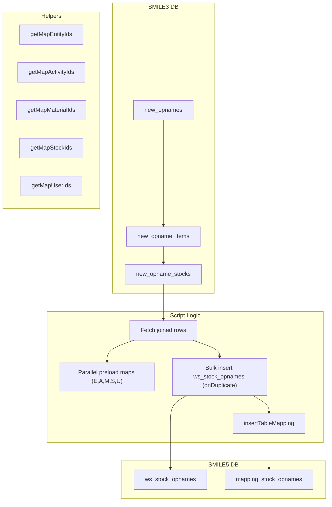

# migrate-stock-opnames.ts

**Purpose**  
Migrates stock opname (inventory count) records from SMILE 3.0 (`new_opnames`, `new_opname_items`, `new_opname_stocks`) into SMILE 5.0 workspace stock opnames (`ws_stock_opnames`), preserving core fields and updating on-duplicate key, then records mappings.

**Associated CLI Command**

```bash
app-cli migrate-ws-stock-opnames --batchSize <number> [--programId <programId>]
```

---

## Source Tables (Before – SMILE 3.0)

| Table               | Notes                                                                                                                                                            |
| ------------------- | ---------------------------------------------------------------------------------------------------------------------------------------------------------------- |
| `new_opnames`       | Master opname header: `id`, `entity_id`, `activity_id`, `period_id`, `status`, `created_at`, `updated_at`, `created_by`                                          |
| `new_opname_items`  | Item lines: `id`, `new_opname_id`, `master_material_id`                                                                                                          |
| `new_opname_stocks` | Stock details: `id`, `new_opname_item_id`, `batch_id`, `batch_code`, `expired_date`, `real_qty`, `smile_qty`, `unsubmit_distribution_qty`, `unsubmit_return_qty` |
| Joined on IDs       | Data is joined across these three tables                                                                                                                         |

---

## Target Table (After – SMILE 5.0)

Table: `ws_stock_opnames`

| Column                     | Notes                                                               |
| -------------------------- | ------------------------------------------------------------------- |
| `id` (auto-generated)      | Platform workbook record ID                                         |
| `entity_id`                | Platform entity ID (mapped via `getMapEntityIds`)                   |
| `activity_id`              | Platform activity ID (mapped via `getMapActivityIds`)               |
| `period_id`                | Original period identifier                                          |
| `material_id`              | Platform material ID (mapped via `getMapMaterialIds`)               |
| `parent_material_id`       | Parent material ID if hierarchy (mapped via same helper)            |
| `stock_id`                 | Platform stock ID (mapped via `getMapStockIds`)                     |
| `batch_code`               | Batch code                                                          |
| `expired_date`             | Expiry date                                                         |
| `recorded_qty`             | `smile_qty` from source                                             |
| `actual_qty`               | `real_qty` from source                                              |
| `in_transit_qty`           | Computed `GREATEST(unsubmit_distribution_qty, unsubmit_return_qty)` |
| `is_within_period`         | Original `status`                                                   |
| `created_at`, `updated_at` | Preserved timestamps                                                |
| `created_by`               | Mapped via `getMapUserIds`                                          |

---

## Mapping Table

Helper `insertTableMapping("stock_opnames", programId, mapLegacyToPlatform)` populates `mapping_stock_opnames`:

| Column                     | Notes                     |
| -------------------------- | ------------------------- |
| `existing_stock_opname_id` | Legacy `new_opnames.id`   |
| `platform_stock_opname_id` | New `ws_stock_opnames.id` |
| `program_id`               | Workspace/program ID      |

---

## Parameters & Options

- `--batchSize <number>`: Number of opname rows per batch.
- `--programId <programId>`: Legacy program ID (default = 1).

---

## Dependencies

- **Constants**:
  - `MAP_EXISTING_ACTIVITY_IDS`
  - `MAP_EXISTING_TO_PLATFORM`
- **Helpers & Libraries**:
  - `getMigrationDB(programId)`
  - `db.transaction()` for batch inserts
  - `getMapEntityIds()`, `getMapActivityIds()`, `getMapMaterialIds()`, `getMapStockIds()`, `getMapUserIds()`
  - `insertTableMapping()`
  - `collect()`, `getUniqueIdsFromFields()`

---

## Key Logic Summary

1. **Batch Loop**  
   Page through `new_opnames.id` in batches until exhausted.

2. **Per-Batch Transaction**

   - Join `new_opnames` → `new_opname_items` → `new_opname_stocks`.
   - Extract fields and compute `in_transit_qty`.
   - Preload all required platform ID maps in parallel.
   - Bulk-insert into `ws_stock_opnames` with `onDuplicateKeyUpdate` on quantities.
   - Do not exit process explicitly (returns to loop).

3. **Exit**  
   Completes when no more batches.

---

## Data Flow Diagram



---

## Before & After Tables

| Stage   | Table                   | Key Columns                                                          |
| ------- | ----------------------- | -------------------------------------------------------------------- |
| Before  | `new_opnames` + joins   | `id`, `entity_id`, `activity_id`, `batch_id`, …                      |
| After   | `ws_stock_opnames`      | `id`, `entity_id`, `activity_id`, `batch_code`, `recorded_qty`, etc. |
| Mapping | `mapping_stock_opnames` | `existing_stock_opname_id`, `platform_stock_opname_id`, `program_id` |
