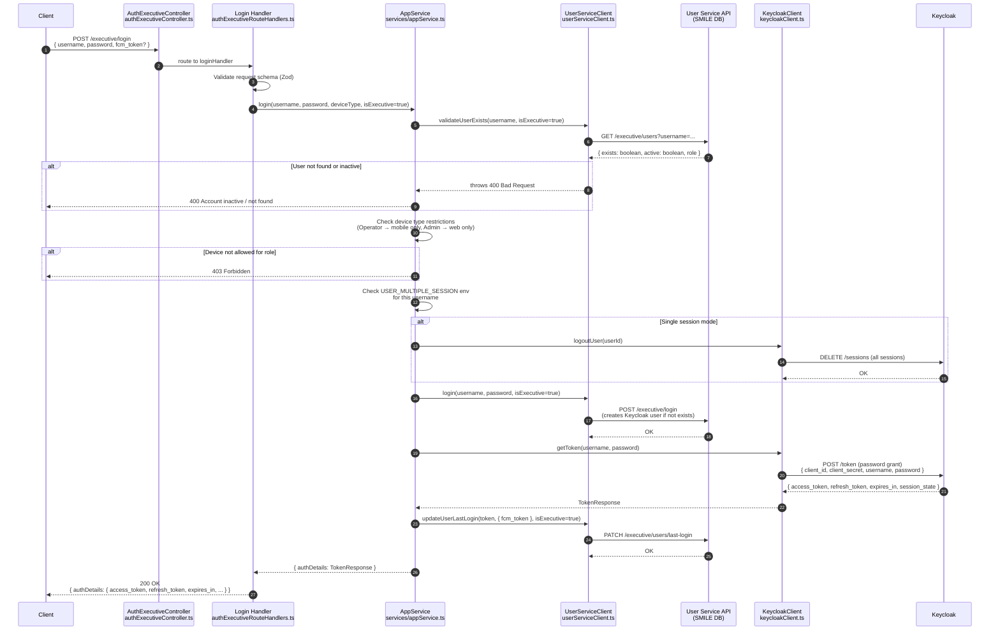
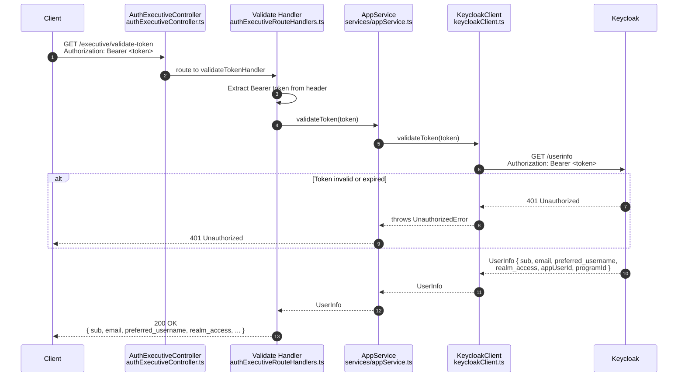
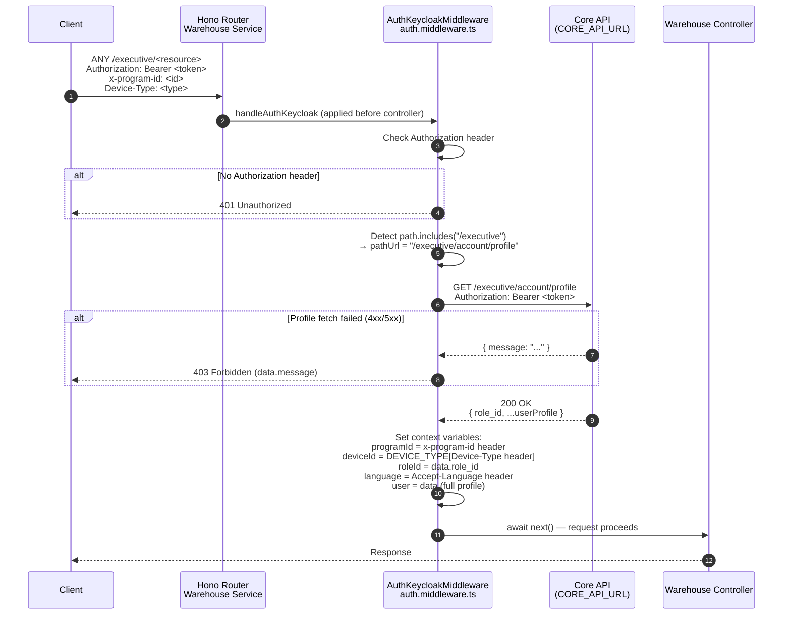
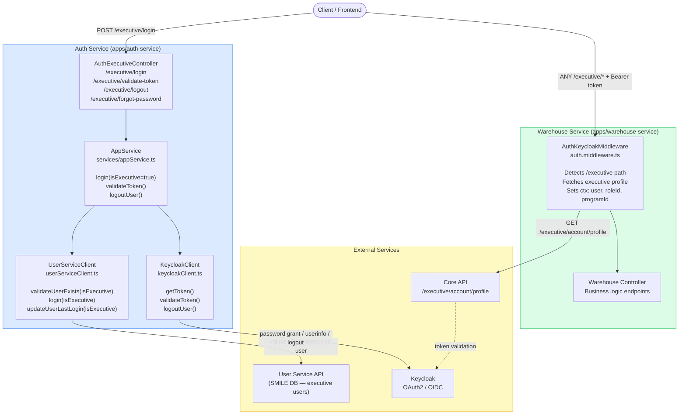

# Executive Auth Flow Diagram

This document describes the authentication flow for **Executive** users across the Auth Service and Warehouse Service.

Executive users are a separate user tier with their own login path (`/executive/*`) and profile endpoint, distinct from regular users.

---

## 1. Executive Login Flow (Auth Service)

---

## 2. Executive Token Validation Flow (Auth Service)

---

## 3. Warehouse Service — Executive Request Auth Middleware

---

## 4. Combined Executive Auth Architecture Overview

---

## Key Differences: Executive vs Regular Auth

| Aspect | Regular User | Executive User |
|---|---|---|
| Login endpoint | `POST /login` | `POST /executive/login` |
| Validate endpoint | `GET /validate-token` | `GET /executive/validate-token` |
| User Service path | `/users?username=...` | `/executive/users?username=...` |
| Core API profile | `/account/profile` | `/executive/account/profile` |
| Warehouse middleware detection | `path` does **not** include `/executive` | `path.includes("/executive")` → `true` |
| Device restrictions | Enforced per role | Same role-based enforcement |
| Keycloak realm | Shared realm | Same shared realm |

---

## Files Referenced

| File | Role |
|---|---|
| [apps/auth-service/src/controllers/authExecutiveController.ts](../../apps/auth-service/src/controllers/authExecutiveController.ts) | Route registration for executive auth endpoints |
| [apps/auth-service/src/route-handlers/authExecutiveRouteHandlers.ts](../../apps/auth-service/src/route-handlers/authExecutiveRouteHandlers.ts) | Executive login, validate, logout, forgot-password handlers |
| [apps/auth-service/src/services/appService.ts](../../apps/auth-service/src/services/appService.ts) | Core auth logic: `login()`, `validateToken()`, `logoutUser()` |
| [apps/auth-service/src/userServiceClient.ts](../../apps/auth-service/src/userServiceClient.ts) | SMILE DB user service client (`isExecutive` flag) |
| [apps/auth-service/src/keycloakClient.ts](../../apps/auth-service/src/keycloakClient.ts) | Keycloak token and admin API client |
| [apps/warehouse-service/src/common/middlewares/auth.middleware.ts](../../apps/warehouse-service/src/common/middlewares/auth.middleware.ts) | `AuthKeycloakMiddleware` — path-based executive profile fetch |
