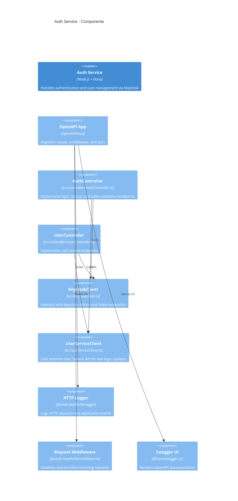

# Auth Service - Component Diagram

```mermaid
C4Component
title Auth Service - Components

Container(auth, "Auth Service", "Node.js + Hono", "Handles authentication and user management via Keycloak")

Component(OpenAPIApp, "OpenAPI App", "OpenAPIHono", "Registers routes, middleware, and docs")
Component(AuthController, "AuthController", "src/controllers/authController.ts", "Implements login, logout, and token validation endpoints")
Component(UserController, "UserController", "src/controllers/userController.ts", "Implements user profile endpoints")
Component(KeycloakClient, "KeycloakClient", "src/keycloakClient.ts", "Interacts with Keycloak Admin and Token endpoints")
Component(UserServiceClient, "UserServiceClient", "src/userServiceClient.ts", "Calls external User Service API for last-login updates")
Component(HTTPLogger, "HTTP Logger", "@smile-health/lib/logger", "Logs HTTP requests and application events")
Component(RequestMiddleware, "Request Middleware", "@smile-health/lib/middlewares", "Validates and enriches incoming requests")
Component(SwaggerUI, "Swagger UI", "@hono/swagger-ui", "Renders OpenAPI documentation")

Rel(OpenAPIApp, HTTPLogger, "Uses")
Rel(OpenAPIApp, RequestMiddleware, "Uses")
Rel(OpenAPIApp, SwaggerUI, "Serves UI")
Rel(AuthController, KeycloakClient, "Calls")
Rel(UserController, KeycloakClient, "Calls")
Rel(AuthController, UserServiceClient, "Calls")
Rel(UserController, UserServiceClient, "Calls")
```
