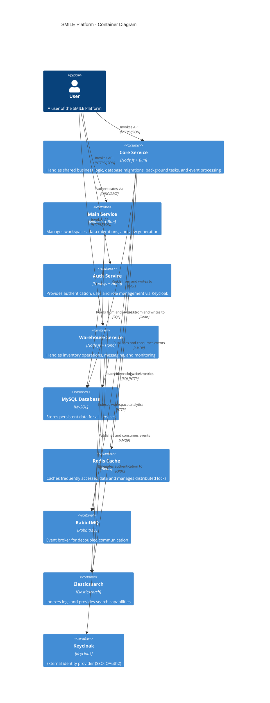

# Container Diagram

```mermaid
C4Container
title SMILE Platform - Container Diagram

Person(user, "User", "A user of the SMILE Platform")

Container(core, "Core Service", "Node.js + Bun", "Handles shared business logic, database migrations, background tasks, and event processing")
Container(main, "Main Service", "Node.js + Bun", "Manages workspaces, data migrations, and view generation")
Container(auth, "Auth Service", "Node.js + Hono", "Provides authentication, user and role management via Keycloak")
Container(warehouse, "Warehouse Service", "Node.js + Hono", "Handles inventory operations, messaging, and monitoring")
Container(db, "MySQL Database", "MySQL", "Stores persistent data for all services")
Container(redis, "Redis Cache", "Redis", "Caches frequently accessed data and manages distributed locks")
Container(rabbitmq, "RabbitMQ", "RabbitMQ", "Event broker for decoupled communication")
Container(elasticsearch, "Elasticsearch", "Elasticsearch", "Indexes logs and provides search capabilities")
Container(keycloak, "Keycloak", "Keycloak", "External identity provider (SSO, OAuth2)")

Rel(user, auth, "Authenticates via", "OIDC/REST")
Rel(user, core, "Invokes API", "HTTPS/JSON")
Rel(user, main, "Invokes API", "HTTPS/JSON")
Rel(user, warehouse, "Invokes API", "HTTPS/JSON")
Rel(core, db, "Reads from and writes to", "SQL")
Rel(main, db, "Reads from and writes to", "SQL")
Rel(warehouse, db, "Reads from and writes to", "SQL")
Rel(core, redis, "Reads from and writes to", "Redis")
Rel(core, rabbitmq, "Publishes and consumes events", "AMQP")
Rel(warehouse, rabbitmq, "Publishes and consumes events", "AMQP")
Rel(core, elasticsearch, "Indexes logs and metrics", "HTTP")
Rel(main, elasticsearch, "Indexes workspace analytics", "HTTP")
Rel(auth, keycloak, "Delegates authentication to", "OIDC")
```
