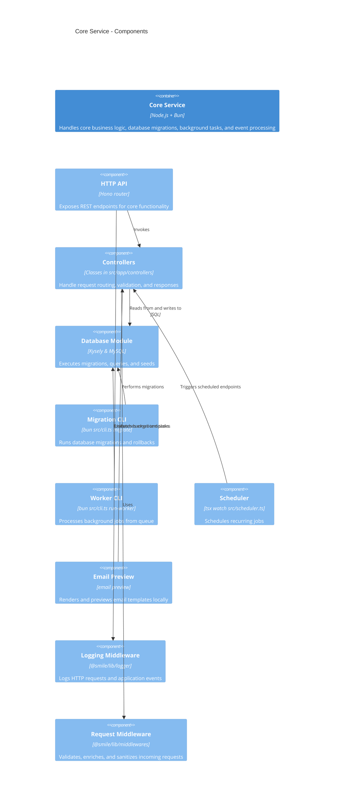

# Core Service - Component Diagram

```mermaid
C4Component
title Core Service - Components

Container(core, "Core Service", "Node.js + Bun", "Handles core business logic, database migrations, background tasks, and event processing")

Component(API, "HTTP API", "Hono router", "Exposes REST endpoints for core functionality")
Component(Controllers, "Controllers", "Classes in src/app/controllers", "Handle request routing, validation, and responses")
Component(DatabaseModule, "Database Module", "Kysely & MySQL", "Executes migrations, queries, and seeds")
Component(MigrationCLI, "Migration CLI", "bun src/cli.ts migrate", "Runs database migrations and rollbacks")
Component(WorkerCLI, "Worker CLI", "bun src/cli.ts run-worker", "Processes background jobs from queue")
Component(Scheduler, "Scheduler", "tsx watch src/scheduler.ts", "Schedules recurring jobs")
Component(EmailPreview, "Email Preview", "email preview", "Renders and previews email templates locally")
Component(LoggerMiddleware, "Logging Middleware", "@smile/lib/logger", "Logs HTTP requests and application events")
Component(RequestMiddleware, "Request Middleware", "@smile/lib/middlewares", "Validates, enriches, and sanitizes incoming requests")

Rel(API, Controllers, "Invokes")
Rel(Controllers, DatabaseModule, "Reads from and writes to", "SQL")
Rel(API, LoggerMiddleware, "Uses")
Rel(Controllers, RequestMiddleware, "Uses")
Rel(MigrationCLI, DatabaseModule, "Performs migrations")
Rel(WorkerCLI, DatabaseModule, "Executes background tasks")
Rel(Scheduler, Controllers, "Triggers scheduled endpoints")
Rel(EmailPreview, Controllers, "Fetches email templates")
```
