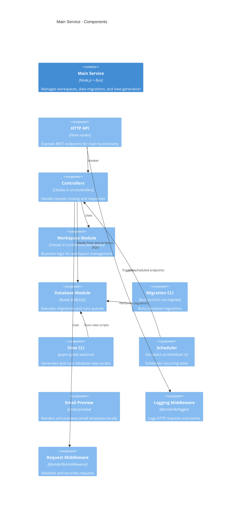

# Main Service - Component Diagram

```mermaid
C4Component
title Main Service - Components

Container(main, "Main Service", "Node.js + Bun", "Manages workspaces, data migrations, and view generation")

Component(API, "HTTP API", "Hono router", "Exposes REST endpoints for main functionality")
Component(Controllers, "Controllers", "Classes in src/controllers", "Handle request routing and responses")
Component(WorkspaceModule, "Workspace Module", "Classes in src/modules/workspace", "Business logic for workspace management")
Component(DatabaseModule, "Database Module", "Kysely & MySQL", "Executes migrations and runs queries")
Component(MigrationCLI, "Migration CLI", "bun src/cli.ts run-migrate", "Runs database migrations")
Component(ViewCLI, "View CLI", "pnpm kysely seed:run", "Generates and runs database view scripts")
Component(Scheduler, "Scheduler", "tsx watch src/scheduler.ts", "Schedules recurring tasks")
Component(EmailPreview, "Email Preview", "email preview", "Renders and previews email templates locally")
Component(LoggerMiddleware, "Logging Middleware", "@smile/lib/logger", "Logs HTTP requests and events")
Component(RequestMiddleware, "Request Middleware", "@smile/lib/middlewares", "Validates and enriches requests")

Rel(API, Controllers, "Invokes")
Rel(Controllers, WorkspaceModule, "Uses")
Rel(Controllers, DatabaseModule, "Reads from and writes to", "SQL")
Rel(MigrationCLI, DatabaseModule, "Performs migrations")
Rel(ViewCLI, DatabaseModule, "Runs view scripts")
Rel(Scheduler, Controllers, "Triggers scheduled endpoints")
Rel(API, LoggerMiddleware, "Uses")
Rel(Controllers, RequestMiddleware, "Uses")
```
