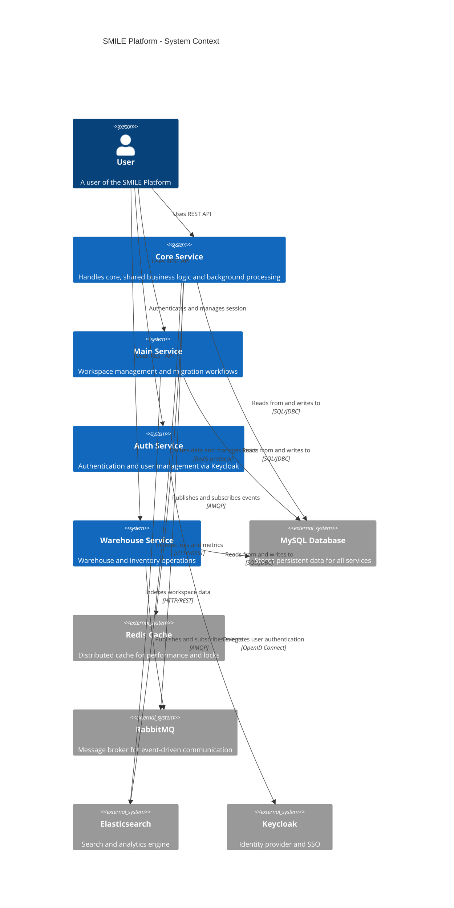

# System Context Diagram

```mermaid
C4Context
title SMILE Platform - System Context

Person(user, "User", "A user of the SMILE Platform")
System(core, "Core Service", "Handles core, shared business logic and background processing")
System(main, "Main Service", "Workspace management and migration workflows")
System(auth, "Auth Service", "Authentication and user management via Keycloak")
System(warehouse, "Warehouse Service", "Warehouse and inventory operations")
System_Ext(db, "MySQL Database", "Stores persistent data for all services")
System_Ext(redis, "Redis Cache", "Distributed cache for performance and locks")
System_Ext(rabbitmq, "RabbitMQ", "Message broker for event-driven communication")
System_Ext(elasticsearch, "Elasticsearch", "Search and analytics engine")
System_Ext(keycloak, "Keycloak", "Identity provider and SSO")

Rel(user, core, "Uses REST API")
Rel(user, main, "Uses REST API")
Rel(user, warehouse, "Uses REST API")
Rel(user, auth, "Authenticates and manages session")
Rel(core, db, "Reads from and writes to", "SQL/JDBC")
Rel(main, db, "Reads from and writes to", "SQL/JDBC")
Rel(warehouse, db, "Reads from and writes to", "SQL/JDBC")
Rel(core, redis, "Caches data and manages locks", "Redis protocol")
Rel(core, rabbitmq, "Publishes and subscribes events", "AMQP")
Rel(warehouse, rabbitmq, "Publishes and subscribes events", "AMQP")
Rel(core, elasticsearch, "Indexes logs and metrics", "HTTP/REST")
Rel(main, elasticsearch, "Indexes workspace data", "HTTP/REST")
Rel(auth, keycloak, "Delegates user authentication", "OpenID Connect")
```
