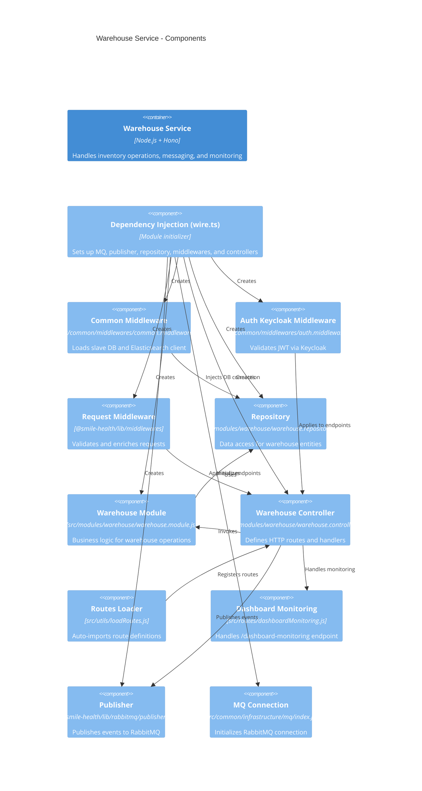

# Warehouse Service - Component Diagram

```mermaid
C4Component
title Warehouse Service - Components

Container(warehouse, "Warehouse Service", "Node.js + Hono", "Handles inventory operations, messaging, and monitoring")

Component(Wire, "Dependency Injection (wire.ts)", "Module initializer", "Sets up MQ, publisher, repository, middlewares, and controllers")
Component(CommonMiddleware, "Common Middleware", "src/common/middlewares/common.middleware.js", "Loads slave DB and Elasticsearch client")
Component(AuthKeycloakMiddleware, "Auth Keycloak Middleware", "src/common/middlewares/auth.middleware.js", "Validates JWT via Keycloak")
Component(RequestMiddleware, "Request Middleware", "@smile-health/lib/middlewares", "Validates and enriches requests")
Component(WarehouseRepository, "Repository", "src/modules/warehouse/warehouse.repository.js", "Data access for warehouse entities")
Component(WarehouseModule, "Warehouse Module", "src/modules/warehouse/warehouse.module.js", "Business logic for warehouse operations")
Component(WarehouseController, "Warehouse Controller", "src/modules/warehouse/warehouse.controller.js", "Defines HTTP routes and handlers")
Component(RoutesLoader, "Routes Loader", "src/utils/loadRoutes.js", "Auto-imports route definitions")
Component(DashboardMonitoringRoute, "Dashboard Monitoring", "src/routes/dashboardMonitoring.js", "Handles /dashboard-monitoring endpoint")
Component(Publisher, "Publisher", "@smile-health/lib/rabbitmq/publisher.js", "Publishes events to RabbitMQ")
Component(MQConnection, "MQ Connection", "src/common/infrastructure/mq/index.js", "Initializes RabbitMQ connection")

Rel(Wire, MQConnection, "Initializes")
Rel(Wire, Publisher, "Creates")
Rel(Wire, WarehouseRepository, "Creates")
Rel(Wire, CommonMiddleware, "Creates")
Rel(Wire, AuthKeycloakMiddleware, "Creates")
Rel(Wire, RequestMiddleware, "Creates")
Rel(Wire, WarehouseModule, "Creates")
Rel(Wire, WarehouseController, "Creates")

Rel(CommonMiddleware, WarehouseRepository, "Injects DB connection")
Rel(AuthKeycloakMiddleware, WarehouseController, "Applies to endpoints")
Rel(RequestMiddleware, WarehouseController, "Applies to endpoints")
Rel(WarehouseController, WarehouseModule, "Invokes")
Rel(WarehouseModule, WarehouseRepository, "Uses")
Rel(WarehouseController, Publisher, "Publishes events")
Rel(WarehouseController, DashboardMonitoringRoute, "Handles monitoring")
Rel(RoutesLoader, WarehouseController, "Registers routes")
```
