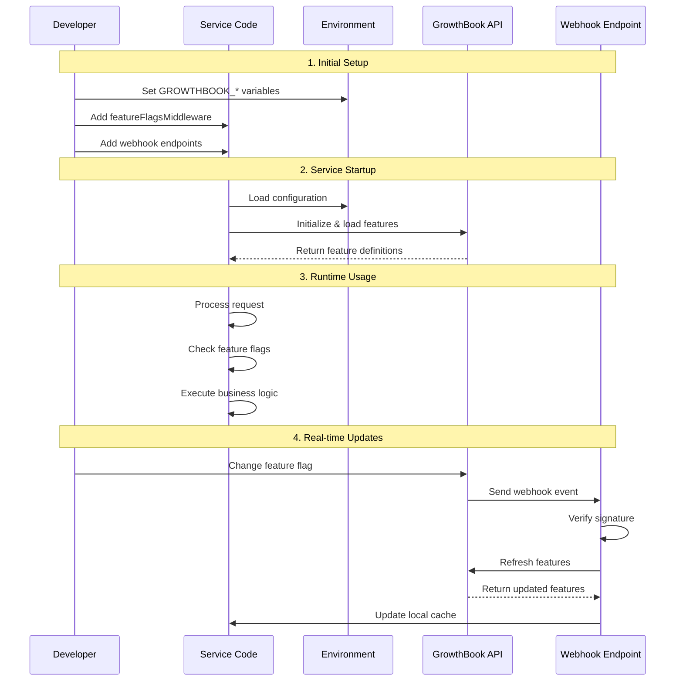
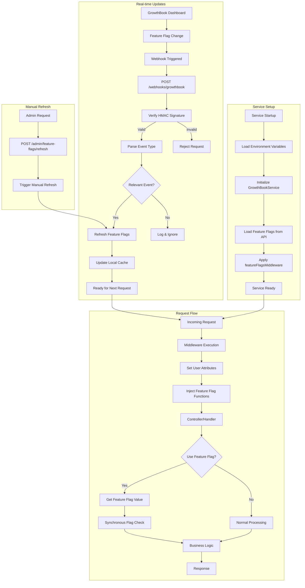
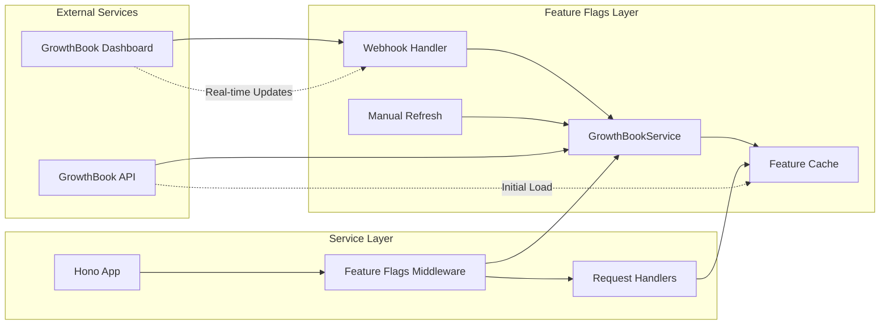
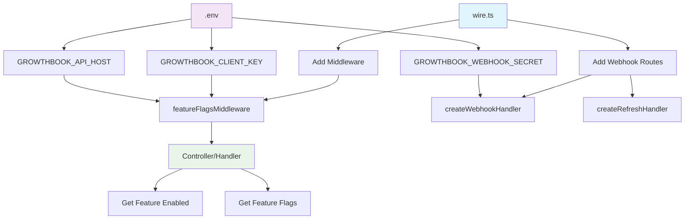

# Feature Flags Implementation Flow

## Implementation Steps

```mermaid
sequenceDiagram
    participant Dev as Developer
    participant Service as Service Code
    participant Env as Environment
    participant GB as GrowthBook API
    participant Webhook as Webhook Endpoint

    Note over Dev,Webhook: 1. Initial Setup
    Dev->>Env: Set GROWTHBOOK_* variables
    Dev->>Service: Add featureFlagsMiddleware
    Dev->>Service: Add webhook endpoints
    
    Note over Dev,Webhook: 2. Service Startup
    Service->>Env: Load configuration
    Service->>GB: Initialize & load features
    GB-->>Service: Return feature definitions
    
    Note over Dev,Webhook: 3. Runtime Usage
    Service->>Service: Process request
    Service->>Service: Check feature flags
    Service->>Service: Execute business logic
    
    Note over Dev,Webhook: 4. Real-time Updates
    Dev->>GB: Change feature flag
    GB->>Webhook: Send webhook event
    Webhook->>Webhook: Verify signature
    Webhook->>GB: Refresh features
    GB-->>Webhook: Return updated features
    Webhook->>Service: Update local cache
```

## Service Integration Diagram

```mermaid
flowchart TB
    subgraph Setup["Service Setup"]
        A[Service Startup] --> B[Load Environment Variables]
        B --> C[Initialize GrowthBookService]
        C --> D[Load Feature Flags from API]
        D --> E[Apply featureFlagsMiddleware]
        E --> F[Service Ready]
    end

    subgraph Request["Request Flow"]
        G[Incoming Request] --> H[Middleware Execution]
        H --> I[Set User Attributes]
        I --> J[Inject Feature Flag Functions]
        J --> K[Controller/Handler]
        K --> L{Use Feature Flag?}
        L -->|Yes| M[Get Feature Flag Value]
        L -->|No| N[Normal Processing]
        M --> O[Synchronous Flag Check]
        O --> P[Business Logic]
        N --> P
        P --> Q[Response]
    end

    subgraph Updates["Real-time Updates"]
        R[GrowthBook Dashboard] --> S[Feature Flag Change]
        S --> T[Webhook Triggered]
        T --> U[POST /webhooks/growthbook]
        U --> V[Verify HMAC Signature]
        V -->|Valid| W[Parse Event Type]
        V -->|Invalid| X[Reject Request]
        W --> Y{Relevant Event?}
        Y -->|Yes| Z[Refresh Feature Flags]
        Y -->|No| AA[Log & Ignore]
        Z --> BB[Update Local Cache]
        BB --> CC[Ready for Next Request]
    end

    subgraph Manual["Manual Refresh"]
        DD[Admin Request] --> EE[POST /admin/feature-flags/refresh]
        EE --> FF[Trigger Manual Refresh]
        FF --> Z
    end

    F --> G
    CC --> G
```

## Architecture Components

```mermaid
graph LR
    subgraph "Service Layer"
        A[Hono App] --> B[Feature Flags Middleware]
        B --> C[Request Handlers]
    end

    subgraph "Feature Flags Layer"
        D[GrowthBookService] --> E[Feature Cache]
        F[Webhook Handler] --> D
        G[Manual Refresh] --> D
    end

    subgraph "External Services"
        H[GrowthBook API] --> D
        I[GrowthBook Dashboard] --> F
    end

    B --> D
    C --> E
    H -.->|Initial Load| E
    I -.->|Real-time Updates| F
```

## Code Integration Points

```mermaid
flowchart TD
    A[wire.ts] --> B[Add Middleware]
    A --> C[Add Webhook Routes]
    
    B --> D[featureFlagsMiddleware]
    C --> E[createWebhookHandler]
    C --> F[createRefreshHandler]
    
    D --> G[Controller/Handler]
    G --> H[Get Feature Enabled]
    G --> I[Get Feature Flags]
    
    J[.env] --> K[GROWTHBOOK_CLIENT_KEY]
    J --> L[GROWTHBOOK_WEBHOOK_SECRET]
    J --> M[GROWTHBOOK_API_HOST]
    
    K --> D
    L --> E
    M --> D
    
    style A fill:#e1f5fe
    style J fill:#f3e5f5
    style G fill:#e8f5e8
```