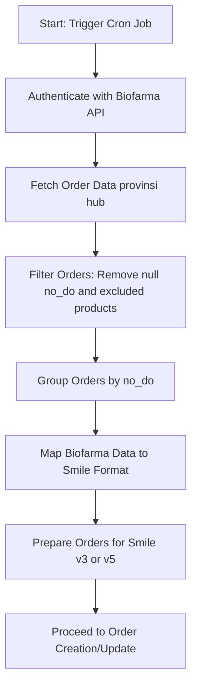
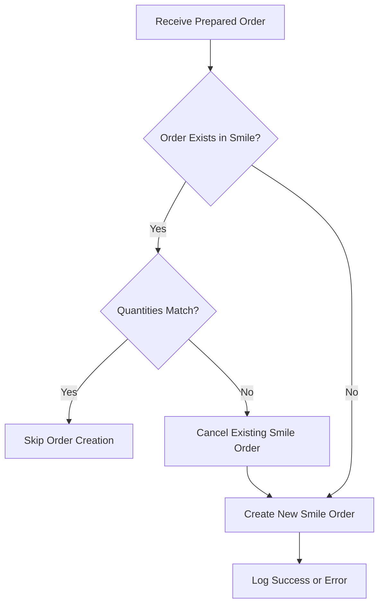
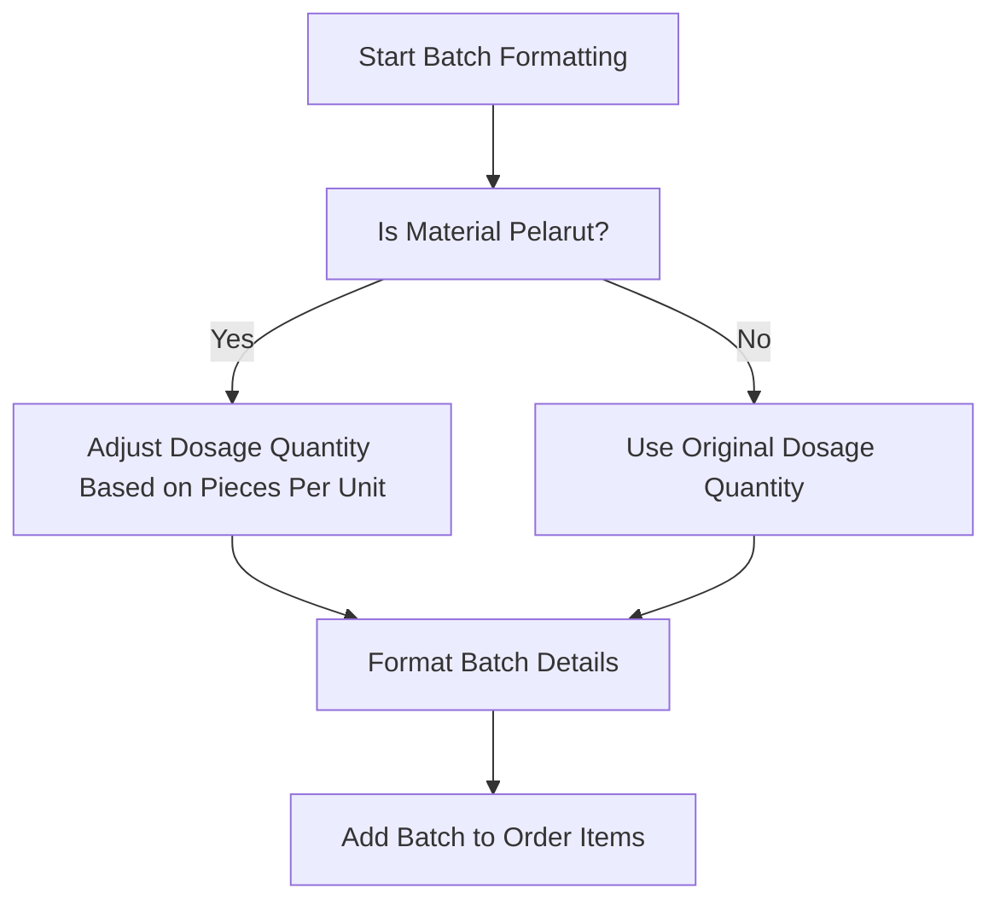
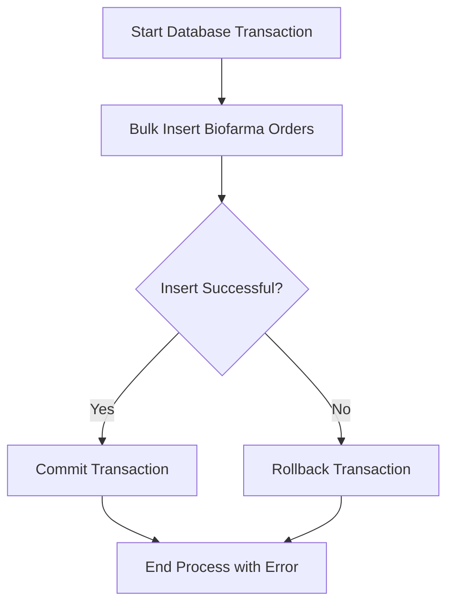

# Documentation: Process Flow of Biofarma Order Controller (v3.0)

## Overview

The Biofarma Order Controller (`biofarmaOrderController.js`) is responsible for synchronizing order data from Biofarma with the Smile platform. It fetches order data from Biofarma APIs, processes and formats the data, and creates or updates orders in Smile via API calls. This process is designed to run periodically via cron jobs.

---

## Process Flow

### 1. Fetching Biofarma Order Data

- The controller authenticates with the Biofarma API using credentials stored in environment variables.
- It fetches order data from different endpoints depending on the order type (`provinsi` or `hub`).
- Pagination and filtering are applied to retrieve all relevant data, including support for monthly or custom date ranges.

### 2. Data Filtering and Preparation

- Orders with null delivery order numbers (`no_do`) are filtered out.
- Orders with excluded product names (e.g., certain COVID-19 vaccines) are filtered out.
- The remaining orders are grouped by delivery order number (`no_do`).

### 3. Mapping Biofarma Data to Smile Format

- Each Biofarma order is mapped to the Smile order format using the `mapBiofarmaToSmile` function.
- Some area codes are adjusted based on predefined mappings.
- Additional data enrichment is performed, such as handling materials classified as "pelarut" (solvent) to adjust dosage quantities.

### 4. Preparing Orders for Smile

- Orders are prepared in batches, grouping items by delivery order number.
- For each order, batches are formatted with details like batch code, expiration date, quantity, and manufacturer.
- Two preparation methods exist: `prepareOrderSmile` for v3 orders and `prepareOrderSmileV2` for v5-compatible orders, which include activity IDs and version flags.

### 5. Creating or Updating Orders in Smile

- The controller checks if an order already exists in Smile and whether the quantities match.
- If the order exists but quantities differ, it attempts to update the order by canceling the existing one and creating a new one.
- If the order does not exist, it creates a new order in Smile via API calls.
- Duplicate orders are tracked to avoid repeated processing.

### 6. Transaction Management

- Biofarma orders are bulk inserted into the local database with duplicate handling.
- Sequelize transactions are used to ensure data integrity during bulk operations.

### 7. Additional Functionalities

- The controller supports fetching and processing Biofarma SMDV (vaccine dashboard) data.
- It provides functions to delete Biofarma orders that no longer exist in the source data.
- Logging is extensively used to track the process flow, successes, and errors.

---

## Key Components

- **Authentication:** Obtains access tokens from Biofarma API for secure requests.
- **Data Mapping:** Converts Biofarma order fields to Smile order schema.
- **Order Creation/Update:** Handles order lifecycle in Smile, including cancellation and recreation.
- **Batch Formatting:** Prepares batch details for order items.
- **Filtering:** Excludes specific products and invalid data.
- **Version Handling:** Supports both v3 and v5 order formats with version flags.
- **Error Handling:** Logs errors and continues processing to avoid blocking.

---

## Summary

The Biofarma Order Controller automates the synchronization of vaccine orders from Biofarma to Smile, ensuring data consistency and timely updates. It handles complex data transformations, API interactions, and transactional database operations to maintain accurate order records.

This process is critical for maintaining up-to-date vaccine distribution data and is designed to be run regularly via scheduled cron jobs.

---

## Process Flow Diagrams

Below are multiple flow diagrams in MermaidJS format illustrating key flows within the Biofarma Order Controller.

### 1. Fetching and Preparing Biofarma Orders

### 2. Creating or Updating Orders in Smile

### 3. Batch Formatting and Material Handling

### 4. Transaction Management and Database Operations

