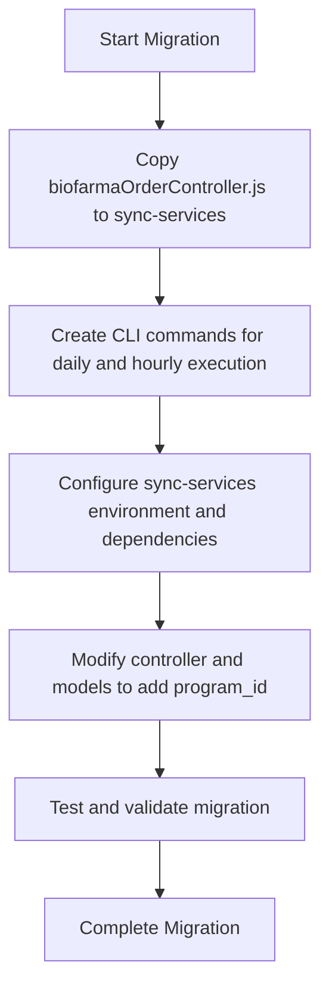
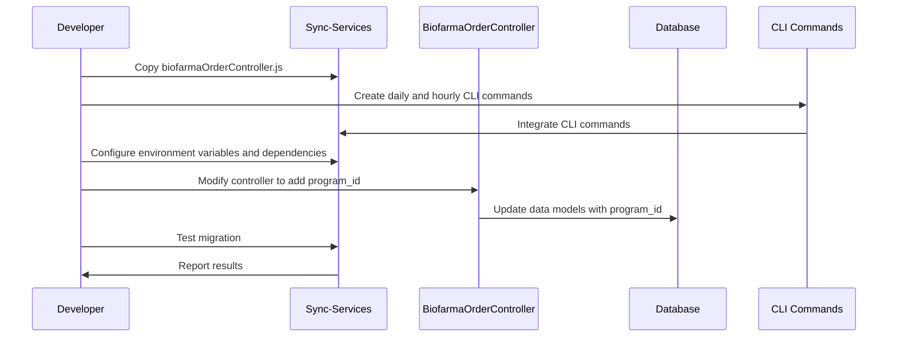

# Migration Guide: Implementing Biofarma Order Controller v3.0 to v5.0

## Overview

This document outlines the steps to migrate the Biofarma Order Controller from version 3.0, located in `apps/3.0/main-api/app/controllers/biofarmaOrderController.js`, to version 5.0 in the `sync-services` service. The migration includes copying the controller, creating CLI commands for daily and hourly execution, configuring the sync-services environment for compatibility, and adding the `program_id` field for immunization program compatibility.

---

## Migration Steps

### 1. Copy Controller to Sync-Services

- Copy the `biofarmaOrderController.js` file from `apps/3.0/main-api/app/controllers/` to the appropriate controllers directory in the `sync-services` project.
- Ensure all dependencies and imports are resolved within the new project context.

### 2. Create CLI Commands for Daily and Hourly Execution

- Implement CLI commands in `sync-services` to run the Biofarma Order Controller processes on a daily and hourly schedule.
- The commands should accept parameters to specify execution mode (e.g., `--isV2`, `--monthly`).
- Integrate these commands with the existing CLI framework in `sync-services`.

### 3. Configure Sync-Services for Compatibility

- Adjust environment variables and configuration files in `sync-services` to include necessary Biofarma and Smile API credentials.
- Ensure the database models and ORM configurations in `sync-services` support the data structures used by the controller.
- Verify logging and error handling are consistent with `sync-services` standards.

### 4. Add `program_id` for Immunization Program Compatibility

- Modify the controller and related data models to include the `program_id` field representing the immunization program.
- Ensure that this field is populated correctly during order processing and persisted in the database.
- Update any API payloads or integrations to include `program_id` where applicable.

---

## Flowchart

---

## Sequence Diagram

---

## Summary

Migrating the Biofarma Order Controller from v3.0 to v5.0 involves relocating the controller to the `sync-services` project, creating CLI commands for scheduled execution, configuring the environment for compatibility, and enhancing the data model with the `program_id` field. The included flowchart and sequence diagram illustrate the migration process steps and interactions.
