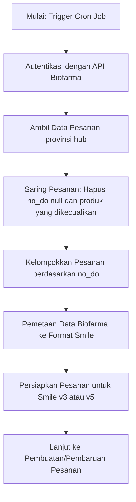
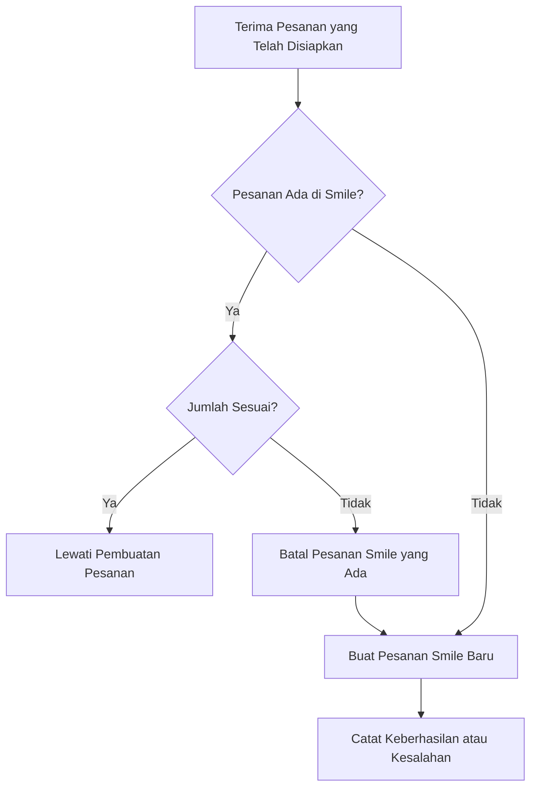
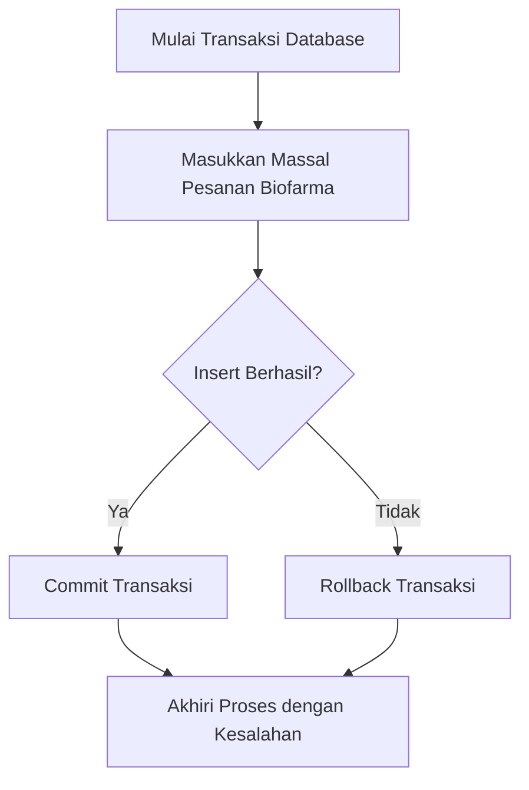

# Dokumentasi: Alur Proses Biofarma Order Controller (v3.0)

## Ikhtisar

Biofarma Order Controller (`biofarmaOrderController.js`) bertanggung jawab untuk menyinkronkan data pesanan dari Biofarma dengan platform Smile. Controller ini mengambil data pesanan dari API Biofarma, memproses dan memformat data tersebut, serta membuat atau memperbarui pesanan di Smile melalui panggilan API. Proses ini dirancang untuk dijalankan secara berkala melalui cron job.

---

## Alur Proses

### 1. Pengambilan Data Pesanan Biofarma

- Controller melakukan autentikasi dengan API Biofarma menggunakan kredensial yang disimpan di variabel lingkungan.
- Mengambil data pesanan dari endpoint yang berbeda tergantung pada jenis pesanan (`provinsi` atau `hub`).
- Penerapan paginasi dan penyaringan untuk mengambil semua data yang relevan, termasuk dukungan untuk rentang tanggal bulanan atau kustom.

### 2. Penyaringan dan Persiapan Data

- Pesanan dengan nomor delivery order (`no_do`) yang bernilai null disaring keluar.
- Pesanan dengan nama produk yang dikecualikan (misalnya, beberapa vaksin COVID-19 tertentu) disaring keluar.
- Pesanan yang tersisa dikelompokkan berdasarkan nomor delivery order (`no_do`).

### 3. Pemetaan Data Biofarma ke Format Smile

- Setiap pesanan Biofarma dipetakan ke format pesanan Smile menggunakan fungsi `mapBiofarmaToSmile`.
- Beberapa kode area disesuaikan berdasarkan pemetaan yang telah ditentukan.
- Enrichment data tambahan dilakukan, seperti penanganan material yang diklasifikasikan sebagai "pelarut" untuk menyesuaikan jumlah dosis.

### 4. Persiapan Pesanan untuk Smile

- Pesanan disiapkan dalam batch, mengelompokkan item berdasarkan nomor delivery order.
- Untuk setiap pesanan, batch diformat dengan detail seperti kode batch, tanggal kedaluwarsa, jumlah, dan produsen.
- Terdapat dua metode persiapan: `prepareOrderSmile` untuk pesanan v3 dan `prepareOrderSmileV2` untuk pesanan kompatibel v5, yang mencakup ID aktivitas dan flag versi.

### 5. Pembuatan atau Pembaruan Pesanan di Smile

- Controller memeriksa apakah pesanan sudah ada di Smile dan apakah jumlahnya sesuai.
- Jika pesanan ada tetapi jumlahnya berbeda, controller mencoba memperbarui pesanan dengan membatalkan pesanan yang ada dan membuat yang baru.
- Jika pesanan belum ada, controller membuat pesanan baru di Smile melalui panggilan API.
- Pesanan duplikat dilacak untuk menghindari pemrosesan berulang.

### 6. Manajemen Transaksi

- Pesanan Biofarma dimasukkan secara massal ke database lokal dengan penanganan duplikat.
- Transaksi Sequelize digunakan untuk memastikan integritas data selama operasi massal.

### 7. Fungsionalitas Tambahan

- Controller mendukung pengambilan dan pemrosesan data Biofarma SMDV (dashboard vaksin).
- Menyediakan fungsi untuk menghapus pesanan Biofarma yang tidak lagi ada di data sumber.
- Logging digunakan secara ekstensif untuk melacak alur proses, keberhasilan, dan kesalahan.

---

## Komponen Utama

- **Autentikasi:** Mendapatkan token akses dari API Biofarma untuk permintaan yang aman.
- **Pemetaan Data:** Mengonversi field pesanan Biofarma ke skema pesanan Smile.
- **Pembuatan/Pembaruan Pesanan:** Menangani siklus hidup pesanan di Smile, termasuk pembatalan dan pembuatan ulang.
- **Format Batch:** Menyiapkan detail batch untuk item pesanan.
- **Penyaringan:** Mengecualikan produk tertentu dan data yang tidak valid.
- **Penanganan Versi:** Mendukung format pesanan v3 dan v5 dengan flag versi.
- **Penanganan Kesalahan:** Mencatat kesalahan dan melanjutkan pemrosesan untuk menghindari pemblokiran.

---

## Ringkasan

Biofarma Order Controller mengotomatisasi sinkronisasi pesanan vaksin dari Biofarma ke Smile, memastikan konsistensi data dan pembaruan tepat waktu. Controller ini menangani transformasi data yang kompleks, interaksi API, dan operasi database transaksional untuk menjaga akurasi catatan pesanan.

Proses ini sangat penting untuk menjaga data distribusi vaksin yang terbaru dan dirancang untuk dijalankan secara rutin melalui cron job yang dijadwalkan.

---

## Diagram Alur Proses

Berikut adalah beberapa diagram alur dalam format MermaidJS yang menggambarkan alur utama dalam Biofarma Order Controller.

### 1. Pengambilan dan Persiapan Pesanan Biofarma



### 2. Pembuatan atau Pembaruan Pesanan di Smile



### 3. Format Batch dan Penanganan Material

```mermaid
flowchart TD
  A[Mulai Format Batch] --> B{Apakah Material "Pelarut"?}
  B -- Ya --> C[Sesuaikan Jumlah Dosis Berdasarkan Potongan Per Unit]
  B -- Tidak --> D[Gunakan Jumlah Dosis Asli]
  C --> E[Format Detail Batch]
  D --> E[Format Detail Batch]
  E --> F[Tambahkan Batch ke Item Pesanan]
```

### 4. Manajemen Transaksi dan Operasi Database


