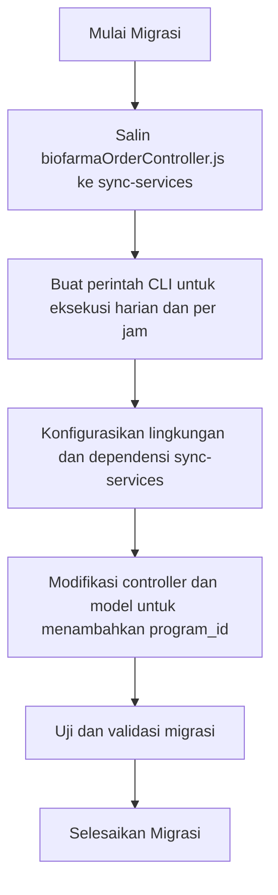
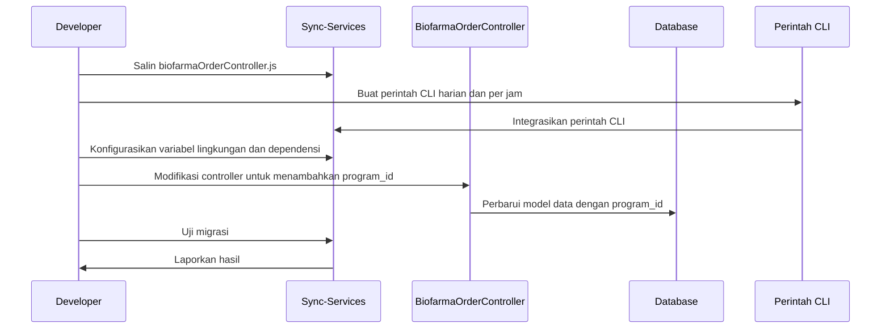

# Panduan Migrasi: Implementasi Biofarma Order Controller v3.0 ke v5.0

## Ikhtisar

Dokumen ini menguraikan langkah-langkah untuk memigrasi Biofarma Order Controller dari versi 3.0, yang berada di `apps/3.0/main-api/app/controllers/biofarmaOrderController.js`, ke versi 5.0 di layanan `sync-services`. Migrasi ini mencakup penyalinan controller, pembuatan perintah CLI untuk eksekusi harian dan per jam, konfigurasi lingkungan sync-services agar kompatibel, serta penambahan field `program_id` untuk kompatibilitas program imunisasi.

---

## Langkah Migrasi

### 1. Salin Controller ke Sync-Services

- Salin file `biofarmaOrderController.js` dari `apps/3.0/main-api/app/controllers/` ke direktori controller yang sesuai di proyek `sync-services`.
- Pastikan semua dependensi dan impor disesuaikan dengan konteks proyek baru.

### 2. Buat Perintah CLI untuk Eksekusi Harian dan Per Jam

- Implementasikan perintah CLI di `sync-services` untuk menjalankan proses Biofarma Order Controller secara harian dan per jam.
- Perintah harus menerima parameter untuk menentukan mode eksekusi (misalnya `--isV2`, `--monthly`).
- Integrasikan perintah ini dengan framework CLI yang sudah ada di `sync-services`.

### 3. Konfigurasikan Sync-Services agar Kompatibel

- Sesuaikan variabel lingkungan dan file konfigurasi di `sync-services` untuk menyertakan kredensial API Biofarma dan Smile yang diperlukan.
- Pastikan model database dan konfigurasi ORM di `sync-services` mendukung struktur data yang digunakan oleh controller.
- Verifikasi bahwa logging dan penanganan error konsisten dengan standar `sync-services`.

### 4. Tambahkan `program_id` untuk Kompatibilitas Program Imunisasi

- Modifikasi controller dan model data terkait untuk menyertakan field `program_id` yang merepresentasikan program imunisasi.
- Pastikan field ini diisi dengan benar selama pemrosesan pesanan dan disimpan di database.
- Perbarui payload API atau integrasi lain untuk menyertakan `program_id` jika diperlukan.

---

## Diagram Alur (Flowchart)

---

## Diagram Urutan (Sequence Diagram)

---

## Ringkasan

Migrasi Biofarma Order Controller dari v3.0 ke v5.0 melibatkan pemindahan controller ke proyek `sync-services`, pembuatan perintah CLI untuk eksekusi terjadwal, konfigurasi lingkungan agar kompatibel, dan penambahan field `program_id` pada model data. Diagram alur dan diagram urutan yang disertakan menggambarkan langkah-langkah proses migrasi dan interaksi yang terjadi.
