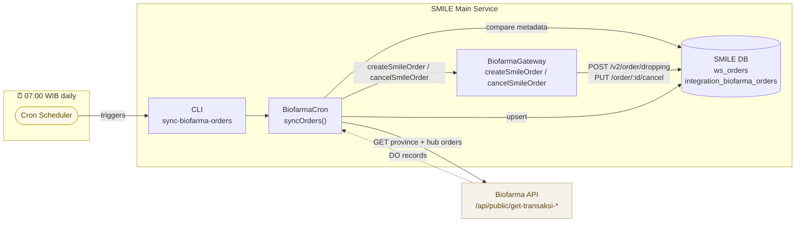
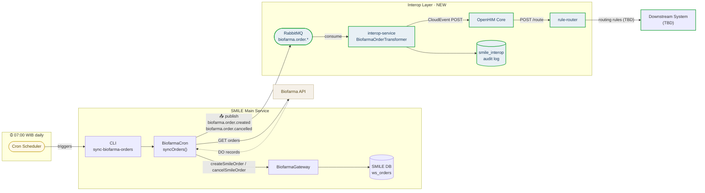
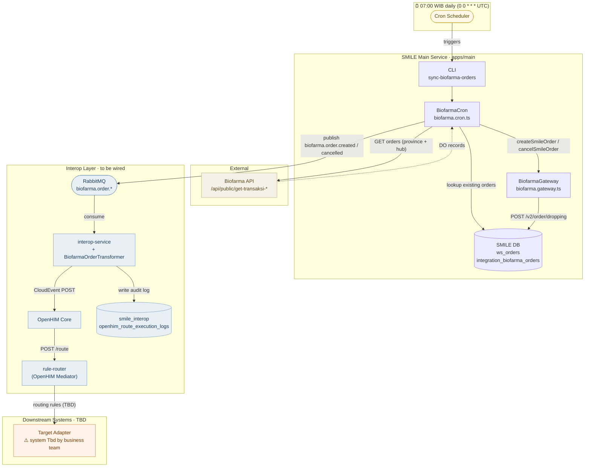
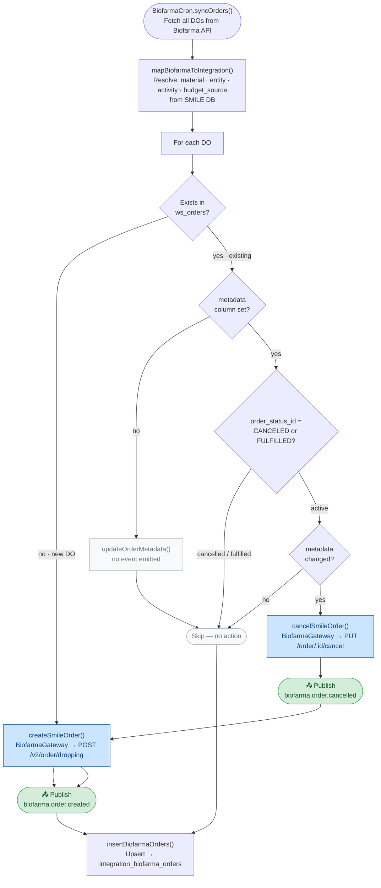
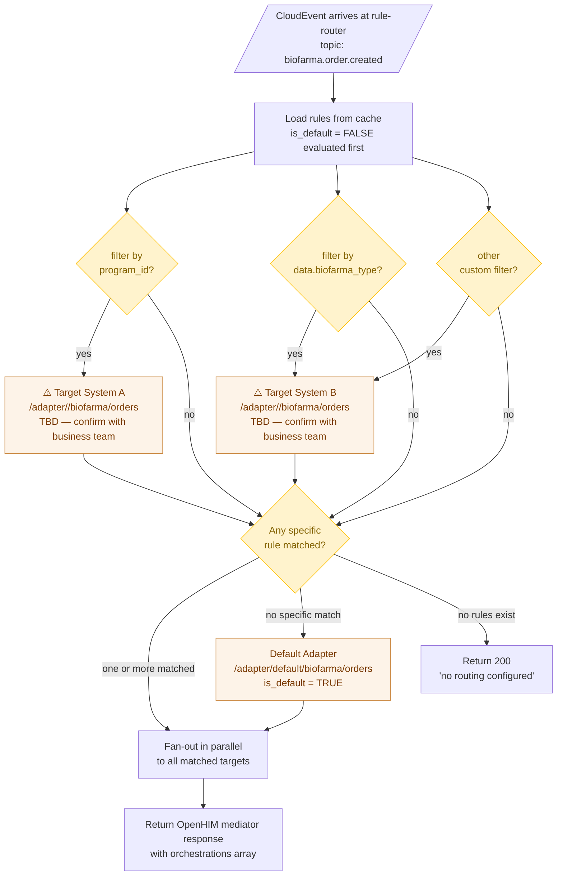
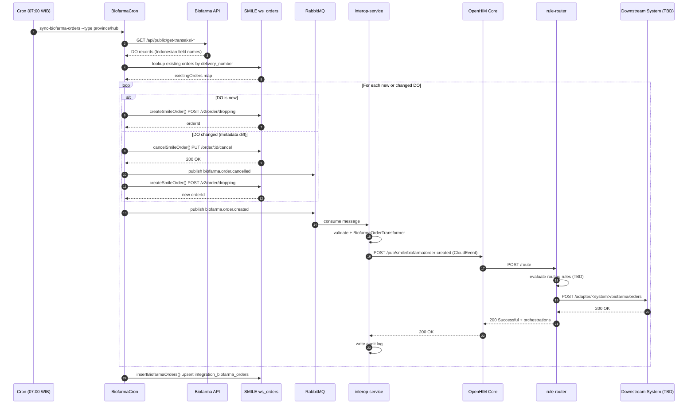

# Biofarma Order Integration via Interop Layer

## Overview

The Biofarma integration syncs vaccine delivery orders (DO — Delivery Orders) from PT Bio Farma (Persero)'s external API into SMILE's internal order system. It runs as a scheduled job every day at **07:00 WIB**.

This document describes how to wire Biofarma order lifecycle events through the interop pipeline so that downstream systems can be notified when vaccine deliveries are created or cancelled inside SMILE.

> ⚠️ **Current state**: The integration today is entirely internal — data flows `Biofarma API → BiofarmaCron → ws_orders`. There is **no outbound notification to any external system**. The interop layer wiring described here is a **design guide** for adding that outbound leg. Actual downstream target systems and filter criteria must be confirmed with the business/integration team before implementing the routing rules in Steps 3–4.

---

### Scheduled Trigger

| Job | Schedule | Timezone | CLI Command |
|-----|----------|----------|-------------|
| Order sync — province | **07:00 WIB** daily | WIB (UTC+7) = 00:00 UTC | `bun ./src/cli.ts sync-biofarma-orders --type province` |
| Order sync — hub | **07:00 WIB** daily | WIB (UTC+7) = 00:00 UTC | `bun ./src/cli.ts sync-biofarma-orders --type hub` |
| Dashboard sync (SMDV) | Configurable | WIB (UTC+7) | `bun ./src/cli.ts sync-biofarma-dashboard --type province` |

**Cron expression:**
```
0 0 * * *   # 00:00 UTC = 07:00 WIB
```

### Implementation Entry Points

| File | Purpose |
|------|---------|
| [biofarma.cron.ts](../../../apps/main/src/modules/order-integration/biofarma/biofarma.cron.ts) | `BiofarmaCron` — core sync logic (syncOrders, syncDashboard) |
| [biofarma.gateway.ts](../../../apps/main/src/modules/order-integration/biofarma/biofarma.gateway.ts) | `BiofarmaGateway` — HTTP client for Biofarma API and SMILE API |
| [biofarma.repository.ts](../../../apps/main/src/modules/order-integration/biofarma/biofarma.repository.ts) | `BiofarmaRepository` — DB reads/writes |
| [sync_orders.ts](../../../apps/main/src/scripts/cron/biofarma/sync_orders.ts) | CLI entry point — sets up transaction context and invokes `BiofarmaCron` |

---

## Before & After the Interop Layer

### Before — Current State

Data flows only inward. SMILE consumes from Biofarma. Nothing is notified externally.



**What's missing:** No external system is told when a vaccine delivery order is created or cancelled inside SMILE. The only record is `console.log` output and `integration_biofarma_orders` in the local DB.

---

### After — With Interop Layer

Same inbound sync remains unchanged. A publish step is added at the end of each `createSmileOrder` / `cancelSmileOrder` call, feeding the interop pipeline.



---

### What Changes

| | Before | After |
|--|--------|-------|
| Biofarma → SMILE sync | `BiofarmaCron.syncOrders()` daily at 07:00 WIB | **Unchanged** |
| Order created in SMILE | Written to `ws_orders` | **Unchanged** + publishes `biofarma.order.created` to RabbitMQ |
| Order cancelled in SMILE | Cancelled via `cancelSmileOrder()` | **Unchanged** + publishes `biofarma.order.cancelled` to RabbitMQ |
| External systems notified | **None** | Via `interop-service` → OpenHIM → downstream adapter (TBD) |
| Audit trail | `console.log` only | `openhim_route_execution_logs` per event with HTTP status, timing, payload |
| Add new downstream system | Code change required | Insert row into `integration_routing_rules` → reload cache |
| Field names sent externally | Indonesian (`no_do`, `kode_area`, `jm_dosis`, ...) | English (`delivery_number`, `area_code`, `quantity_doses`, ...) via `BiofarmaOrderTransformer` |

---

### Code Change Required (Minimal)

Only one addition is needed inside `BiofarmaCron.syncOrders()` — a publish call after each successful `createSmileOrder` / `cancelSmileOrder`:

```typescript
// After createSmileOrder() succeeds — add:
await this.publishEvent("biofarma.order.created", item, context)

// After cancelSmileOrder() succeeds — add:
await this.publishEvent("biofarma.order.cancelled", item, context)
```

Everything else (route mapping, OpenHIM channel, routing rules, transformer) is configuration — no further code changes to `BiofarmaCron` are needed.

---

## System Architecture



---

## What the Code Actually Does (Current Flow)

### `BiofarmaCron.syncOrders()` — per type (province / hub)



### Key data lookups inside `syncOrders()`

| Lookup | Source | Used for |
|--------|--------|---------|
| `getMapOrderByNomorDO()` | `ws_orders` | Detect new vs. existing DOs |
| `getMapEntityIdByCode()` | entity table | Resolve `customer_id` and `vendor_id` from `kode_area` |
| `getMapMaterialByCode()` | materials table | Resolve `material_id` and `program_id` from product name |
| `getMapActivityByProgramId()` | activity table | Resolve `activity_id` per program |
| `getMapBudgetSourceByProgramId()` | budget source table | Resolve `budget_source_id` per program |
| `getMaterialManufactureGroup()` | manufacture table | Find "Biofarma" manufacture record for batch creation |

### `BiofarmaCron.syncDashboard()` — per type (province / hub)

Fetches SMDV distribution data from:
- `get_province_dashboard` → `getProvinceDashboard()`
- `get_hub_dashboard` → `getHubDashboard()`

Maps to `integration_biofarma_smdv_orders` table in batches of 10,000 rows. Publishes `biofarma.order.smdv.synced` after each successful batch insert.

---

## Events Published to RabbitMQ

| Topic | Trigger | Published by |
|-------|---------|-------------|
| `biofarma.order.created` | New DO successfully created in SMILE via `createSmileOrder()` | `BiofarmaCron.syncOrders()` |
| `biofarma.order.cancelled` | Existing DO cancelled due to changed batch data via `cancelSmileOrder()` | `BiofarmaCron.syncOrders()` |
| `biofarma.order.smdv.synced` | SMDV dashboard data inserted into `integration_biofarma_smdv_orders` | `BiofarmaCron.syncDashboard()` |

> **Volume per run**: equals the number of new/changed DOs in the date range. Daily incremental runs typically emit a small number; a full historical backfill (`--startDate BIOFARMA_STARTDATE`) may emit hundreds.

---

## Idempotency

The sync re-fetches data daily, so the same DO can appear on multiple runs. `interop-service` does not deduplicate — **downstream adapters must handle idempotent processing** using `delivery_number` (`no_do`) as the upsert key.

---

## Interop Layer Wiring Guide

Follow [adding-new-event.md](../adding-new-event.md) Scenario A. The steps below provide Biofarma-specific SQL values. **Replace placeholder adapter URLs with real targets once downstream systems are confirmed.**

### Step 1 — Confirm the RabbitMQ Topic Name

Topic: **`biofarma.order.created`**

Published inside `BiofarmaCron.syncOrders()` [biofarma.cron.ts:~261](../../../apps/main/src/modules/order-integration/biofarma/biofarma.cron.ts) once per DO after `createSmileOrder()` succeeds. **Publish timing: 07:00 WIB daily** (cron: `0 0 * * *` UTC).

---

### Step 2 — Insert Route Mapping

```sql
INSERT INTO openhim_route_mappings (
  rabbitmq_topic,
  enabled,
  openhim_channel_id,
  openhim_channel_name,
  http_method,
  request_path,
  headers_json,
  include_context,
  auth_type,
  max_retries,
  retry_backoff_ms,
  retry_backoff_multiplier,
  expected_status_codes,
  created_by
) VALUES (
  'biofarma.order.created',
  1,
  'smile-biofarma-order-created-channel',
  'SMILE Biofarma Order Created Channel',
  'POST',
  '/pub/smile/biofarma/order-created',
  JSON_OBJECT('Content-Type', 'application/json', 'Accept', 'application/json'),
  1,        -- include program_id, user_id, workspace_id as CloudEvent extensions
  'basic',
  3,        -- max retries
  1000,     -- initial backoff ms
  2,        -- backoff multiplier (1s → 2s → 4s)
  '200,201,202,204',
  'system'
);
```

Add to [apps/interop-service/db-scripts/route-mapping-insert.sql](../../../apps/interop-service/db-scripts/route-mapping-insert.sql).

---

### Step 3 — Create the OpenHIM Channel

| Field | Value |
|-------|-------|
| Name | `SMILE Biofarma Order Created Channel` |
| URL Pattern | `/pub/smile/biofarma/order-created` |
| Type | HTTP |
| Status | Enabled |
| Allowed clients | `smile-app` |
| Route | `rule-router` host:4005 path `/route` |

---

### Step 4 — Insert Routing Rules

> ⚠️ The filter keys and target URLs below are **placeholders**. Replace `program_id` values and `/adapter/<system>/...` paths with the actual confirmed targets.

The `program_id` available in the CloudEvent is resolved by `mapMaterial[produk].program_id` inside `BiofarmaCron`. The `biofarma_type` field (`"province"` or `"hub"`) is available as `data.biofarma_type` for field-level filtering.



**Template SQL — replace placeholders before running:**

```sql
-- Rule 1: filter by program_id (replace value and target_url)
INSERT INTO integration_routing_rules
  (topic, filter_key, filter_operator, filter_value, target_url, target_name, is_default, priority, enabled)
VALUES
  (
    'biofarma.order.created',
    'program_id', 'eq', '<PROGRAM_ID>',          -- e.g. the program_id of your vaccine program
    '/adapter/<your-system>/biofarma/orders',     -- confirm with your adapter team
    '<System Name> - Biofarma Order Created',
    FALSE, 1, TRUE
  );

-- Rule 2: filter by delivery type (province or hub)
INSERT INTO integration_routing_rules
  (topic, filter_key, filter_operator, filter_value, target_url, target_name, is_default, priority, enabled)
VALUES
  (
    'biofarma.order.created',
    'data.biofarma_type', 'eq', 'province',
    '/adapter/<your-system>/biofarma/orders/province',
    '<System Name> - Biofarma Province Order Created',
    FALSE, 2, TRUE
  );

-- Default fallback: catch-all when no specific rule matches
INSERT INTO integration_routing_rules
  (topic, filter_key, filter_operator, filter_value, target_url, target_name, is_default, priority, enabled)
VALUES
  (
    'biofarma.order.created',
    'program_id', 'eq', '',
    '/adapter/default/biofarma/orders',
    'Default - Biofarma Order Created',
    TRUE, 99, TRUE
  );
```

Add to [apps/openhim-mediators/rule-router/db-scripts/routing-rules-insert.sql](../../../apps/openhim-mediators/rule-router/db-scripts/routing-rules-insert.sql).

---

### Step 5 — Custom Transformer (Required)

The Biofarma payload uses Indonesian field names (`no_do`, `kode_area`, `jm_dosis`, etc.). A `BiofarmaOrderTransformer` normalises them to English before forwarding.

**Create** in `apps/interop-service/src/modules/transformers/biofarma-order.transformer.ts`:

```typescript
export class BiofarmaOrderTransformer extends BaseTransformer {
  readonly topic = "biofarma.order.created";
  readonly cloudEventType = "com.smile.biofarma.order.created";

  transform(
    payload: unknown,
    context?: MessageContext,
  ): CloudEvent<Record<string, unknown>> {
    this.requireFields(payload, [
      "no_do", "kode_area", "produk", "no_batch", "jm_dosis", "biofarma_type",
    ]);

    const obj = payload as Record<string, unknown>;

    return this.createCloudEvent(
      {
        delivery_number:          obj.no_do,
        delivery_date:            obj.tanggal_do ?? null,
        purchase_order_number:    obj.no_po ?? null,
        area_code:                String(obj.kode_area),
        sender:                   obj.pengirim ?? null,
        destination:              obj.tujuan ?? null,
        product_name:             obj.produk,
        product_code_kemenkes:    obj.code_product_kemenkes ?? null,
        batch_number:             obj.no_batch,
        expiry_date:              obj.expired_date ?? null,
        quantity_vials:           obj.jm_vial ?? null,
        quantity_doses:           obj.jm_dosis,
        quantity_vials_received:  obj.jm_vial_terima ?? null,
        quantity_doses_received:  obj.jm_dosis_terima ?? null,
        status:                   obj.status ?? null,
        ship_date:                obj.tanggal_kirim ?? null,
        receive_date:             obj.tanggal_terima ?? null,
        delivery_type:            obj.biofarma_type,   // "province" | "hub"
        service_type:             obj.service_type ?? null,
        document_number:          obj.no_document ?? null,
        released_date:            obj.released_date ?? null,
        notes:                    obj.notes ?? null,
        entrance_type:            obj.entrance_type ?? null,
        grant_country:            obj.grant_country ?? null,
        manufacture_country:      obj.manufacture_country ?? null,
        unit_price:               obj.unit_price ?? 0,
      },
      this.extractSubject(payload),
      context,
    );
  }

  extractSubject(payload: unknown): string | undefined {
    const noDo = this.getField(payload, "no_do");
    return noDo !== undefined ? `biofarma_do_${noDo}` : undefined;
  }
}
```

**Register** in `apps/interop-service/src/modules/transformers/registry.ts`:

```typescript
// Inside initializeDefaultTransformers():
this.register("biofarma.order.created", new BiofarmaOrderTransformer());
```

Set `ENABLE_PAYLOAD_TRANSFORMATION=true` in the `interop-service` environment to activate.

---

### Step 6 — Reload Caches

```bash
curl -X POST http://localhost:4004/admin/refresh-routes
curl -X POST http://localhost:4005/admin/refresh-rules

# Verify
curl http://localhost:4004/admin/routes | jq '[.routes[] | .rabbitmq_topic]'
curl http://localhost:4005/admin/rules | jq '[.rules[] | {topic: .topic, target: .target_name}]'
```

### Step 7 — Redeploy

Required because a transformer was added:

```bash
# Docker Compose
docker compose up --build interop-service

# Kubernetes
kubectl set image deployment/interop-service interop-service=your-registry/interop-service:v1.x
kubectl rollout status deployment/interop-service
```

---

## Sample Payloads

### RabbitMQ Message (`biofarma.order.created`)

> `user_id` and `user_email` are `null` — this is a system-scheduled job with no user session. `client_key` comes from `integration_clients` where `key = 'biofarma'`. `program_id` is resolved per material by `mapMaterial[produk].program_id`.

```json
{
  "topic": "biofarma.order.created",
  "payload": {
    "no_do": "DO-2025-BF-00123",
    "tanggal_do": "2025-03-01",
    "no_po": "PO-2025-00456",
    "kode_area": "3201",
    "pengirim": "PT Bio Farma (Persero)",
    "tujuan": "Dinas Kesehatan Provinsi Jawa Barat",
    "alamat": "Jl. Pasteur No. 25, Bandung",
    "produk": "VAKSIN BCG (KERING) AMP 10 DOS",
    "no_batch": "BCG20250201A",
    "expired_date": "2026-08-31",
    "jm_vial": 500,
    "jm_dosis": 5000,
    "jm_vial_terima": 500,
    "jm_dosis_terima": 5000,
    "status": "TERIMA",
    "tanggal_kirim": "2025-03-01",
    "tanggal_terima": "2025-03-03",
    "biofarma_type": "province",
    "service_type": "REGULER",
    "no_document": "SURAT-2025-001",
    "released_date": "2025-02-28",
    "notes": null,
    "code_product_kemenkes": "BCG-001",
    "entrance_type": null,
    "grant_country": null,
    "manufacture_country": "Indonesia",
    "unit_price": 0
  },
  "context": {
    "program_id": 1,
    "workspace_id": 2,
    "user_id": null,
    "user_email": null,
    "request_id": "bf-sync-2025-03-09T00:00:00Z-DO-2025-BF-00123",
    "trace_id": "00-4bf92f3577b34da6a3ce929d0e0e4736-00f067aa0ba902b7-01",
    "client_key": "biofarma"
  },
  "headers": {
    "traceparent": "00-4bf92f3577b34da6a3ce929d0e0e4736-00f067aa0ba902b7-01"
  }
}
```

### CloudEvent (after `BiofarmaOrderTransformer`)

```json
{
  "specversion": "1.0",
  "type": "com.smile.biofarma.order.created",
  "source": "urn:smile:biofarma",
  "id": "550e8400-e29b-41d4-a716-446655440001",
  "time": "2025-03-09T00:00:01.000Z",
  "datacontenttype": "application/json",
  "subject": "biofarma_do_DO-2025-BF-00123",
  "program_id": "1",
  "workspace_id": "2",
  "user_id": null,
  "user_email": null,
  "request_id": "bf-sync-2025-03-09T00:00:00Z-DO-2025-BF-00123",
  "trace_id": "00-4bf92f3577b34da6a3ce929d0e0e4736-00f067aa0ba902b7-01",
  "client_key": "biofarma",
  "data": {
    "delivery_number": "DO-2025-BF-00123",
    "delivery_date": "2025-03-01",
    "purchase_order_number": "PO-2025-00456",
    "area_code": "3201",
    "sender": "PT Bio Farma (Persero)",
    "destination": "Dinas Kesehatan Provinsi Jawa Barat",
    "product_name": "VAKSIN BCG (KERING) AMP 10 DOS",
    "product_code_kemenkes": "BCG-001",
    "batch_number": "BCG20250201A",
    "expiry_date": "2026-08-31",
    "quantity_vials": 500,
    "quantity_doses": 5000,
    "quantity_vials_received": 500,
    "quantity_doses_received": 5000,
    "status": "TERIMA",
    "ship_date": "2025-03-01",
    "receive_date": "2025-03-03",
    "delivery_type": "province",
    "service_type": "REGULER",
    "document_number": "SURAT-2025-001",
    "released_date": "2025-02-28",
    "notes": null,
    "entrance_type": null,
    "grant_country": null,
    "manufacture_country": "Indonesia",
    "unit_price": 0
  }
}
```

---

## Sequence Diagram

> Steps inside the `loop` repeat once per new or changed DO. The cron runs `--type province` then `--type hub` sequentially.



---

## Testing End-to-End

### Option A — Trigger the Actual Cron Manually

Run for a narrow date range to avoid bulk data:

```bash
bun ./src/cli.ts sync-biofarma-orders --type province --startDate 2025-03-08 --endDate 2025-03-08
bun ./src/cli.ts sync-biofarma-orders --type hub     --startDate 2025-03-08 --endDate 2025-03-08
```

### Option B — Publish a Test Message Directly to RabbitMQ

Use when Biofarma API is unavailable or testing the interop pipeline in isolation:

```javascript
const message = {
  topic: "biofarma.order.created",
  payload: {
    no_do: "DO-TEST-001",
    kode_area: "3201",
    produk: "VAKSIN BCG (KERING) AMP 10 DOS",
    no_batch: "BCG-TEST-BATCH",
    expired_date: "2026-08-31",
    jm_vial: 10,
    jm_dosis: 100,
    biofarma_type: "province",
    unit_price: 0,
  },
  context: {
    program_id: 1,
    workspace_id: 2,
    user_id: null,
    user_email: null,
    request_id: "test-bf-001",
    client_key: "biofarma",
  },
  headers: {},
};

channel.publish("smile.events", "biofarma.order.created", Buffer.from(JSON.stringify(message)));
```

### Verify

```sql
SELECT status, http_status_code, execution_time_ms, error_message, created_at
FROM openhim_route_execution_logs
WHERE rabbitmq_topic = 'biofarma.order.created'
ORDER BY created_at DESC
LIMIT 10;
```

---

## Implementation Checklist

```
□ Confirm downstream target systems with business/integration team
□ Confirm filter criteria (program_id values, biofarma_type, etc.) per system

□ biofarma.order.created
  □ Insert into openhim_route_mappings → apps/interop-service/db-scripts/route-mapping-insert.sql
  □ Create OpenHIM channel (URL: /pub/smile/biofarma/order-created, client: smile-app)
  □ Insert routing rules with confirmed targets → apps/openhim-mediators/rule-router/db-scripts/routing-rules-insert.sql
  □ Write BiofarmaOrderTransformer (extends BaseTransformer, maps Indonesian fields)
  □ Register transformer in TransformerRegistry.initializeDefaultTransformers()
  □ Set ENABLE_PAYLOAD_TRANSFORMATION=true in interop-service env
  □ POST /admin/refresh-routes + POST /admin/refresh-rules
  □ Rebuild and redeploy interop-service
  □ Verify via GET /admin/routes and GET /admin/rules
  □ Test end-to-end, check openhim_route_execution_logs for success

□ biofarma.order.cancelled
  □ Insert into openhim_route_mappings (path: /pub/smile/biofarma/order-cancelled)
  □ Create OpenHIM channel
  □ Insert routing rules (same pattern as order.created, no transformer needed)
  □ Reload caches + verify + test

□ biofarma.order.smdv.synced
  □ Insert into openhim_route_mappings (path: /pub/smile/biofarma/smdv-synced)
  □ Create OpenHIM channel
  □ Insert routing rules (filter by data.biofarma_type: province / hub)
  □ Reload caches + verify + test
```

---

## Related Documents

- [Architecture](../architecture.md) — Full interop layer architecture
- [Adding a New Event](../adding-new-event.md) — Generic step-by-step guide
- [Configuration Reference](../configuration-reference.md) — Environment variables and DB schemas
- [Operations](../operations.md) — Running locally, Docker Compose, Kubernetes
