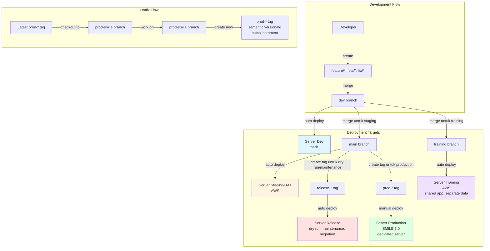
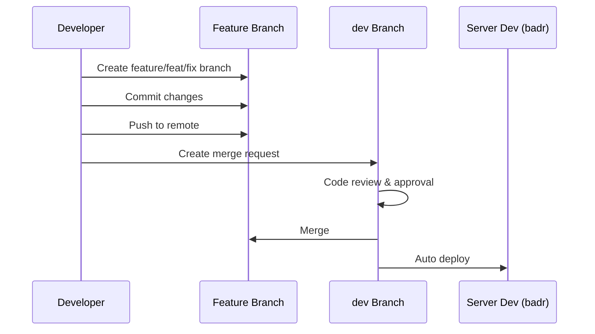
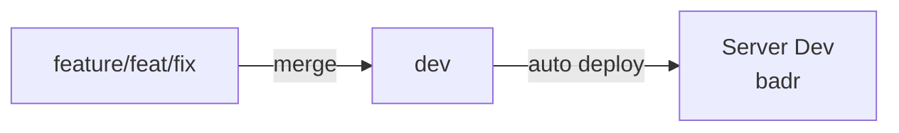
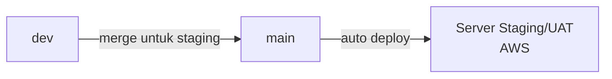
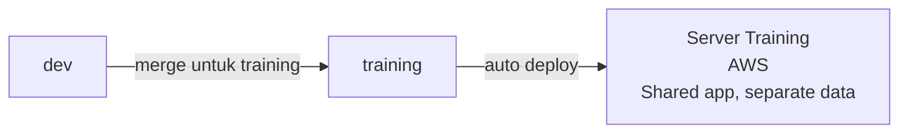
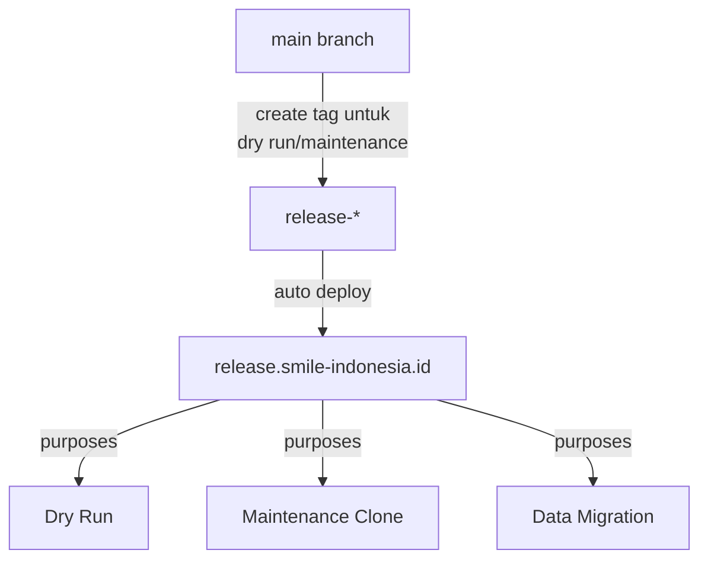
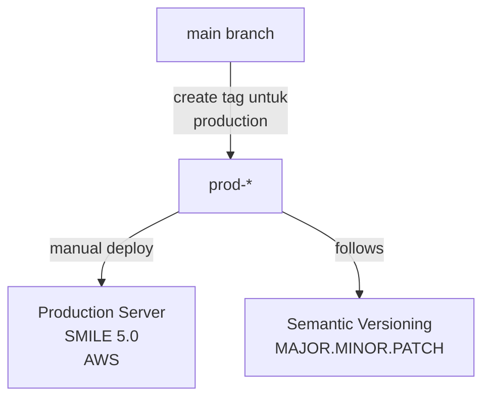
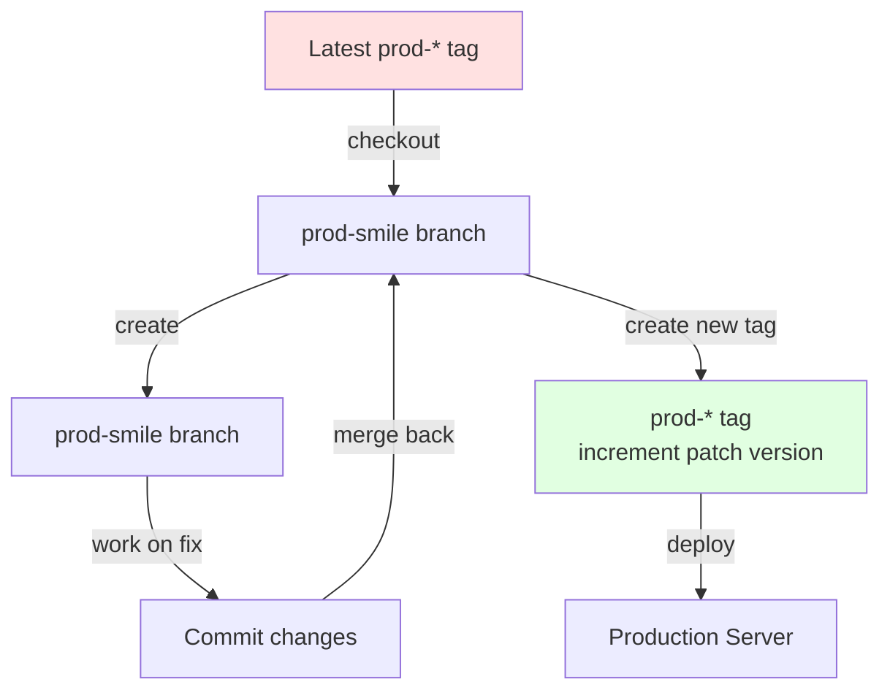
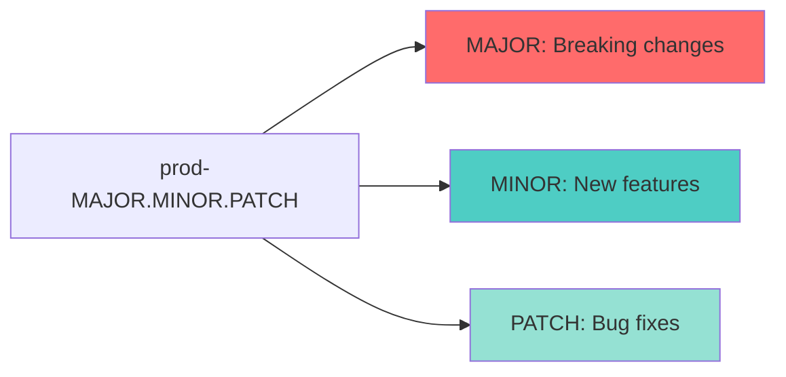
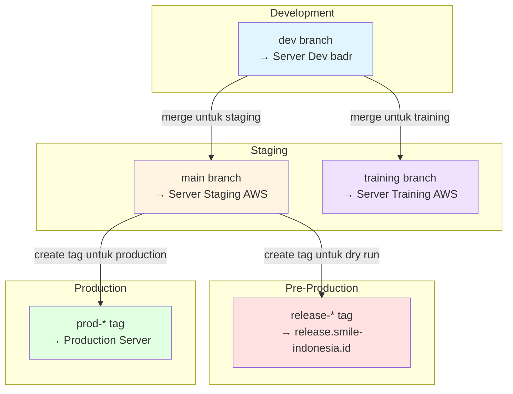

# Version Control Workflow

Dokumentasi ini menjelaskan alur kerja version control yang digunakan dalam proyek SMILE Platform.

## Ringkasan Strategi Branching



## Alur Kerja Detail

```mermaid
gitGraph
    commit id: "Initial"
    branch dev
    checkout dev
    commit id: "Dev init"

    branch feature/user-auth
    checkout feature/user-auth
    commit id: "Add login"
    commit id: "Add register"
    checkout dev
    merge feature/user-auth tag: "→ badr server"

    branch feat/dashboard
    checkout feat/dashboard
    commit id: "Dashboard UI"
    checkout dev
    merge feat/dashboard

    branch fix/login-bug
    checkout fix/login-bug
    commit id: "Fix validation"
    checkout dev
    merge fix/login-bug
    commit id: "Dev stable" tag: "→ badr server"

    checkout main
    branch main
    merge dev tag: "v1.0.0 → AWS staging"

    branch training
    checkout training
    commit id: "Training data" tag: "→ AWS training"

    checkout main
    branch release-1.0.0
    checkout release-1.0.0
    commit id: "Dry run prep" tag: "→ release domain"

    checkout main
    commit id: "Prod ready" tag: "prod-1.0.0 → Production"

    branch prod-smile
    checkout prod-smile
    commit id: "Prod deploy"

    branch hotfix
    checkout hotfix
    commit id: "Critical fix"
    checkout prod-smile
    merge hotfix
    commit id: "Hotfix applied" tag: "prod-1.0.1 → Production"
```

## Branch Strategy

### 1. Development Branches

#### Feature/Fix Branches

- **Pattern**: `feature/*`, `feat/*`, `fix/*`
- **Dibuat oleh**: Developer
- **Merge ke**: `dev`
- **Contoh**:
  - `feature/user-authentication`
  - `feat/dashboard-redesign`
  - `fix/login-validation`



### 2. Main Deployment Branches

#### Dev Branch

- **Target**: Server Development (badr)
- **Auto Deploy**: ✅ Yes
- **Purpose**: Development testing



#### Main Branch

- **Source**: Merge dari `dev`
- **Target**: Server Staging/UAT (AWS)
- **Auto Deploy**: ✅ Yes
- **Purpose**: Pre-production testing
- **Kapan merge**: Ketika ada perubahan yang ingin dilihat/deploy ke staging



#### Training Branch

- **Source**: Merge dari `dev`
- **Target**: Server Training (AWS)
- **Auto Deploy**: ✅ Yes
- **Purpose**: Training environment
- **Note**: Shared application with staging, separate database
- **Kapan merge**: Ketika ada keperluan training



### 3. Release Tags

#### release-\* Tag

- **Pattern**: `release-1.0.0`, `release-2.1.0`
- **Source**: Dibuat dari `main` branch
- **Target**: release.smile-indonesia.id
- **Auto Deploy**: ✅ Yes
- **Kapan dibuat**: Ketika ada keperluan:
  - Dry run testing
  - Maintenance clone of production
  - Data migration testing



### 4. Production Tags

#### prod-\* Tag

- **Pattern**: `prod-1.0.0`, `prod-1.0.1`
- **Source**: Dibuat dari `main` branch
- **Target**: Server Production SMILE 5.0
- **Deploy**: Manual
- **Versioning**: Semantic Versioning
- **Server**: Dedicated production server
- **Kapan dibuat**: Ketika siap untuk production release



### 5. Hotfix Workflow



## Semantic Versioning untuk Production



### Contoh:

- `prod-1.0.0` → Initial production release
- `prod-1.0.1` → Hotfix/patch
- `prod-1.1.0` → New feature (backward compatible)
- `prod-2.0.0` → Breaking changes

## Environment Overview



## Best Practices

### 1. Branch Naming Convention

```
feature/descriptive-name
feat/descriptive-name
fix/descriptive-name
hotfix (untuk production fixes)
```

### 2. Commit Messages

```
feat: add user authentication
fix: resolve login validation issue
docs: update API documentation
refactor: improve code structure
test: add unit tests for auth module
```

### 3. Merge Strategy

- **Feature → Dev**: Squash and merge (optional)
- **Dev → Main**: Merge commit (ketika ingin deploy ke staging)
- **Dev → Training**: Merge commit (ketika ada keperluan training)
- **Hotfix → Prod-smile**: Merge commit

## Deployment Matrix

| Branch/Tag  | Server | Environment    | Auto Deploy                  | Purpose                              |
| ----------- | ------ | -------------- | ---------------------------- | ------------------------------------ |
| `dev`       | Badr   | Development    | ✅                           | Development testing                  |
| `main`      | AWS    | Staging/UAT    | ✅                           | Pre-production testing               |
| `training`  | AWS    | Training       | ✅                           | Training (shared app, separate data) |
| `release-*` | AWS    | Pre-production | ✅                           | Dry run, maintenance, migration      |
| `prod-*`    | AWS    | Production     | ❌ Auto CI but manual deploy | Live production                      |

## Referensi

- [Semantic Versioning](https://semver.org/)
- [Git Flow](https://nvie.com/posts/a-successful-git-branching-model/)
- [Conventional Commits](https://www.conventionalcommits.org/)
