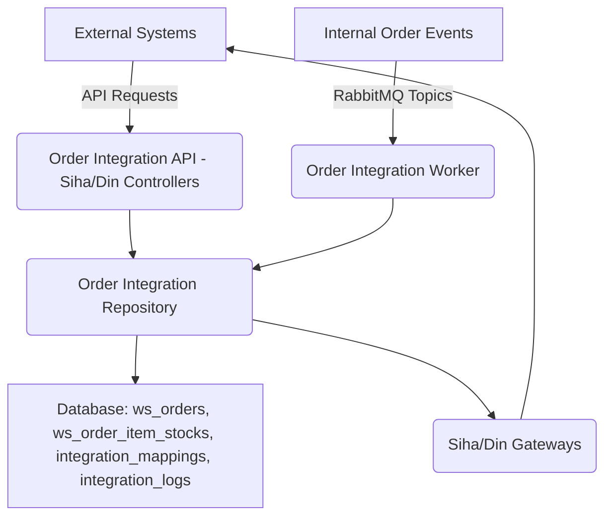

# Order Integration Module

This module is responsible for facilitating the integration of order-related processes with external systems, specifically "Siha" and "Din". It acts as an interoperability layer for SMILE 5.0, handling asynchronous order status updates, mapping internal and external identifiers, and logging all integration activities.

## Architecture

The module is structured to manage incoming order status messages, process them, and communicate with various external client gateways. It leverages a message queue for asynchronous processing and a database for persistence and mapping.

## Key Components

*   [`context.ts`](apps/main/src/modules/order-integration/context.ts): Defines the `AppContextVariableMap` which extends `IContextVariableMap` with `orderId`, `requestType`, and `validate`. This context is used across the module to carry essential request-specific information.
*   [`index.ts`](apps/main/src/modules/order-integration/index.ts): The main entry point for the module. It initializes all necessary dependencies, including database connections, message queue publishers and consumers, authentication services, and various repositories from other modules. It also sets up the `SihaController` and `DinController` for API exposure and registers the `OrderIntegrationWorker` to process asynchronous messages.
*   [`order-integration.repository.ts`](apps/main/src/modules/order-integration/order-integration.repository.ts): Extends `OrderRepository` and provides methods for data access and manipulation specific to order integration. Key functionalities include:
    *   Retrieving order and item metadata.
    *   Managing `integration_clients` and dynamically providing `SihaGateway` or `DinGateway` instances.
    *   Mapping internal IDs to external IDs and vice-versa for various entities (materials, orders, entities).
    *   Creating and updating integration logs.
    *   Creating order items.
*   [`order-integration.worker.ts`](apps/main/src/modules/order-integration/order-integration.worker.ts): Handles asynchronous processing of order status messages from RabbitMQ. It registers consumers for `TOPIC.ORDER_STATUS_ORDER_VALIDATED`, `TOPIC.ORDER_STATUS_ORDER_FULFILLED`, and `TOPIC.ORDER_STATUS_ORDER_CANCEL` topics. It orchestrates the communication with external client gateways (`SihaGateway`, `DinGateway`) based on the order's metadata and logs the request/response. It also supports retry mechanisms for failed requests.
*   [`type.ts`](apps/main/src/modules/order-integration/type.ts): Contains shared interfaces and types used throughout the module, including:
    *   `Payload`: Defines the structure of messages processed by the worker.
    *   `CanValidateOrder`, `CanReceiveOrder`, `CanCancelOrder`: Interfaces for client gateways, ensuring they implement specific order action methods.
    *   `Action`: A union type for possible order actions ("validate", "receive", "cancel").
    *   `RequestLog`, `ResponseLog`, `Request`, `Result`, `ClientConfig`: Types for logging and client configuration.
*   `din/`: This directory contains components specific to the "Din" integration, likely including a controller, middleware, module, repository, and gateway.
*   `siha/`: This directory contains components specific to the "Siha" integration, likely including a controller, middleware, module, repository, and gateway.

## Integration Flow

The module primarily handles two types of interactions:

1.  **Asynchronous Order Status Updates**:
    *   Internal order events (e.g., order validated, fulfilled, canceled) are published to RabbitMQ topics.
    *   The `OrderIntegrationWorker` consumes these messages.
    *   For each message, it retrieves order metadata, identifies the relevant external client (Siha or Din), and calls the appropriate action (`validateOrder`, `receiveOrder`, `cancelOrder`) on the client gateway.
    *   All requests and responses with external systems are logged in the `integration_logs` table.

2.  **Synchronous API Requests**:
    *   External systems can interact with the module via dedicated API endpoints exposed by `SihaController` and `DinController`. These controllers utilize their respective modules and the `OrderIntegrationRepository` to perform operations.

## External Integrations

The module currently supports integration with two primary external systems:

*   **Siha**: An external system for which specific controllers, modules, and gateways are implemented.
*   **Din**: Another external system with its own set of controllers, modules, and gateways.

The `OrderIntegrationRepository` dynamically selects the appropriate gateway based on the `client_key` found in the order metadata.

## Database Interactions

The module interacts with several database tables:

*   `ws_orders`: Stores core order information.
*   `ws_order_item_stocks`: Stores details about items within an order.
*   `integration_mappings`: Manages the mapping between internal and external identifiers for various entities (e.g., orders, materials).
*   `integration_logs`: Records all incoming and outgoing requests and responses for auditing and troubleshooting purposes.