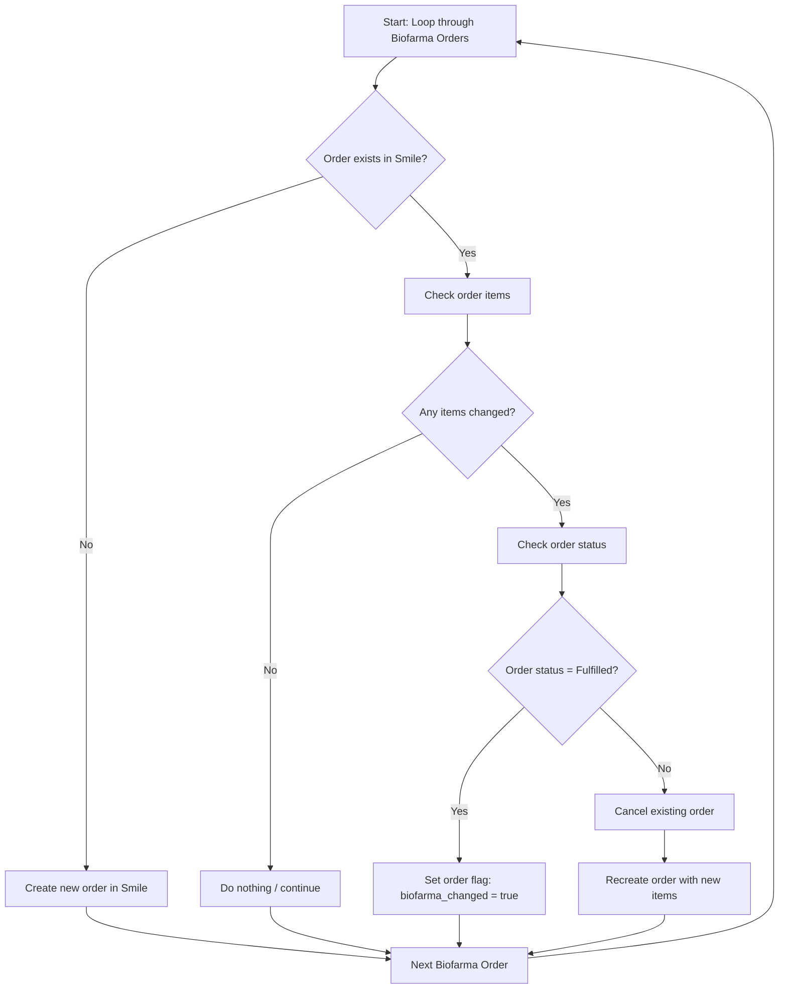

```mermaid
flowchart TD
    A[Start: Loop through Biofarma Orders] --> B{Order exists in Smile?}
    
    B -- No --> C[Create new order in Smile]
    B -- Yes --> D[Check order items]

    D --> E{Any items changed?}
    E -- No --> F[Do nothing / continue]
    E -- Yes --> G[Check order status]

    G --> H{Order status = Fulfilled?}
    H -- Yes --> I[Set order flag: biofarma_changed = true]
    H -- No --> J[Cancel existing order]
    J --> K[Recreate order with new items]

    F --> L[Next Biofarma Order]
    C --> L
    I --> L
    K --> L
    L --> A
```
