# SMILE Platform — Entity Relationship Diagram (ERD)

> Generated from migration files (latest state). Grouped by feature/function/flow.

---

## 1. Core — User, Auth & Role

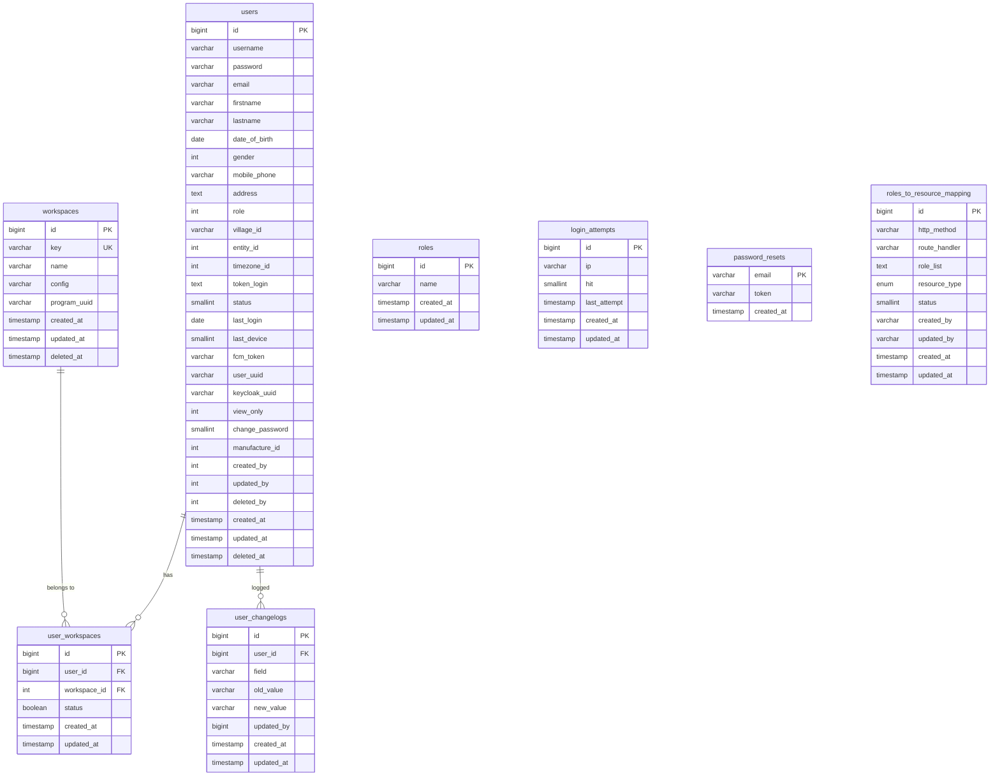
```mermaid
erDiagram
    workspaces {
        bigint id PK
        varchar key UK
        varchar name
        varchar config
        varchar program_uuid
        timestamp created_at
        timestamp updated_at
        timestamp deleted_at
    }

    users {
        bigint id PK
        varchar username
        varchar password
        varchar email
        varchar firstname
        varchar lastname
        date date_of_birth
        int gender
        varchar mobile_phone
        text address
        int role
        varchar village_id
        int entity_id
        int timezone_id
        text token_login
        smallint status
        date last_login
        smallint last_device
        varchar fcm_token
        varchar user_uuid
        varchar keycloak_uuid
        int view_only
        smallint change_password
        int manufacture_id
        int created_by
        int updated_by
        int deleted_by
        timestamp created_at
        timestamp updated_at
        timestamp deleted_at
    }

    roles {
        bigint id PK
        varchar name
        timestamp created_at
        timestamp updated_at
    }

    user_workspaces {
        bigint id PK
        bigint user_id FK
        int workspace_id FK
        boolean status
        timestamp created_at
        timestamp updated_at
    }

    user_changelogs {
        bigint id PK
        bigint user_id FK
        varchar field
        varchar old_value
        varchar new_value
        bigint updated_by
        timestamp created_at
        timestamp updated_at
    }

    login_attempts {
        bigint id PK
        varchar ip
        smallint hit
        timestamp last_attempt
        timestamp created_at
        timestamp updated_at
    }

    password_resets {
        varchar email PK
        varchar token
        timestamp created_at
    }

    roles_to_resource_mapping {
        bigint id PK
        varchar http_method
        varchar route_handler
        text role_list
        enum resource_type
        smallint status
        varchar created_by
        varchar updated_by
        timestamp created_at
        timestamp updated_at
    }

    users ||--o{ user_workspaces : "has"
    workspaces ||--o{ user_workspaces : "belongs to"
    users ||--o{ user_changelogs : "logged"
```

---

## 2. Core — Entity & Location

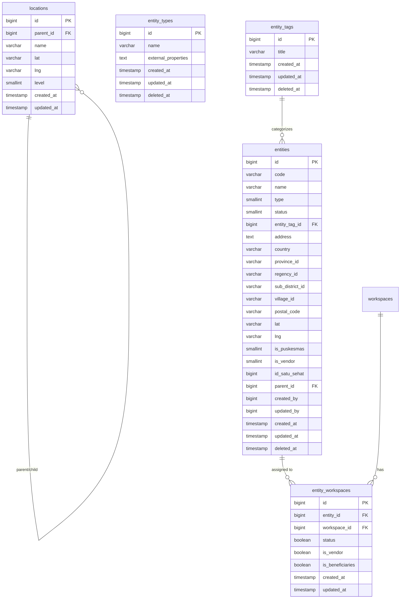
```mermaid
erDiagram
    locations {
        bigint id PK
        bigint parent_id FK
        varchar name
        varchar lat
        varchar lng
        smallint level
        timestamp created_at
        timestamp updated_at
    }

    entity_types {
        bigint id PK
        varchar name
        text external_properties
        timestamp created_at
        timestamp updated_at
        timestamp deleted_at
    }

    entity_tags {
        bigint id PK
        varchar title
        timestamp created_at
        timestamp updated_at
        timestamp deleted_at
    }

    entities {
        bigint id PK
        varchar code
        varchar name
        smallint type
        smallint status
        bigint entity_tag_id FK
        text address
        varchar country
        varchar province_id
        varchar regency_id
        varchar sub_district_id
        varchar village_id
        varchar postal_code
        varchar lat
        varchar lng
        smallint is_puskesmas
        smallint is_vendor
        bigint id_satu_sehat
        bigint parent_id FK
        bigint created_by
        bigint updated_by
        timestamp created_at
        timestamp updated_at
        timestamp deleted_at
    }

    entity_workspaces {
        bigint id PK
        bigint entity_id FK
        bigint workspace_id FK
        boolean status
        boolean is_vendor
        boolean is_beneficiaries
        timestamp created_at
        timestamp updated_at
    }

    entities ||--o{ entity_workspaces : "assigned to"
    workspaces ||--o{ entity_workspaces : "has"
    entity_tags ||--o{ entities : "categorizes"
    locations ||--o{ locations : "parent/child"
```

---

## 3. Core — Material Master Data

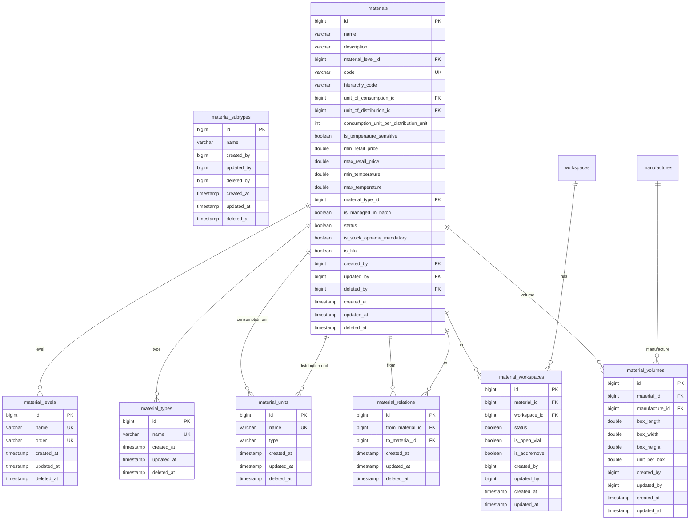
```mermaid
erDiagram
    material_levels {
        bigint id PK
        varchar name UK
        varchar order UK
        timestamp created_at
        timestamp updated_at
        timestamp deleted_at
    }

    material_types {
        bigint id PK
        varchar name UK
        timestamp created_at
        timestamp updated_at
        timestamp deleted_at
    }

    material_units {
        bigint id PK
        varchar name UK
        varchar type
        timestamp created_at
        timestamp updated_at
        timestamp deleted_at
    }

    material_subtypes {
        bigint id PK
        varchar name
        bigint created_by
        bigint updated_by
        bigint deleted_by
        timestamp created_at
        timestamp updated_at
        timestamp deleted_at
    }

    materials {
        bigint id PK
        varchar name
        varchar description
        bigint material_level_id FK
        varchar code UK
        varchar hierarchy_code
        bigint unit_of_consumption_id FK
        bigint unit_of_distribution_id FK
        int consumption_unit_per_distribution_unit
        boolean is_temperature_sensitive
        double min_retail_price
        double max_retail_price
        double min_temperature
        double max_temperature
        bigint material_type_id FK
        boolean is_managed_in_batch
        boolean status
        boolean is_stock_opname_mandatory
        boolean is_kfa
        bigint created_by FK
        bigint updated_by FK
        bigint deleted_by FK
        timestamp created_at
        timestamp updated_at
        timestamp deleted_at
    }

    material_relations {
        bigint id PK
        bigint from_material_id FK
        bigint to_material_id FK
        timestamp created_at
        timestamp updated_at
        timestamp deleted_at
    }

    material_workspaces {
        bigint id PK
        bigint material_id FK
        bigint workspace_id FK
        boolean status
        boolean is_open_vial
        boolean is_addremove
        bigint created_by
        bigint updated_by
        timestamp created_at
        timestamp updated_at
    }

    material_volumes {
        bigint id PK
        bigint material_id FK
        bigint manufacture_id FK
        double box_length
        double box_width
        double box_height
        double unit_per_box
        bigint created_by
        bigint updated_by
        timestamp created_at
        timestamp updated_at
    }

    materials ||--o{ material_levels : "level"
    materials ||--o{ material_types : "type"
    materials ||--o{ material_units : "consumption unit"
    materials ||--o{ material_units : "distribution unit"
    materials ||--o{ material_relations : "from"
    materials ||--o{ material_relations : "to"
    materials ||--o{ material_workspaces : "in"
    workspaces ||--o{ material_workspaces : "has"
    materials ||--o{ material_volumes : "volume"
    manufactures ||--o{ material_volumes : "manufacture"
```

---

## 4. Core — Manufacture

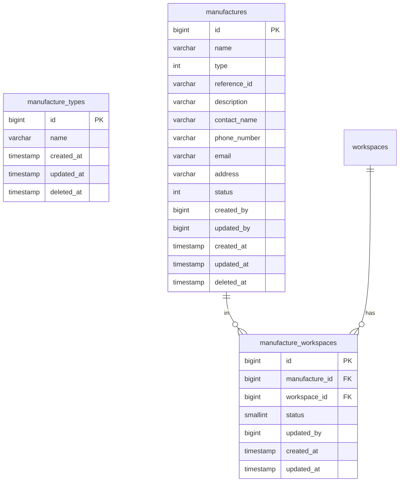
```mermaid
erDiagram
    manufacture_types {
        bigint id PK
        varchar name
        timestamp created_at
        timestamp updated_at
        timestamp deleted_at
    }

    manufactures {
        bigint id PK
        varchar name
        int type
        varchar reference_id
        varchar description
        varchar contact_name
        varchar phone_number
        varchar email
        varchar address
        int status
        bigint created_by
        bigint updated_by
        timestamp created_at
        timestamp updated_at
        timestamp deleted_at
    }

    manufacture_workspaces {
        bigint id PK
        bigint manufacture_id FK
        bigint workspace_id FK
        smallint status
        bigint updated_by
        timestamp created_at
        timestamp updated_at
    }

    manufactures ||--o{ manufacture_workspaces : "in"
    workspaces ||--o{ manufacture_workspaces : "has"
```

---

## 5. Core — Budget Source

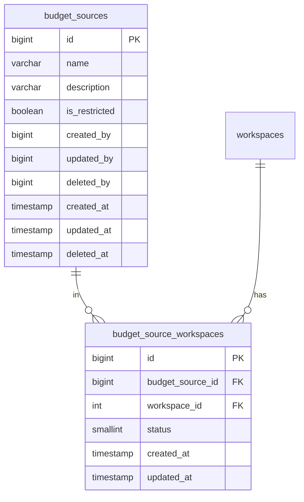
```mermaid
erDiagram
    budget_sources {
        bigint id PK
        varchar name
        varchar description
        boolean is_restricted
        bigint created_by
        bigint updated_by
        bigint deleted_by
        timestamp created_at
        timestamp updated_at
        timestamp deleted_at
    }

    budget_source_workspaces {
        bigint id PK
        bigint budget_source_id FK
        int workspace_id FK
        smallint status
        timestamp created_at
        timestamp updated_at
    }

    budget_sources ||--o{ budget_source_workspaces : "in"
    workspaces ||--o{ budget_source_workspaces : "has"
```

---

## 6. Core — Asset Management

```mermaid
erDiagram
    asset_vendor_types {
        bigint id PK
        varchar name
        timestamp created_at
        timestamp updated_at
    }

    asset_vendors {
        bigint id PK
        varchar name
        bigint asset_vendor_type_id FK
        text description
        bigint created_by
        bigint updated_by
        timestamp created_at
        timestamp updated_at
    }

    asset_vendor_workspaces {
        bigint id PK
        bigint asset_vendor_id FK
        bigint workspace_id FK
        boolean status
        bigint created_by
        bigint updated_by
        timestamp created_at
        timestamp updated_at
    }

    asset_classifications {
        bigint id PK
        varchar name
        text description
        timestamp created_at
        timestamp updated_at
    }

    asset_types {
        bigint id PK
        varchar name
        text description
        double min_temperature
        double max_temperature
        bigint pqs_code_id FK
        bigint created_by
        bigint updated_by
        timestamp created_at
        timestamp updated_at
        timestamp deleted_at
    }

    asset_types_classifications {
        bigint id PK
        bigint asset_type_id FK
        bigint asset_classifications_id FK
        timestamp created_at
        timestamp updated_at
    }

    asset_type_workspaces {
        bigint id PK
        bigint asset_type_id FK
        bigint workspace_id FK
        boolean status
        bigint created_by
        bigint updated_by
        timestamp created_at
        timestamp updated_at
    }

    asset_models {
        bigint id PK
        varchar name
        bigint asset_type_id FK
        bigint manufacture_id FK
        bigint pqs_code_id FK
        double net_capacity
        double gross_capacity
        bigint created_by
        bigint updated_by
        timestamp created_at
        timestamp updated_at
        timestamp deleted_at
    }

    asset_model_workspaces {
        bigint id PK
        bigint asset_model_id FK
        bigint workspace_id FK
        boolean status
        bigint created_by
        bigint updated_by
        timestamp created_at
        timestamp updated_at
    }

    temperature_thresholds {
        bigint id PK
        double min_temperature
        double max_temperature
        boolean is_predefined
        timestamp created_at
        timestamp updated_at
    }

    asset_types_temperatures {
        bigint id PK
        bigint asset_type_id FK
        bigint temperature_threshold_id FK
        timestamp created_at
        timestamp updated_at
    }

    asset_models_temperatures_capacities {
        bigint id PK
        bigint asset_model_id FK
        bigint asset_type_temperature_id FK
        double net_capacity
        double gross_capacity
        timestamp created_at
        timestamp updated_at
    }

    asset_models_non_temperatures_capacities {
        bigint id PK
        bigint asset_model_id FK
        double net_capacity
        double gross_capacity
        timestamp created_at
        timestamp updated_at
    }

    humidity_thresholds {
        bigint id PK
        double min_humidity
        double max_humidity
        timestamp created_at
        timestamp updated_at
    }

    asset_type_humidity {
        bigint id PK
        bigint asset_type_id FK
        bigint humidity_threshold_id FK
        timestamp created_at
        timestamp updated_at
    }

    pqs_types {
        bigint id PK
        varchar name
        timestamp created_at
        timestamp updated_at
    }

    cceigat_descriptions {
        bigint id PK
        varchar name
        timestamp created_at
        timestamp updated_at
    }

    pqs_codes {
        bigint id PK
        varchar code
        bigint pqs_type_id FK
        bigint cceigat_description_id FK
        timestamp created_at
        timestamp updated_at
    }

    pqs_net_capacities {
        bigint id PK
        bigint pqs_code_id FK
        bigint temperature_threshold_id FK
        double net_capacity
        timestamp created_at
        timestamp updated_at
    }

    asset_working_statuses {
        int id PK
        varchar name
        timestamp created_at
        timestamp updated_at
    }

    asset_electricities {
        int id PK
        varchar name
        timestamp created_at
        timestamp updated_at
    }

    asset_calibration_schedules {
        int id PK
        varchar name
        timestamp created_at
        timestamp updated_at
    }

    asset_maintenance_schedules {
        int id PK
        varchar name
        timestamp created_at
        timestamp updated_at
    }

    asset_inventories {
        int id PK
        varchar serial_number
        int production_year
        int budget_year
        smallint ownership_status
        date warranty_start_date
        date warranty_end_date
        int warranty_asset_vendor_id FK
        int borrowed_from_entity_id FK
        int budget_source_id FK
        int asset_model_id FK
        int asset_type_id FK
        int manufacture_id FK
        int entity_id FK
        date calibration_last_date
        int calibration_schedule_id FK
        int calibration_asset_vendor_id FK
        date maintenance_last_date
        int maintenance_schedule_id FK
        int maintenance_asset_vendor_id FK
        int status
        int working_status_id FK
        int electricity_id FK
        text delete_reason
        timestamp created_at
        timestamp updated_at
    }

    asset_inventory_workspaces {
        bigint id PK
        bigint asset_inventory_id FK
        bigint workspace_id FK
        boolean status
        timestamp created_at
        timestamp updated_at
    }

    asset_inventory_temperature_capacity_histories {
        bigint id PK
        bigint asset_inventory_id FK
        int asset_model_temperature_capacity_id FK
        timestamp created_at
        timestamp updated_at
    }

    asset_inventory_other_capacities {
        bigint id PK
        bigint asset_inventory_id FK
        double gross
        double net
        double max_temperature
        double min_temperature
        timestamp created_at
        timestamp updated_at
    }

    asset_types ||--o{ asset_types_temperatures : "has thresholds"
    temperature_thresholds ||--o{ asset_types_temperatures : "used in"
    asset_models ||--o{ asset_models_temperatures_capacities : "capacity"
    asset_models ||--o{ asset_models_non_temperatures_capacities : "capacity"
    asset_inventories ||--o{ asset_types : "type"
    asset_inventories ||--o{ asset_models : "model"
    asset_inventories ||--o{ manufactures : "made by"
    asset_inventories ||--o{ entities : "located at"
    asset_inventories ||--o{ asset_inventory_workspaces : "in workspace"
```

---

## 7. Core — RTMD (Real-Time Monitoring Device)

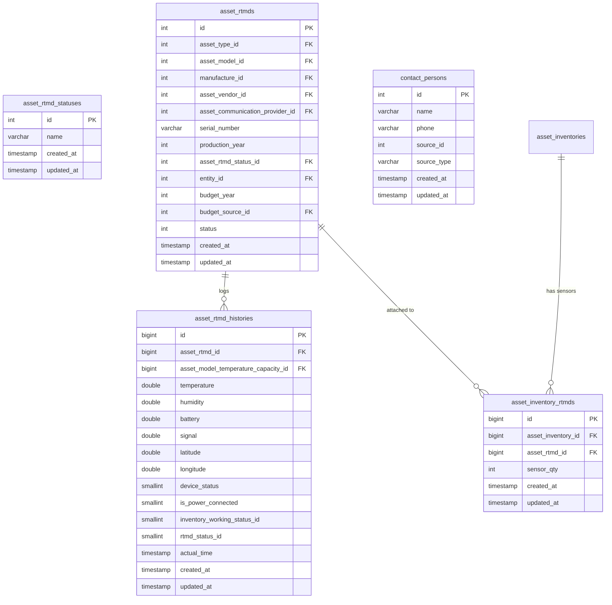
```mermaid
erDiagram
    asset_rtmd_statuses {
        int id PK
        varchar name
        timestamp created_at
        timestamp updated_at
    }

    asset_rtmds {
        int id PK
        int asset_type_id FK
        int asset_model_id FK
        int manufacture_id FK
        int asset_vendor_id FK
        int asset_communication_provider_id FK
        varchar serial_number
        int production_year
        int asset_rtmd_status_id FK
        int entity_id FK
        int budget_year
        int budget_source_id FK
        int status
        timestamp created_at
        timestamp updated_at
    }

    asset_rtmd_histories {
        bigint id PK
        bigint asset_rtmd_id FK
        bigint asset_model_temperature_capacity_id FK
        double temperature
        double humidity
        double battery
        double signal
        double latitude
        double longitude
        smallint device_status
        smallint is_power_connected
        smallint inventory_working_status_id
        smallint rtmd_status_id
        timestamp actual_time
        timestamp created_at
        timestamp updated_at
    }

    asset_inventory_rtmds {
        bigint id PK
        bigint asset_inventory_id FK
        bigint asset_rtmd_id FK
        int sensor_qty
        timestamp created_at
        timestamp updated_at
    }

    contact_persons {
        int id PK
        varchar name
        varchar phone
        int source_id
        varchar source_type
        timestamp created_at
        timestamp updated_at
    }

    asset_rtmds ||--o{ asset_rtmd_histories : "logs"
    asset_inventories ||--o{ asset_inventory_rtmds : "has sensors"
    asset_rtmds ||--o{ asset_inventory_rtmds : "attached to"
```

---

## 8. Core — Population & Demographics

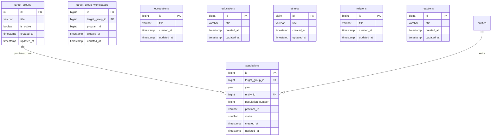
```mermaid
erDiagram
    target_groups {
        int id PK
        varchar title
        boolean is_active
        timestamp created_at
        timestamp updated_at
    }

    target_group_workspaces {
        bigint id PK
        bigint target_group_id FK
        bigint program_id
        timestamp created_at
        timestamp updated_at
    }

    populations {
        bigint id PK
        bigint target_group_id FK
        year year
        bigint entity_id FK
        bigint population_number
        varchar province_id
        smallint status
        timestamp created_at
        timestamp updated_at
    }

    occupations {
        bigint id PK
        varchar title
        timestamp created_at
        timestamp updated_at
    }

    educations {
        bigint id PK
        varchar title
        timestamp created_at
        timestamp updated_at
    }

    ethnics {
        bigint id PK
        varchar title
        timestamp created_at
        timestamp updated_at
    }

    religions {
        bigint id PK
        varchar title
        timestamp created_at
        timestamp updated_at
    }

    reactions {
        bigint id PK
        varchar title
        timestamp created_at
        timestamp updated_at
    }

    target_groups ||--o{ populations : "population count"
    entities ||--o{ populations : "entity"
```

---

## 9. Core — Protocol & Planning Approach

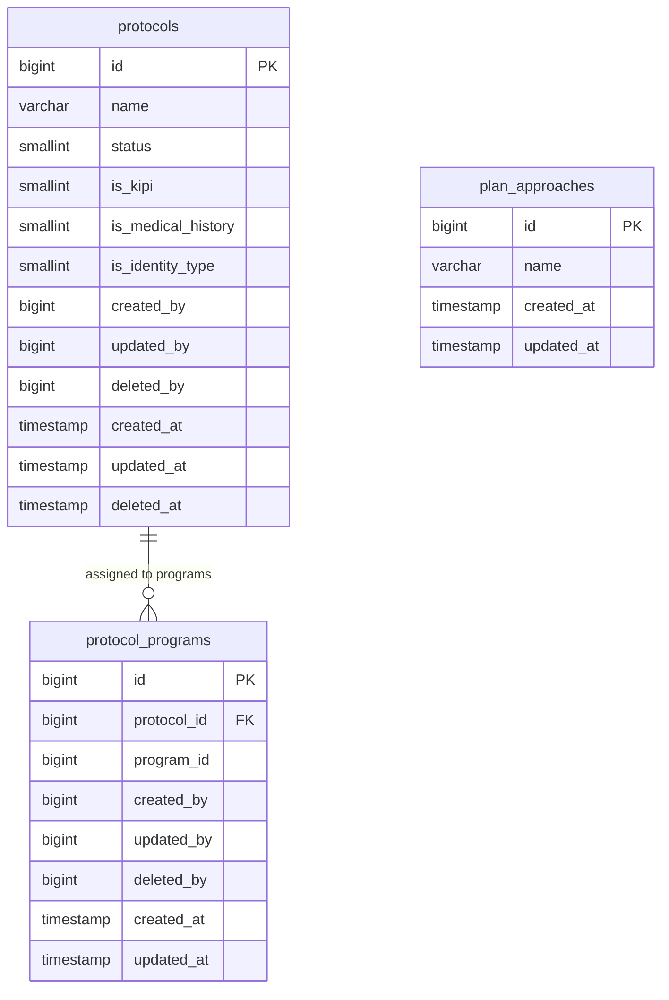
```mermaid
erDiagram
    protocols {
        bigint id PK
        varchar name
        smallint status
        smallint is_kipi
        smallint is_medical_history
        smallint is_identity_type
        bigint created_by
        bigint updated_by
        bigint deleted_by
        timestamp created_at
        timestamp updated_at
        timestamp deleted_at
    }

    protocol_programs {
        bigint id PK
        bigint protocol_id FK
        bigint program_id
        bigint created_by
        bigint updated_by
        bigint deleted_by
        timestamp created_at
        timestamp updated_at
    }

    plan_approaches {
        bigint id PK
        varchar name
        timestamp created_at
        timestamp updated_at
    }

    protocols ||--o{ protocol_programs : "assigned to programs"
```

---

## 10. Core — Notification

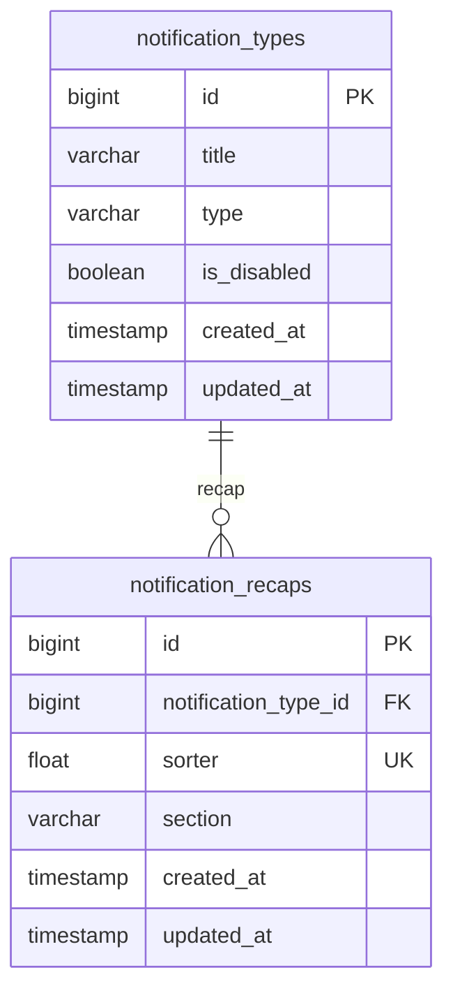
```mermaid
erDiagram
    notification_types {
        bigint id PK
        varchar title
        varchar type
        boolean is_disabled
        timestamp created_at
        timestamp updated_at
    }

    notification_recaps {
        bigint id PK
        bigint notification_type_id FK
        float sorter UK
        varchar section
        timestamp created_at
        timestamp updated_at
    }

    notification_types ||--o{ notification_recaps : "recap"
```

---

## 11. Core — Dashboard, Export, Import

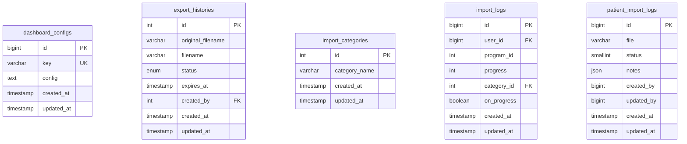
```mermaid
erDiagram
    dashboard_configs {
        bigint id PK
        varchar key UK
        text config
        timestamp created_at
        timestamp updated_at
    }

    export_histories {
        int id PK
        varchar original_filename
        varchar filename
        enum status
        timestamp expires_at
        int created_by FK
        timestamp created_at
        timestamp updated_at
    }

    import_categories {
        int id PK
        varchar category_name
        timestamp created_at
        timestamp updated_at
    }

    import_logs {
        bigint id PK
        bigint user_id FK
        int program_id
        int progress
        int category_id FK
        boolean on_progress
        timestamp created_at
        timestamp updated_at
    }

    patient_import_logs {
        bigint id PK
        varchar file
        smallint status
        json notes
        bigint created_by
        bigint updated_by
        timestamp created_at
        timestamp updated_at
    }
```

---

## 12. Core — Cold Storage

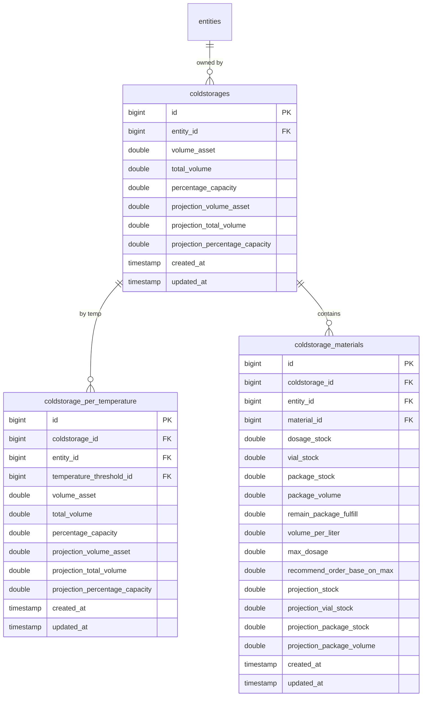
```mermaid
erDiagram
    coldstorages {
        bigint id PK
        bigint entity_id FK
        double volume_asset
        double total_volume
        double percentage_capacity
        double projection_volume_asset
        double projection_total_volume
        double projection_percentage_capacity
        timestamp created_at
        timestamp updated_at
    }

    coldstorage_per_temperature {
        bigint id PK
        bigint coldstorage_id FK
        bigint entity_id FK
        bigint temperature_threshold_id FK
        double volume_asset
        double total_volume
        double percentage_capacity
        double projection_volume_asset
        double projection_total_volume
        double projection_percentage_capacity
        timestamp created_at
        timestamp updated_at
    }

    coldstorage_materials {
        bigint id PK
        bigint coldstorage_id FK
        bigint entity_id FK
        bigint material_id FK
        double dosage_stock
        double vial_stock
        double package_stock
        double package_volume
        double remain_package_fulfill
        double volume_per_liter
        double max_dosage
        double recommend_order_base_on_max
        double projection_stock
        double projection_vial_stock
        double projection_package_stock
        double projection_package_volume
        timestamp created_at
        timestamp updated_at
    }

    coldstorages ||--o{ coldstorage_per_temperature : "by temp"
    coldstorages ||--o{ coldstorage_materials : "contains"
    entities ||--o{ coldstorages : "owned by"
```

---

## 13. Core — Executive Module

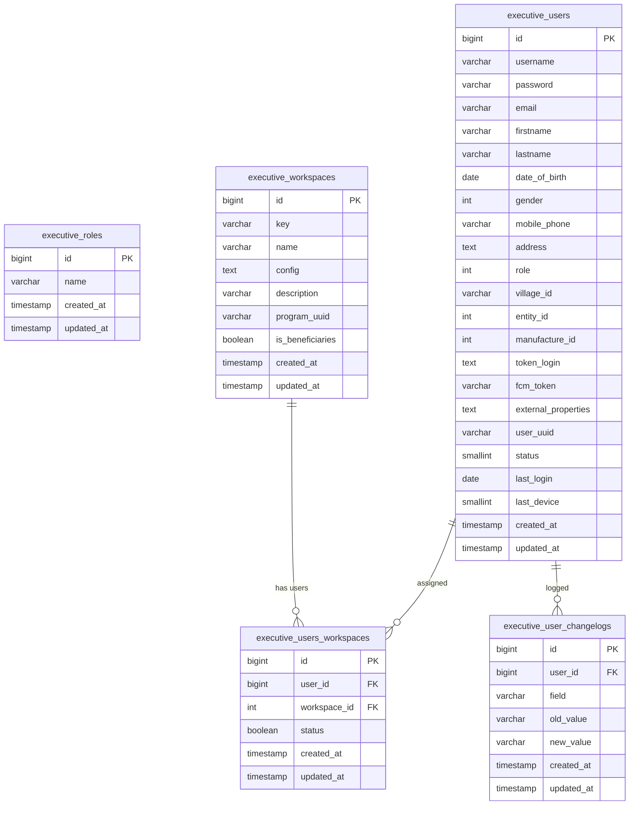
```mermaid
erDiagram
    executive_roles {
        bigint id PK
        varchar name
        timestamp created_at
        timestamp updated_at
    }

    executive_workspaces {
        bigint id PK
        varchar key
        varchar name
        text config
        varchar description
        varchar program_uuid
        boolean is_beneficiaries
        timestamp created_at
        timestamp updated_at
    }

    executive_users {
        bigint id PK
        varchar username
        varchar password
        varchar email
        varchar firstname
        varchar lastname
        date date_of_birth
        int gender
        varchar mobile_phone
        text address
        int role
        varchar village_id
        int entity_id
        int manufacture_id
        text token_login
        varchar fcm_token
        text external_properties
        varchar user_uuid
        smallint status
        date last_login
        smallint last_device
        timestamp created_at
        timestamp updated_at
    }

    executive_users_workspaces {
        bigint id PK
        bigint user_id FK
        int workspace_id FK
        boolean status
        timestamp created_at
        timestamp updated_at
    }

    executive_user_changelogs {
        bigint id PK
        bigint user_id FK
        varchar field
        varchar old_value
        varchar new_value
        timestamp created_at
        timestamp updated_at
    }

    executive_users ||--o{ executive_users_workspaces : "assigned"
    executive_workspaces ||--o{ executive_users_workspaces : "has users"
    executive_users ||--o{ executive_user_changelogs : "logged"
```

---

## 14. Business — Stock & Transaction

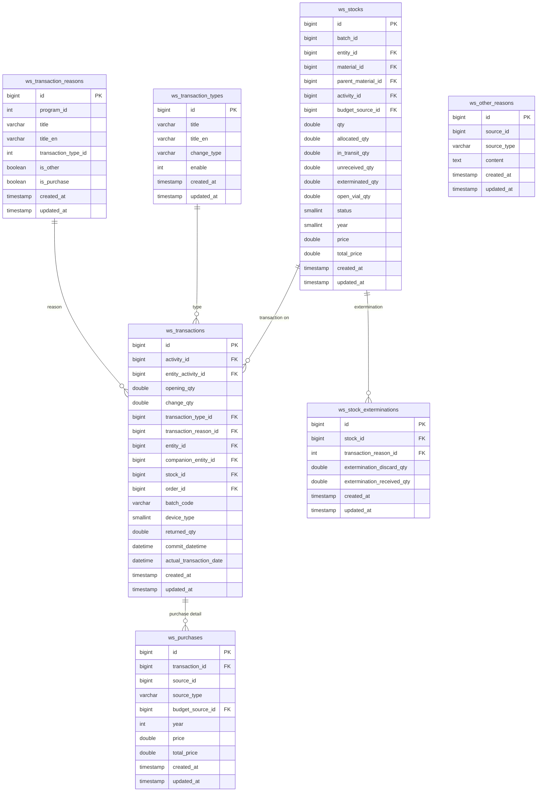
```mermaid
erDiagram
    ws_transaction_types {
        bigint id PK
        varchar title
        varchar title_en
        varchar change_type
        int enable
        timestamp created_at
        timestamp updated_at
    }

    ws_transaction_reasons {
        bigint id PK
        int program_id
        varchar title
        varchar title_en
        int transaction_type_id
        boolean is_other
        boolean is_purchase
        timestamp created_at
        timestamp updated_at
    }

    ws_transactions {
        bigint id PK
        bigint activity_id FK
        bigint entity_activity_id FK
        double opening_qty
        double change_qty
        bigint transaction_type_id FK
        bigint transaction_reason_id FK
        bigint entity_id FK
        bigint companion_entity_id FK
        bigint stock_id FK
        bigint order_id FK
        varchar batch_code
        smallint device_type
        double returned_qty
        datetime commit_datetime
        datetime actual_transaction_date
        timestamp created_at
        timestamp updated_at
    }

    ws_purchases {
        bigint id PK
        bigint transaction_id FK
        bigint source_id
        varchar source_type
        bigint budget_source_id FK
        int year
        double price
        double total_price
        timestamp created_at
        timestamp updated_at
    }

    ws_stocks {
        bigint id PK
        bigint batch_id
        bigint entity_id FK
        bigint material_id FK
        bigint parent_material_id FK
        bigint activity_id FK
        bigint budget_source_id FK
        double qty
        double allocated_qty
        double in_transit_qty
        double unreceived_qty
        double exterminated_qty
        double open_vial_qty
        smallint status
        smallint year
        double price
        double total_price
        timestamp created_at
        timestamp updated_at
    }

    ws_stock_exterminations {
        bigint id PK
        bigint stock_id FK
        int transaction_reason_id FK
        double extermination_discard_qty
        double extermination_received_qty
        timestamp created_at
        timestamp updated_at
    }

    ws_other_reasons {
        bigint id PK
        bigint source_id
        varchar source_type
        text content
        timestamp created_at
        timestamp updated_at
    }

    ws_stocks ||--o{ ws_transactions : "transaction on"
    ws_transaction_types ||--o{ ws_transactions : "type"
    ws_transaction_reasons ||--o{ ws_transactions : "reason"
    ws_transactions ||--o{ ws_purchases : "purchase detail"
    ws_stocks ||--o{ ws_stock_exterminations : "extermination"
```

---

## 15. Business — Entity Relations (Order/Distribution Flow)

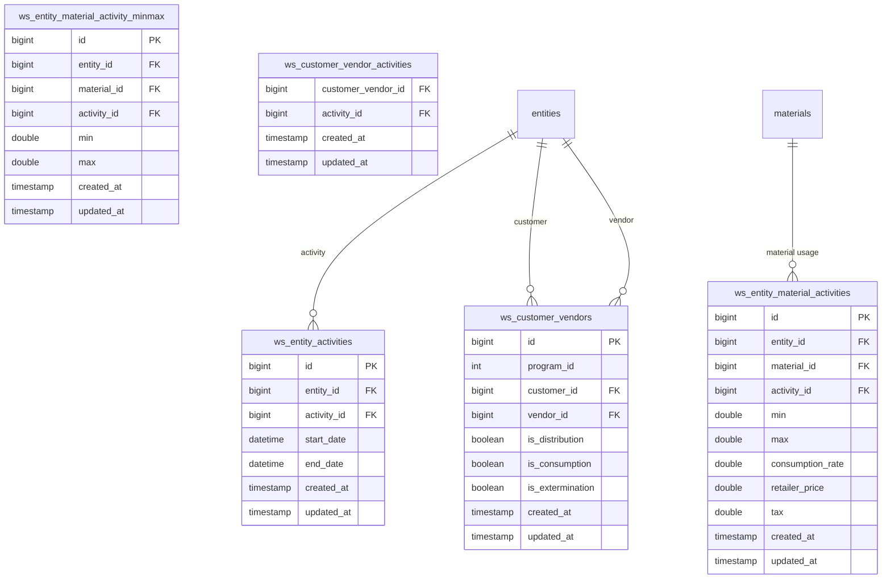
```mermaid
erDiagram
    ws_entity_activities {
        bigint id PK
        bigint entity_id FK
        bigint activity_id FK
        datetime start_date
        datetime end_date
        timestamp created_at
        timestamp updated_at
    }

    ws_entity_material_activities {
        bigint id PK
        bigint entity_id FK
        bigint material_id FK
        bigint activity_id FK
        double min
        double max
        double consumption_rate
        double retailer_price
        double tax
        timestamp created_at
        timestamp updated_at
    }

    ws_entity_material_activity_minmax {
        bigint id PK
        bigint entity_id FK
        bigint material_id FK
        bigint activity_id FK
        double min
        double max
        timestamp created_at
        timestamp updated_at
    }

    ws_customer_vendors {
        bigint id PK
        int program_id
        bigint customer_id FK
        bigint vendor_id FK
        boolean is_distribution
        boolean is_consumption
        boolean is_extermination
        timestamp created_at
        timestamp updated_at
    }

    ws_customer_vendor_activities {
        bigint customer_vendor_id FK
        bigint activity_id FK
        timestamp created_at
        timestamp updated_at
    }

    entities ||--o{ ws_entity_activities : "activity"
    entities ||--o{ ws_customer_vendors : "customer"
    entities ||--o{ ws_customer_vendors : "vendor"
    materials ||--o{ ws_entity_material_activities : "material usage"
```

---

## 16. Business — Patient, Immunization & Protocol

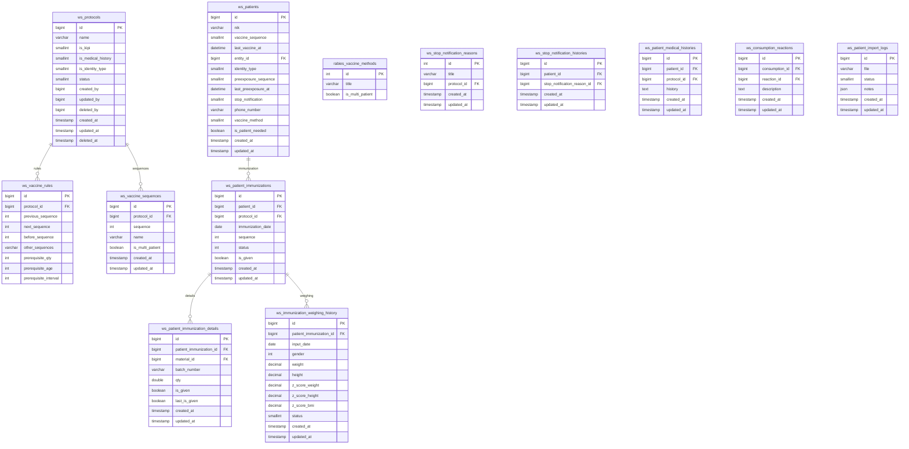
```mermaid
erDiagram
    ws_patients {
        bigint id PK
        varchar nik
        smallint vaccine_sequence
        datetime last_vaccine_at
        bigint entity_id FK
        smallint identity_type
        smallint preexposure_sequence
        datetime last_preexposure_at
        smallint stop_notification
        varchar phone_number
        smallint vaccine_method
        boolean is_patient_needed
        timestamp created_at
        timestamp updated_at
    }

    ws_protocols {
        bigint id PK
        varchar name
        smallint is_kipi
        smallint is_medical_history
        smallint is_identity_type
        smallint status
        bigint created_by
        bigint updated_by
        bigint deleted_by
        timestamp created_at
        timestamp updated_at
        timestamp deleted_at
    }

    ws_vaccine_rules {
        bigint id PK
        bigint protocol_id FK
        int previous_sequence
        int next_sequence
        int before_sequence
        varchar other_sequences
        int prerequisite_qty
        int prerequisite_age
        int prerequisite_interval
    }

    ws_vaccine_sequences {
        bigint id PK
        bigint protocol_id FK
        int sequence
        varchar name
        boolean is_multi_patient
        timestamp created_at
        timestamp updated_at
    }

    rabies_vaccine_methods {
        int id PK
        varchar title
        boolean is_multi_patient
    }

    ws_stop_notification_reasons {
        int id PK
        varchar title
        bigint protocol_id FK
        timestamp created_at
        timestamp updated_at
    }

    ws_stop_notification_histories {
        bigint id PK
        bigint patient_id FK
        bigint stop_notification_reason_id FK
        timestamp created_at
        timestamp updated_at
    }

    ws_patient_medical_histories {
        bigint id PK
        bigint patient_id FK
        bigint protocol_id FK
        text history
        timestamp created_at
        timestamp updated_at
    }

    ws_consumption_reactions {
        bigint id PK
        bigint consumption_id FK
        bigint reaction_id FK
        text description
        timestamp created_at
        timestamp updated_at
    }

    ws_patient_immunizations {
        bigint id PK
        bigint patient_id FK
        bigint protocol_id FK
        date immunization_date
        int sequence
        int status
        boolean is_given
        timestamp created_at
        timestamp updated_at
    }

    ws_patient_immunization_details {
        bigint id PK
        bigint patient_immunization_id FK
        bigint material_id FK
        varchar batch_number
        double qty
        boolean is_given
        boolean last_is_given
        timestamp created_at
        timestamp updated_at
    }

    ws_immunization_weighing_history {
        bigint id PK
        bigint patient_immunization_id FK
        date input_date
        int gender
        decimal weight
        decimal height
        decimal z_score_weight
        decimal z_score_height
        decimal z_score_bmi
        smallint status
        timestamp created_at
        timestamp updated_at
    }

    ws_patient_import_logs {
        bigint id PK
        varchar file
        smallint status
        json notes
        timestamp created_at
        timestamp updated_at
    }

    ws_protocols ||--o{ ws_vaccine_rules : "rules"
    ws_protocols ||--o{ ws_vaccine_sequences : "sequences"
    ws_patients ||--o{ ws_patient_immunizations : "immunization"
    ws_patient_immunizations ||--o{ ws_patient_immunization_details : "details"
    ws_patient_immunizations ||--o{ ws_immunization_weighing_history : "weighing"
```

---

## 17. Business — Program Planning (Macro)

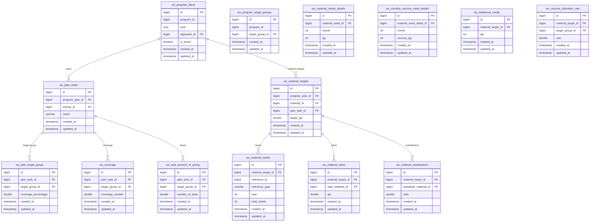
```mermaid
erDiagram
    ws_program_plans {
        bigint id PK
        bigint program_id
        year year
        bigint approach_id FK
        boolean is_active
        timestamp created_at
        timestamp updated_at
    }

    ws_plan_tasks {
        bigint id PK
        bigint program_plan_id FK
        bigint activity_id FK
        varchar name
        timestamp created_at
        timestamp updated_at
    }

    ws_plan_target_group {
        bigint id PK
        bigint plan_task_id FK
        bigint target_group_id FK
        double coverage_percentage
        timestamp created_at
        timestamp updated_at
    }

    ws_coverage {
        bigint id PK
        bigint plan_task_id FK
        bigint target_group_id FK
        double coverage_number
        timestamp created_at
        timestamp updated_at
    }

    ws_task_amount_of_giving {
        bigint id PK
        bigint plan_task_id FK
        bigint target_group_id FK
        double number_of_dose
        timestamp created_at
        timestamp updated_at
    }

    ws_program_target_groups {
        bigint id PK
        bigint program_id
        bigint target_group_id FK
        timestamp created_at
        timestamp updated_at
    }

    ws_material_targets {
        bigint id PK
        bigint program_plan_id FK
        bigint material_id FK
        bigint plan_task_id FK
        double target_qty
        timestamp created_at
        timestamp updated_at
    }

    ws_material_ratios {
        bigint id PK
        bigint material_target_id FK
        bigint ratio_material_id FK
        double qty
        timestamp created_at
        timestamp updated_at
    }

    ws_material_substitutions {
        bigint id PK
        bigint material_target_id FK
        bigint substitute_material_id FK
        double ratio
        timestamp created_at
        timestamp updated_at
    }

    ws_material_needs {
        bigint id PK
        bigint material_target_id FK
        bigint reference_id
        varchar reference_type
        int year
        int total_needs
        timestamp created_at
        timestamp updated_at
    }

    ws_material_needs_details {
        bigint id PK
        bigint material_need_id FK
        int month
        int qty
        timestamp created_at
        timestamp updated_at
    }

    ws_monthly_vaccine_need_details {
        bigint id PK
        bigint material_need_detail_id FK
        int month
        int vaccine_qty
        timestamp created_at
        timestamp updated_at
    }

    ws_additional_needs {
        bigint id PK
        bigint material_target_id FK
        int qty
        timestamp created_at
        timestamp updated_at
    }

    ws_vaccine_utilization_rate {
        bigint id PK
        bigint material_target_id FK
        bigint target_group_id FK
        double rate
        timestamp created_at
        timestamp updated_at
    }

    ws_program_plans ||--o{ ws_plan_tasks : "tasks"
    ws_plan_tasks ||--o{ ws_plan_target_group : "target group"
    ws_plan_tasks ||--o{ ws_coverage : "coverage"
    ws_plan_tasks ||--o{ ws_task_amount_of_giving : "doses"
    ws_program_plans ||--o{ ws_material_targets : "material targets"
    ws_material_targets ||--o{ ws_material_needs : "needs"
    ws_material_targets ||--o{ ws_material_ratios : "ratios"
    ws_material_targets ||--o{ ws_material_substitutions : "substitutions"
```

---

## 18. Business — Target Estimations (Microplanning)

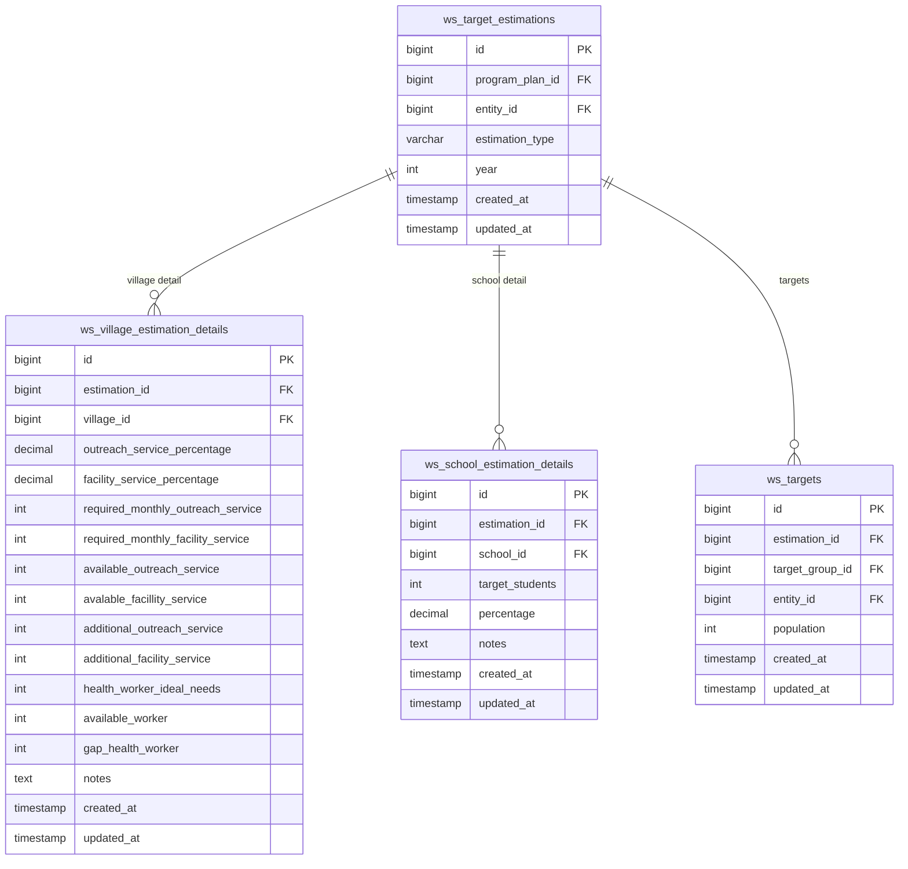
```mermaid
erDiagram
    ws_target_estimations {
        bigint id PK
        bigint program_plan_id FK
        bigint entity_id FK
        varchar estimation_type
        int year
        timestamp created_at
        timestamp updated_at
    }

    ws_village_estimation_details {
        bigint id PK
        bigint estimation_id FK
        bigint village_id FK
        decimal outreach_service_percentage
        decimal facility_service_percentage
        int required_monthly_outreach_service
        int required_monthly_facility_service
        int available_outreach_service
        int avalable_facillity_service
        int additional_outreach_service
        int additional_facility_service
        int health_worker_ideal_needs
        int available_worker
        int gap_health_worker
        text notes
        timestamp created_at
        timestamp updated_at
    }

    ws_school_estimation_details {
        bigint id PK
        bigint estimation_id FK
        bigint school_id FK
        int target_students
        decimal percentage
        text notes
        timestamp created_at
        timestamp updated_at
    }

    ws_targets {
        bigint id PK
        bigint estimation_id FK
        bigint target_group_id FK
        bigint entity_id FK
        int population
        timestamp created_at
        timestamp updated_at
    }

    ws_target_estimations ||--o{ ws_village_estimation_details : "village detail"
    ws_target_estimations ||--o{ ws_school_estimation_details : "school detail"
    ws_target_estimations ||--o{ ws_targets : "targets"
```

---

## 19. Business — Annual Needs

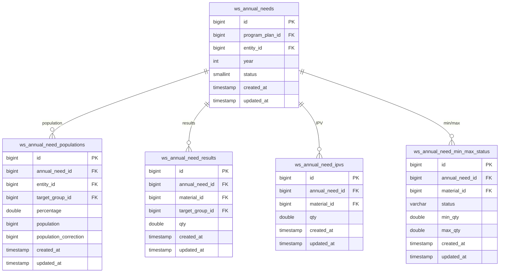
```mermaid
erDiagram
    ws_annual_needs {
        bigint id PK
        bigint program_plan_id FK
        bigint entity_id FK
        int year
        smallint status
        timestamp created_at
        timestamp updated_at
    }

    ws_annual_need_populations {
        bigint id PK
        bigint annual_need_id FK
        bigint entity_id FK
        bigint target_group_id FK
        double percentage
        bigint population
        bigint population_correction
        timestamp created_at
        timestamp updated_at
    }

    ws_annual_need_results {
        bigint id PK
        bigint annual_need_id FK
        bigint material_id FK
        bigint target_group_id FK
        double qty
        timestamp created_at
        timestamp updated_at
    }

    ws_annual_need_ipvs {
        bigint id PK
        bigint annual_need_id FK
        bigint material_id FK
        double qty
        timestamp created_at
        timestamp updated_at
    }

    ws_annual_need_min_max_status {
        bigint id PK
        bigint annual_need_id FK
        bigint material_id FK
        varchar status
        double min_qty
        double max_qty
        timestamp created_at
        timestamp updated_at
    }

    ws_annual_needs ||--o{ ws_annual_need_populations : "population"
    ws_annual_needs ||--o{ ws_annual_need_results : "results"
    ws_annual_needs ||--o{ ws_annual_need_ipvs : "IPV"
    ws_annual_needs ||--o{ ws_annual_need_min_max_status : "min/max"
```

---

## 20. Business — Microplanning

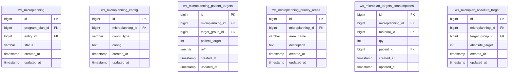
```mermaid
erDiagram
    ws_microplanning {
        bigint id PK
        bigint program_plan_id FK
        bigint entity_id FK
        varchar status
        timestamp created_at
        timestamp updated_at
    }

    ws_microplanning_config {
        bigint id PK
        bigint microplanning_id FK
        varchar config_type
        text config
        timestamp created_at
        timestamp updated_at
    }

    ws_microplanning_patient_targets {
        bigint id PK
        bigint microplanning_id FK
        bigint target_group_id FK
        int patient_target
        varchar reff
        timestamp created_at
        timestamp updated_at
    }

    ws_microplanning_priority_areas {
        bigint id PK
        bigint microplanning_id FK
        varchar area_name
        text description
        timestamp created_at
        timestamp updated_at
    }

    ws_microplan_targets_consumptions {
        bigint id PK
        bigint microplanning_id FK
        bigint material_id FK
        int qty
        bigint patient_id FK
        timestamp created_at
        timestamp updated_at
    }

    ws_microplan_absolute_target {
        bigint id PK
        bigint microplanning_id FK
        bigint target_group_id FK
        int absolute_target
        timestamp created_at
        timestamp updated_at
    }
```

---

## 21. Business — Microplanning Program Config

```mermaid
erDiagram
    ws_mp_program_config {
        bigint id PK
        int year
        bigint program_id
        enum category
        smallint status
        bigint seeded_from_plan_id
        timestamp seeded_at
        timestamp created_at
        timestamp updated_at
    }

    ws_mp_material_target_config {
        bigint id PK
        bigint mp_program_config_id FK
        bigint material_id FK
        bigint target_group_id FK
        double target_qty
        timestamp created_at
        timestamp updated_at
    }

    ws_mp_province_coverage {
        bigint id PK
        bigint mp_material_target_config_id FK
        bigint province_id FK
        double coverage_number
        timestamp created_at
        timestamp updated_at
    }

    ws_mp_material_substitution {
        bigint id PK
        bigint mp_program_config_id FK
        bigint material_id FK
        bigint substitution_material_id FK
        smallint priority
        bigint source_ref_id
        timestamp created_at
        timestamp updated_at
    }

    ws_mp_program_config ||--o{ ws_mp_material_target_config : "material config"
    ws_mp_material_target_config ||--o{ ws_mp_province_coverage : "province coverage"
    ws_mp_program_config ||--o{ ws_mp_material_substitution : "substitution"
```

---

## 22. Business — Map & Route (Logistics)

```mermaid
erDiagram
    ws_map_service_points {
        bigint id PK
        bigint microplanning_id FK
        varchar name
        varchar type
        double latitude
        double longitude
        timestamp created_at
        timestamp updated_at
    }

    ws_map_destinations {
        bigint id PK
        bigint microplanning_id FK
        bigint service_point_id FK
        varchar name
        varchar type
        varchar sub_type
        decimal latitude
        decimal longitude
        decimal distance_meters
        varchar road_type
        text notes
        tinyint status
        timestamp created_at
        timestamp updated_at
    }

    ws_map_routes {
        bigint id PK
        bigint microplanning_id FK
        varchar name
        varchar type
        timestamp created_at
        timestamp updated_at
    }

    ws_map_route_stops {
        bigint id PK
        bigint route_id FK
        bigint destination_id FK
        int stop_order
        double distance_meters
        double duration_seconds
        timestamp created_at
        timestamp updated_at
    }

    ws_microplanning ||--o{ ws_map_service_points : "service points"
    ws_microplanning ||--o{ ws_map_destinations : "destinations"
    ws_microplanning ||--o{ ws_map_routes : "routes"
    ws_map_routes ||--o{ ws_map_route_stops : "stops"
    ws_map_service_points ||--o{ ws_map_destinations : "destinations"
    ws_map_destinations ||--o{ ws_map_route_stops : "route stop"
```

---

## 23. Business — BMHP (Lab/Examination Planning)

```mermaid
erDiagram
    bmhp_examination_types {
        int id PK
        varchar name UK
        text description
        timestamp created_at
        timestamp updated_at
    }

    bmhp_parameters {
        int id PK
        varchar name
        varchar unit
        text description
        timestamp created_at
        timestamp updated_at
    }

    bmhp_target_groups {
        int id PK
        varchar code UK
        varchar name
        varchar age_range
        text description
        boolean is_active
        timestamp created_at
        timestamp updated_at
    }

    ws_bmhp_examination_target_groups {
        bigint id PK
        bigint examination_type_id FK
        bigint bmhp_target_group_id FK
        timestamp created_at
        timestamp updated_at
    }

    ws_bmhp_examination_target_materials {
        bigint id PK
        bigint examination_type_id FK
        bigint material_id FK
        timestamp created_at
        timestamp updated_at
    }

    ws_bmhp_examination_parameters {
        bigint id PK
        bigint examination_type_id FK
        bigint bmhp_parameter_id FK
        timestamp created_at
        timestamp updated_at
    }

    ws_bmhp_examination_methods {
        bigint id PK
        bigint examination_type_id FK
        varchar method_name
        timestamp created_at
        timestamp updated_at
    }

    ws_bmhp_material_details {
        bigint id PK
        bigint examination_target_material_id FK
        varchar detail_name
        int qty
        bigint unit_id FK
        timestamp created_at
        timestamp updated_at
    }

    ws_bmhp_materials_unit_details {
        bigint id PK
        bigint bmhp_material_detail_id FK
        bigint unit_id FK
        double conversion_rate
        timestamp created_at
        timestamp updated_at
    }

    ws_bmhp_material_variant {
        bigint id PK
        bigint material_id FK
        int is_variant
        timestamp created_at
        timestamp updated_at
    }

    ws_bmhp_material_variant_detail {
        bigint id PK
        bigint material_variant_id FK
        bigint material_id FK
        varchar name
        int test_qty
        bigint unit_id FK
        timestamp created_at
        timestamp updated_at
    }
```

---

## 24. Business — BMHP Planning & Approval

```mermaid
erDiagram
    ws_bmhp_planning {
        bigint id PK
        bigint entity_id FK
        int year
        int examination_id FK
        varchar status
        bigint approved_by FK
        datetime submitted_at
        datetime approved_at
        timestamp created_at
        timestamp updated_at
    }

    ws_bmhp_planning_target_groups {
        bigint id PK
        bigint bmhp_planning_id FK
        bigint target_group_id FK
        int population
        timestamp created_at
        timestamp updated_at
    }

    ws_bmhp_planning_materials {
        bigint id PK
        bigint bmhp_planning_id FK
        bigint material_id FK
        double qty
        timestamp created_at
        timestamp updated_at
    }

    ws_bmhp_planning_methods {
        bigint id PK
        bigint bmhp_planning_id FK
        varchar method
        timestamp created_at
        timestamp updated_at
    }

    ws_bmhp_material_calculations {
        bigint id PK
        bigint bmhp_planning_id FK
        bigint material_id FK
        double calculated_qty
        timestamp created_at
        timestamp updated_at
    }

    ws_bmhp_stock_recaps {
        bigint id PK
        bigint bmhp_planning_id FK
        bigint material_id FK
        bigint variant_id FK
        double stock_qty
        timestamp created_at
        timestamp updated_at
    }

    ws_bmhp_approval_periods {
        bigint id PK
        bigint bmhp_planning_id FK
        varchar period_name
        date start_date
        date end_date
        date remaining_stock_date
        varchar status
        timestamp created_at
        timestamp updated_at
    }

    ws_bmhp_approval_period_province {
        bigint id PK
        bigint approval_period_id FK
        bigint province_id FK
        timestamp created_at
        timestamp updated_at
    }

    ws_bmhp_approval_logs {
        bigint id PK
        bigint bmhp_planning_id FK
        bigint user_id FK
        varchar action
        text notes
        timestamp created_at
        timestamp updated_at
    }

    ws_bmhp_revision_notifications {
        bigint id PK
        bigint bmhp_planning_id FK
        text message
        boolean is_read
        timestamp created_at
        timestamp updated_at
    }

    ws_bmhp_desk_results {
        bigint id PK
        bigint bmhp_planning_id FK
        varchar result
        text notes
        timestamp created_at
        timestamp updated_at
    }

    ws_bmhp_screening_completions {
        bigint id PK
        bigint bmhp_planning_id FK
        boolean is_completed
        timestamp completed_at
        timestamp created_at
        timestamp updated_at
    }

    bmhp_approval_signatures {
        int id PK
        bigint user_id FK
        varchar name
        varchar position
        varchar signature_url
        timestamp created_at
        timestamp updated_at
    }

    ws_bmhp_approval_signature {
        bigint id PK
        bigint bmhp_planning_id FK
        bigint approval_signature_id FK
        timestamp signed_at
        timestamp created_at
        timestamp updated_at
    }
```

---

## 25. Business — Environmental Health

```mermaid
erDiagram
    environmental_parameter_categories {
        bigint id PK
        varchar name
        smallint status
        timestamp created_at
        timestamp updated_at
    }

    ws_environmental_tests {
        bigint id PK
        bigint entity_id FK
        bigint parameter_category_id FK
        bigint activity_id FK
        varchar test_material
        varchar packaging
        varchar brand
        varchar sample_id
        date received_date
        varchar lab_result_status
        date test_start_date
        date test_end_date
        varchar sample_collected_by
        varchar location
        date collection_date
        timestamp created_at
        timestamp updated_at
    }

    ws_environmental_tests_detail {
        bigint id PK
        bigint environmental_test_id FK
        bigint analysis_parameter_id FK
        varchar result
        timestamp created_at
        timestamp updated_at
    }

    ws_environmental_test_field {
        bigint id PK
        bigint environmental_test_id FK
        varchar field_name
        varchar field_value
        timestamp created_at
        timestamp updated_at
    }

    environmental_parameter_validation_rules {
        bigint id PK
        bigint analysis_parameter_id FK
        varchar result_format_type
        varchar validation_type
        decimal min_value
        decimal max_value
        varchar comparison_operator
        decimal comparison_value
        boolean allow_decimal
        timestamp created_at
        timestamp updated_at
    }

    ws_environmental_parameter_category_details {
        bigint id PK
        bigint parameter_category_id FK
        varchar parameter_name
        varchar unit
        timestamp created_at
        timestamp updated_at
    }

    ws_activity_environmental_parameter_categories {
        bigint id PK
        bigint activity_id FK
        bigint parameter_category_id FK
        timestamp created_at
        timestamp updated_at
    }

    ws_test_results {
        bigint id PK
        bigint environmental_test_id FK
        varchar result_value
        timestamp created_at
        timestamp updated_at
    }

    ws_test_inventories {
        bigint id PK
        bigint environmental_test_id FK
        bigint material_id FK
        int qty
        timestamp created_at
        timestamp updated_at
    }

    environmental_parameter_categories ||--o{ ws_environmental_tests : "tests"
    ws_environmental_tests ||--o{ ws_environmental_tests_detail : "details"
    ws_environmental_tests ||--o{ ws_test_results : "results"
    ws_environmental_tests ||--o{ ws_test_inventories : "inventory"
```

---

## 26. Business — Sentinel & Surveillance

```mermaid
erDiagram
    ws_sentinel_laboratory {
        bigint id PK
        bigint entity_id FK
        varchar lab_name
        varchar status
        timestamp created_at
        timestamp updated_at
    }

    ws_sentinel_surveillance {
        bigint id PK
        bigint sentinel_laboratory_id FK
        bigint patient_id FK
        varchar case_type
        date report_date
        timestamp created_at
        timestamp updated_at
    }

    ws_specimens {
        bigint id PK
        bigint sentinel_surveillance_id FK
        varchar specimen_type
        date collection_date
        varchar result
        timestamp created_at
        timestamp updated_at
    }

    ws_patient_dengues {
        bigint id PK
        bigint patient_id FK
        date diagnosis_date
        varchar dengue_type
        timestamp created_at
        timestamp updated_at
    }

    examination_method {
        bigint id PK
        varchar name
        timestamp created_at
        timestamp updated_at
    }

    specimen_type {
        bigint id PK
        varchar name
        timestamp created_at
        timestamp updated_at
    }

    last_status {
        bigint id PK
        varchar name
        timestamp created_at
        timestamp updated_at
    }
```

---

## 27. Business — Commitment & Contract

```mermaid
erDiagram
    ws_commitments {
        bigint id PK
        bigint program_id
        bigint contract_id
        bigint vendor_id FK
        int year
        datetime contract_start_date
        datetime contract_end_date
        text information
        timestamp created_at
        timestamp updated_at
    }

    ws_commitment_items {
        bigint id PK
        bigint commitment_id FK
        bigint delivery_type_id
        bigint material_id FK
        bigint parent_material_id FK
        bigint province_id FK
        int vial_quantity
        int dose_quantity
        timestamp created_at
        timestamp updated_at
    }

    ws_commitments ||--o{ ws_commitment_items : "items"
```

---

## 28. Business — Disposal

```mermaid
erDiagram
    ws_disposal_transaction_types {
        bigint id PK
        varchar name
        timestamp created_at
        timestamp updated_at
    }

    ws_disposal_methods {
        bigint id PK
        varchar name
        timestamp created_at
        timestamp updated_at
    }

    ws_disposal_shipments {
        bigint id PK
        bigint activity_id FK
        bigint customer_id FK
        bigint vendor_id FK
        smallint status
        smallint type
        varchar no_document
        text comments
        datetime shipped_at
        datetime fulfilled_at
        datetime cancelled_at
        bigint created_by FK
        bigint updated_by FK
        timestamp created_at
        timestamp updated_at
    }

    ws_disposal_shipment_items {
        bigint id PK
        bigint disposal_shipment_id FK
        bigint material_id FK
        double qty
        double confirmed_qty
        text notes
        bigint created_by FK
        timestamp created_at
        timestamp updated_at
    }

    ws_disposal_shipment_stocks {
        bigint id PK
        bigint disposal_shipment_item_id FK
        bigint stock_id FK
        bigint batch_id
        bigint activity_id FK
        double stock_qty
        double received_qty
        double discard_qty
        int transaction_reason_id FK
        bigint created_by FK
        timestamp created_at
        timestamp updated_at
    }

    ws_disposal_shipment_comments {
        bigint id PK
        bigint disposal_shipment_id FK
        text comment
        smallint status
        bigint user_id FK
        timestamp created_at
        timestamp updated_at
    }

    ws_disposal_stocks {
        bigint id PK
        bigint disposal_shipment_id FK
        bigint stock_id FK
        double qty
        timestamp created_at
        timestamp updated_at
    }

    ws_disposal_instructions {
        bigint id PK
        bigint disposal_shipment_id FK
        text instruction
        smallint status
        timestamp created_at
        timestamp updated_at
    }

    ws_disposal_instruction_comments {
        bigint id PK
        bigint disposal_instruction_id FK
        text comment
        bigint user_id FK
        timestamp created_at
        timestamp updated_at
    }
```

---

## 29. Business — Reconciliation

```mermaid
erDiagram
    ws_reconciliations {
        bigint id PK
        bigint entity_id FK
        int year
        varchar status
        timestamp created_at
        timestamp updated_at
    }

    ws_reconciliation_items {
        bigint id PK
        bigint reconciliation_id FK
        bigint material_id FK
        double system_qty
        double physical_qty
        double variance
        text notes
        timestamp created_at
        timestamp updated_at
    }

    ws_reconciliation_item_reason_actions {
        bigint id PK
        bigint reconciliation_item_id FK
        varchar reason
        varchar action
        timestamp created_at
        timestamp updated_at
    }

    ws_reconciliations ||--o{ ws_reconciliation_items : "items"
    ws_reconciliation_items ||--o{ ws_reconciliation_item_reason_actions : "reason/action"
```

---

## 30. Business — Integration & Export

```mermaid
erDiagram
    integration_ws_order_logs {
        bigint ws_order_id
        bigint integration_order_id
        varchar system_source
        varchar system_target
        varchar endpoint
        varchar http_method
        varchar action_type
        text request_body
        text request_headers
        int http_status_code
        varchar status
        text error_message
        timestamp created_at
        timestamp updated_at
    }

    integration_asik_aggregate {
        int id PK
        int customer_id
        varchar pos_imunisasi_asik
        int vendor_id
        varchar puskesmas_asik
        int material_id
        varchar vaksin_asik
        varchar batch_number_asik
        int batch_id_smile
        varchar batch_code_smile
        date injection_date
        int aggregate
        date input_date
        timestamp created_at
        timestamp updated_at
    }

    ws_loggers {
        bigint id PK
        bigint entity_id FK
        varchar name
        varchar type
        timestamp created_at
        timestamp updated_at
    }

    ws_logger_histories {
        bigint id PK
        bigint logger_id FK
        varchar data
        timestamp logged_at
        timestamp created_at
        timestamp updated_at
    }

    ws_export_categories {
        bigint id PK
        varchar name
        timestamp created_at
        timestamp updated_at
    }

    export_logs {
        bigint id PK
        bigint export_category_id FK
        bigint program_id
        varchar code
        smallint month
        smallint year
        timestamp created_at
        timestamp updated_at
    }
```

---

## 31. Business — Event Reports

```mermaid
erDiagram
    ws_event_report_reasons {
        bigint id PK
        varchar title
        timestamp created_at
        timestamp updated_at
    }

    ws_event_report_status {
        bigint id PK
        varchar name
        timestamp created_at
        timestamp updated_at
    }
```

---

## Summary — All Features Grouped

| # | Feature Group | Key Tables | Description |
|---|---------------|------------|-------------|
| 1 | User & Auth | `users`, `roles`, `user_workspaces`, `login_attempts` | Authentication, authorization, resource mapping |
| 2 | Entity & Location | `entities`, `entity_types`, `locations`, `entity_workspaces` | Organization hierarchy, geography |
| 3 | Material Master | `materials`, `material_levels`, `material_types`, `material_units` | Product/item catalog |
| 4 | Manufacture | `manufactures`, `manufacture_types` | Supplier/manufacturer data |
| 5 | Budget Source | `budget_sources` | Funding sources |
| 6 | Asset Management | `asset_types`, `asset_models`, `asset_inventories` | Cold chain equipment catalog & inventory |
| 7 | RTMD | `asset_rtmds`, `asset_rtmd_histories` | Real-time temperature monitoring |
| 8 | Population | `populations`, `target_groups`, `occupations` | Demographic data |
| 9 | Protocol | `protocols`, `protocol_programs`, `plan_approaches` | Medical protocols |
| 10 | Notification | `notification_types`, `notification_recaps` | Alert/notification system |
| 11 | Dashboard | `dashboard_configs` | Dashboard layout config |
| 12 | Cold Storage | `coldstorages`, `coldstorage_materials` | Cold chain capacity management |
| 13 | Executive | `executive_users`, `executive_workspaces` | Separate executive dashboard module |
| 14 | Stock & Transaction | `ws_stocks`, `ws_transactions`, `ws_purchases` | Inventory movements, stock management |
| 15 | Entity Relations | `ws_entity_activities`, `ws_customer_vendors` | Entity-to-entity distribution flow |
| 16 | Patient & Immunization | `ws_patients`, `ws_protocols`, `ws_patient_immunizations` | Patient records, vaccination schedule |
| 17 | Program Planning (Macro) | `ws_program_plans`, `ws_material_targets`, `ws_material_needs` | National/provincial level target planning |
| 18 | Target Estimations | `ws_target_estimations`, `ws_village_estimation_details` | Micro-level service estimation |
| 19 | Annual Needs | `ws_annual_needs`, `ws_annual_need_results` | Annual vaccine need calculation |
| 20 | Microplanning | `ws_microplanning`, `ws_microplanning_config` | Operational microplanning |
| 21 | MP Config | `ws_mp_program_config`, `ws_mp_province_coverage` | Microplanning program configuration |
| 22 | Map & Route | `ws_map_service_points`, `ws_map_routes`, `ws_map_route_stops` | Geographic route optimization |
| 23 | BMHP | `ws_bmhp_planning`, `ws_bmhp_material_calculations` | Lab exam supply planning |
| 24 | Environmental | `ws_environmental_tests`, `environmental_parameter_categories` | Environmental health testing |
| 25 | Sentinel & Surveillance | `ws_sentinel_surveillance`, `ws_specimens` | Disease surveillance |
| 26 | Commitment | `ws_commitments`, `ws_commitment_items` | Vendor contracts |
| 27 | Disposal | `ws_disposal_shipments`, `ws_disposal_stocks` | Waste disposal management |
| 28 | Reconciliation | `ws_reconciliations`, `ws_reconciliation_items` | Stock reconciliation/audit |
| 29 | Integration | `integration_ws_order_logs`, `integration_asik_aggregate` | External system integration |
| 30 | Event Reports | `ws_event_report_reasons`, `ws_event_report_status` | Incident reporting |
| 31 | Export/Import | `export_histories`, `import_logs`, `export_logs` | Data export and import tracking |
