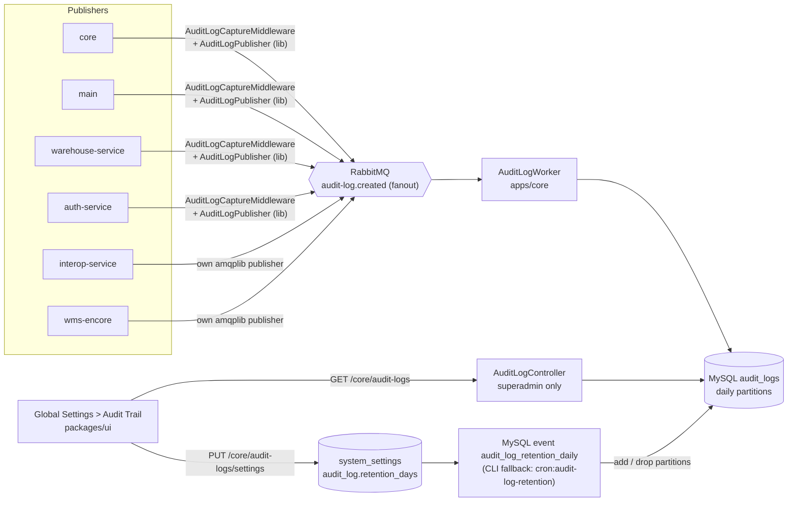
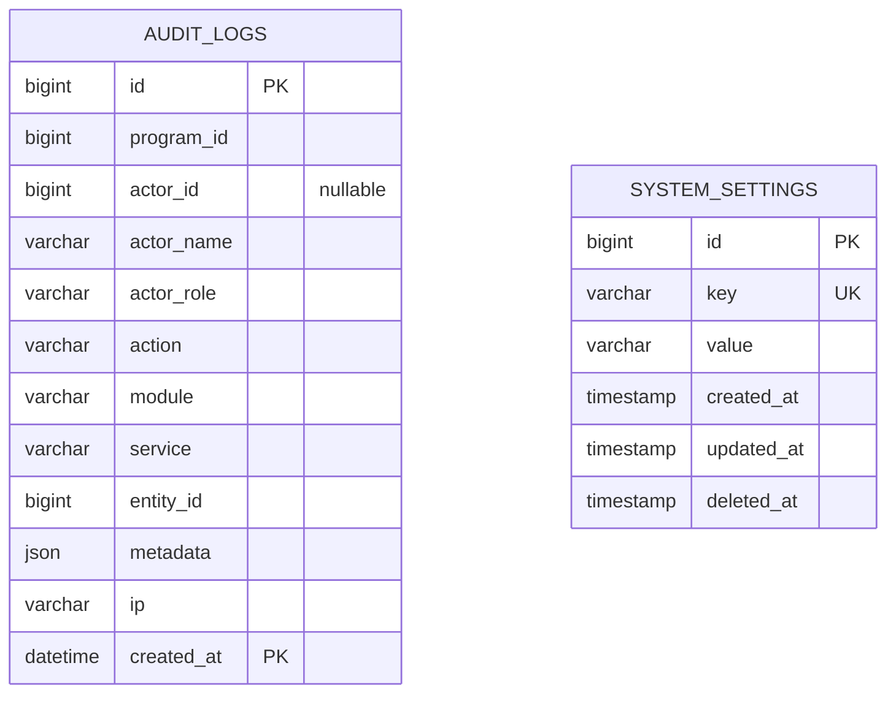
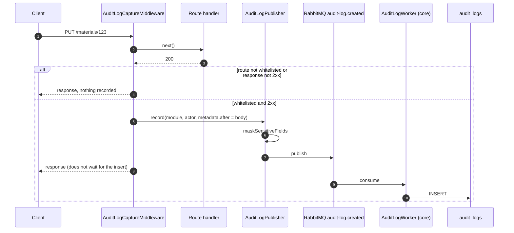

# Audit Trail

**Branch:** `feat/audit-trail` · **Origin:** port of smile-collaboration BA-337, adapted to this monorepo

> **Status: implemented on the branch, not yet run end-to-end.** Everything below was written from the code in the working tree. Unit tests exist, but no real `audit_logs` row has been produced by a running stack. See [Known limitations](#known-limitations).
>
> The older page [Audit Trail Implementation Plan (archived)](../../archive/audit-trail-clickhouse-plan.md) describes a different, ClickHouse-based design that was never built. It is not this feature.

## Overview

Every backend service records whitelisted user actions (create, update, delete, export, login, logout) as audit events. Events travel over RabbitMQ and are written to one MySQL table by one writer, `AuditLogWorker` in `apps/core`. Superadmins read them from Global Settings, and can change how long they are kept.



Design rules:

- **Whitelist, not blanket capture.** A route is recorded only if listed in its service's `AUDITED_ROUTES`. Blanket capture would log PII payloads nobody signed off on.
- **Only 2xx responses** are recorded. A failed login produces no row.
- **Masking happens before publish.** A raw PII value never reaches RabbitMQ, the table or the viewer.
- **Best-effort.** A failure to capture or publish is logged and never affects the business response.
- **One writer.** Only `apps/core` inserts into `audit_logs`. Every other service just publishes.

## ERD

Source: [migration `1783400000000_create-audit-logs-and-system-settings.ts`](https://github.com/smile-health/platform/blob/main/apps/core/src/common/infrastructure/database/migrations/1783400000000_create-audit-logs-and-system-settings.ts). One migration creates both tables.



### `audit_logs`

| Column | Type | Null | Notes |
|---|---|---|---|
| `id` | bigint | no | Auto increment. Part of the composite PK `(id, created_at)` because MySQL requires the partition column in every unique key. |
| `program_id` | bigint | yes | From `c.var.programId`, else the `x-program-id` header, else the `program_id` route param. |
| `actor_id` | bigint | **yes** | Null when no numeric actor can be resolved (auth-service, interop). |
| `actor_name` | varchar(255) | yes | Set by publishers whose actor is not in core's `users` table. Null means the reader joins `users`. |
| `actor_role` | varchar(50) | yes | Role label snapshot at event time. |
| `action` | varchar(50) | no | `create`, `update`, `delete`, `export`, `login`, `logout`, `refresh`, `activate`, `update_status`, and so on. |
| `module` | varchar(100) | no | Source module, for example `material`, `order`, `export`. |
| `service` | varchar(30) | yes | `core`, `main`, `warehouse`, `auth`, `interop`, `wms`. Stamped by the publisher. |
| `entity_id` | bigint | yes | From the `:id` route param, else `id` / `result.id` in the response body. |
| `metadata` | json | yes | `{ before, after }`, already masked. |
| `ip` | varchar(255) | yes | `x-forwarded-for` header. |
| `created_at` | **datetime** | no | `datetime`, not `timestamp`: MySQL rejects `TIMESTAMP` in `PARTITION BY RANGE COLUMNS`. |

Indexes: `(module, entity_id)`, `(created_at)`, `(actor_id)`, `(service, created_at)`. The table is append-only, with no soft delete and no `created_by` columns. Retention is enforced by dropping partitions.

Partitioning: `PARTITION BY RANGE COLUMNS(created_at)`, one partition per day named `p<YYYYMMDD>`. The migration creates 40 days ahead. The daily MySQL retention event keeps the window rolling.

### `system_settings`

Generic key/value table with a unique `key` and the standard timestamp columns. The migration seeds `audit_log.retention_days = 7`.

## Capture

The generic middleware is [`AuditLogCaptureMiddleware`](https://github.com/smile-health/platform/blob/main/packages/lib/audit-log/capture-middleware.ts). Each service passes it a route whitelist and a `getActor` function.

For each request it:

1. Finds the first route whose `match` regex hits `c.req.path` and whose `methods` include the request method. The default methods are POST, PUT, PATCH, DELETE.
2. Derives the action: `route.action` if set, otherwise POST=create, PUT/PATCH=update, DELETE=delete.
3. Reads the JSON request body through Hono's body cache. `c.req.raw.clone()` throws if an earlier middleware such as auth already consumed the stream.
4. For PUT/PATCH/DELETE on a route with `before`, captures the row id from `c.req.path` with `before.idFrom` and calls the service's `loadBefore(table, id)`. `c.req.param()` cannot be used here: in a `"*"` middleware it is `undefined` until `next()` runs. A failed lookup is logged and leaves `before` null.
5. Calls `next()`. If the response is not 2xx, nothing is recorded.
6. Calls `getActor(c, responseBody)`. The response body is passed in so a login can take its actor from the response.
7. Calls `AuditLogPublisher.record()` with `metadata = { before, after: requestBody ?? responseBody }`. `before` is trimmed to the keys present in `after`. A DELETE with no body keeps the whole row.

Route entries can override two things ([`AuditableRoute`](https://github.com/smile-health/platform/blob/main/packages/lib/audit-log/capture-middleware.ts)):

| Field | Purpose | Example |
|---|---|---|
| `action` | Replaces the method-derived action | `"export"`, `"login"`, `"logout"` |
| `methods` | Replaces the default method list | `["GET"]` for an export endpoint |
| `before` | Loads the row before an update/delete | `{ table: "materials", idFrom: /^\/materials\/(\d+)(\/status)?$/ }` |
| `before.track` | Columns the body doesn't carry: kept in `before` and re-read after the handler into `after` | `track: ["order_status_id"]` on `PUT /orders/:id/cancel` |

`loadBefore(table, id, c)` is the constructor's fourth argument. core and main pass a Kysely `selectFrom(table).selectAll().where("id", "=", id)` on `c.var.trx` (falling back to `db`), guarded by `AUDIT_BEFORE_TABLES` (the tables named in their route list). It must use the request transaction: `trxMiddleware` wraps the audit middleware and commits only after it returns, so the `track` re-read would otherwise see the old value. A service that passes no loader records `before: null`.

### Masking

[`AuditLogPublisher.record()`](https://github.com/smile-health/platform/blob/main/packages/lib/audit-log/publisher.ts) masks `metadata.before` and `metadata.after` with [`maskSensitiveFields`](https://github.com/smile-health/platform/blob/main/packages/lib/audit-log/mask.ts) before publishing. Keys matching a sensitive-name pattern (password, token, otp, nik, npwp, phone, email, address, date of birth, and others) are masked at every leaf underneath them, up to depth 10. The masking itself uses the existing `packages/lib/masking.ts`. When you find a new sensitive field, extend `SENSITIVE_KEY_PATTERN`, and err towards masking too much.

### Explicit capture

The generic middleware loads `before` only when the row id is in the path and the route names a single table. It cannot give per-table precision or handle ids sent in the body. Modules that need that call `AuditLogPublisher.record()` from their service layer. Today there is one: `StockOpnamePeriodModule.updateStatus()` in [apps/main](https://github.com/smile-health/platform/blob/main/apps/main/src/modules/stock-opname-period/stock-opname-period.module.ts). It records `module: "stock_opname_period"` with `before: { status }` and `after: { status }`. It is recorded at the period level (activate/deactivate) because individual stock opname rows have no approval step and their volume is too high for the middleware.

### Per-service capture

| Service | Whitelist | Actor resolution |
|---|---|---|
| core | [`audit-log.constants.ts`](https://github.com/smile-health/platform/blob/main/apps/core/src/modules/audit-log/audit-log.constants.ts): an `export` entry (GET/POST on `/xls`, `/export`, `/download`) plus about 20 admin and master-data modules (user, program, workspace, material*, entity*, asset*, executive*) | `actorId` from `c.var.accountID` (fallback `c.var.user.id`), role label mapped from `USER_ROLE`. `actorName` is null, so the reader joins `users`. Mounted in `wire.ts` after auth. |
| main | [`audit-log.constants.ts`](https://github.com/smile-health/platform/blob/main/apps/main/src/modules/audit-log/audit-log.constants.ts): exports, `transaction` (add/remove/discard stock), `stock`, `order`, `order_comment`, `reconciliation`, `entity_customer`, `entity_material`, `entity_activity` | `actorId` is `c.var.user.global_id` (the id of core's global `users` row), falling back to `c.var.userId`. `actorName` from the workspace user's first and last name. Role from `MAP_USER_ROLE_LABEL`. |
| warehouse-service | [`audit-log.route-config.ts`](https://github.com/smile-health/platform/blob/main/apps/warehouse-service/src/common/constants/audit-log.route-config.ts): **exports only** (`/export`, `/download/code/:code`) | `c.var.user` is core's `/account/profile` response, so `actorId = user.id` and the name comes from that profile. The service is read-only, so there are no write routes to audit. |
| auth-service | [`auditLogRouteConfig.ts`](https://github.com/smile-health/platform/blob/main/apps/auth-service/src/audit/auditLogRouteConfig.ts): `/login`, `/logout`, `/executive/login`, `/executive/logout`, and writes on `/users*` | **`actor_id` is always null.** Keycloak identifies users by UUID. The actor name and role come from the JWT: on login from `authDetails.access_token` in the response body, otherwise from the caller's bearer token. The JWT is decoded for display only, never verified. |
| interop-service | One route in `server.ts`: `POST /admin/refresh-routes` (`interop_route_mapping`, action `refresh`) | No actor. The admin routes are unauthenticated service-to-service calls. `actor_id`, `actor_name` and `actor_role` are null. |
| wms-encore | [`audit-routes.ts`](https://github.com/smile-health/platform/blob/main/apps/wms-encore/shared/audit/audit-routes.ts): global settings, waste bag QR code, manual scale request, waste bag create, partnership and its maps, partner vehicle, assets, QR code config, users PUT. Modules are prefixed `wms_`. | `actor_id = getAuthData().userNumericId`, role from auth data or the cached profile, name from `getCachedProfile`. |

`auth-service` and `interop-service` and `wms-encore` differ from the others in how they publish, described next.

## Transport

- **Topic:** `audit-log.created`, added to [`TOPIC`](https://github.com/smile-health/platform/blob/main/packages/lib/rabbitmq/topic.ts) as `AUDIT_LOG_CREATED`. It is a durable fanout exchange.
- **Message:** JSON `{ headers, payload }` where `payload` is a `CreateAuditLogInput` ([types.ts](https://github.com/smile-health/platform/blob/main/packages/lib/audit-log/types.ts)). `headers` never carries credentials: `authorization`, `cookie`, `proxy-authorization` and `x-api-key` are stripped before publish (`stripCredentialHeaders` in `publisher.ts`, mirrored in interop; wms sends `{}`). The worker ignores `headers` and stores only `payload`.
- **Publishers using the lib:** core, main, warehouse and auth build `new AuditLogPublisher(publisher, "<service>")`, which extends `SyncPublisher` and stamps `service` on every record. Auth has its own lazy amqplib connection (`src/audit/rabbitmq.ts`), so it still boots without RabbitMQ.
- **Publishers that cannot use the lib:**
  - **interop-service** runs plain `tsc` output as CommonJS, which cannot load the lib's ESM TypeScript. It has a self-contained [`audit-log-publisher.ts`](https://github.com/smile-health/platform/blob/main/apps/interop-service/src/common/infrastructure/rabbitmq/audit-log-publisher.ts) that reuses the service's existing RabbitMQ channel.
  - **wms-encore** is an Encore app. It has its own amqplib publisher in [`shared/audit/`](https://github.com/smile-health/platform/blob/main/apps/wms-encore/shared/audit/audit-log-publisher.ts) and an Encore middleware in [`shared/http/audit.ts`](https://github.com/smile-health/platform/blob/main/apps/wms-encore/shared/http/audit.ts), registered in every `encore.service.ts` after `errorEnvelope`. The connection is lazy and reused. If `RABBITMQ_URL` is unset, auditing is a no-op with one warning.
  - Both must emit the exact wire format of the lib: fanout exchange `audit-log.created`, routing key empty, body `{ headers, payload }`, persistent.
- **Consumer:** [`AuditLogWorker`](https://github.com/smile-health/platform/blob/main/apps/core/src/modules/audit-log/audit-log.worker.ts) listens on `audit-log-queue` and calls `AuditLogRepository.create()`. It is registered in core's `runWorker()` in `server.ts`. It is the only writer of `audit_logs`.



## Read API

All three endpoints live in `apps/core` under `/audit-logs` (clients see them as `/core/audit-logs`) and require **superadmin** (`RoleValidationMiddleware.onlySuperAdmin`). Others get 403.

| Endpoint | Purpose |
|---|---|
| `GET /audit-logs` | Paginated list, newest first (`created_at desc, id desc`). |
| `GET /audit-logs/settings` | Returns `{ retention_days }`. |
| `PUT /audit-logs/settings` | Body `{ retention_days }`, integer 1 to 90. Returns the new settings. |

`GET /audit-logs` query, validated by [`audit-log.schema.ts`](https://github.com/smile-health/platform/blob/main/apps/core/src/modules/audit-log/audit-log.schema.ts): `page`, `paginate`, `program_id`, `module`, `service`, `action`, `entity_id`, `actor_id`, `date_from`, `date_to` (both inclusive, whole calendar days in the requester's `timezone` header, UTC if missing or invalid; converted to a UTC range on `created_at`). `created_at` is returned as UTC ISO-8601 with `Z`, and the UI renders it in the user's timezone. The response is the standard `PaginatedResponse`. Rows with a null `actor_id` return `actor_id: null`. For actor names, `actor_name` from the row wins. Only rows with neither `actor_name` nor a null `actor_id` are resolved through a `users` join ([`AuditLogModule.list()`](https://github.com/smile-health/platform/blob/main/apps/core/src/modules/audit-log/audit-log.module.ts)).

## Retention

Retention drops whole daily partitions rather than deleting rows.

- The window is `system_settings.audit_log.retention_days`. Default is **7**, allowed range **1 to 90**. A missing or invalid value falls back to 7 and out-of-range values are clamped ([`resolveRetentionDays`](https://github.com/smile-health/platform/blob/main/apps/core/src/modules/audit-log/audit-log.constants.ts)).
- **Primary mechanism: a MySQL event.** Migration `1783400000001_create-audit-log-retention-event.ts` creates the stored procedure `audit_log_maintain_partitions()` and the event `audit_log_retention_daily`, which runs `CALL audit_log_maintain_partitions()` every day at 00:05 UTC. No external scheduler is needed. The procedure is idempotent and does, in order:
  1. Reads `audit_log.retention_days` from `system_settings` (default 7, clamped to 1 to 90).
  2. Creates every missing daily partition up to today + 2 days (UTC) with `REORGANIZE PARTITION pmax`.
  3. Drops every daily partition whose exclusive upper bound is at or before `today - retention_days`. `pmax` is never dropped.
- **Prerequisites.** `event_scheduler=ON` on the MySQL server (`SET GLOBAL event_scheduler = ON`, and `event_scheduler=ON` in the server config so it survives restarts). The migration user needs `EVENT`, `CREATE ROUTINE`, `ALTER` and `DROP` on the schema. All date logic uses `UTC_DATE()`, because `created_at` is written in UTC.
- **Fallback CLI.** [`audit-log-retention.ts`](https://github.com/smile-health/platform/blob/main/apps/core/src/scripts/audit-log-retention.ts) runs the same maintenance by hand: `pnpm --filter @smile/smile-core cron:audit-log-retention` (`bun ./src/cli.ts audit-log-retention`). It logs whether `event_scheduler` is ON (warning if not), calls the procedure if it exists, and otherwise runs equivalent TypeScript logic. Use it from an external scheduler when the event scheduler or the privileges are unavailable, or to force a run.
- The table migration pre-creates 40 partitions, so writes work before the first event run. Lowering retention takes effect at the next run, not immediately.

## Frontend

Brief, since the UI is in `packages/ui`:

- Page: `packages/ui/src/pages/audit-trail/` (list page, filter, detail drawer, `RetentionSettingCard`, a SMILE panel and a WMS waste-bag panel), mounted as a tab in `GlobalSettings.tsx` and routed by `apps/web/pages/[lang]/v5/global-settings/audit-trail/`.
- Data: `services/audit-log.ts` calls `/core/audit-logs` and `/core/audit-logs/settings`. The WMS panel uses `lib/wms-axios.ts` with `WMS_API_URL` and reads the existing `waste_bag_audit_trail`, which is a separate system.
- Access: the permission `audit-trail-view` is granted to SUPERADMIN only in `shared/permission/config.ts`. The tab is hidden and the route redirects otherwise, and the API enforces superadmin independently.

See the [source folder](https://github.com/smile-health/platform/blob/main/packages/ui/src/pages/audit-trail) for the current state.

## Environment variables

| Service | Variables | Notes |
|---|---|---|
| core | `RABBITMQ_HOST/PORT/USERNAME/PASSWORD` | Already required. Core both publishes and consumes. |
| main | `RABBITMQ_*` | Already required. |
| warehouse-service | `RABBITMQ_*` | Already required. |
| auth-service | `RABBITMQ_PROTOCOL`, `RABBITMQ_HOST`, `RABBITMQ_PORT`, `RABBITMQ_USERNAME`, `RABBITMQ_PASSWORD`, `RABBITMQ_VHOST` | **New**, added to `.env.example`. Defaults to `amqp://guest@localhost:5672/`. Connection is lazy. |
| interop-service | `RABBITMQ_*` | Already required. Reuses the existing channel. |
| wms-encore | `RABBITMQ_URL` | **New**, a full amqp URL read from `process.env`. Unset means auditing is silently off. `amqplib` was added as a dependency. |
| web / ui | `WMS_API_URL` | Existing. Used only by the WMS panel. |

All services must point at the **same RabbitMQ broker and vhost**, because core consumes from the same fanout exchange the others publish to.

## Deviations from smile-collaboration BA-337

| # | Collaboration | This repo | Why |
|---|---|---|---|
| 1 | `actor_id` not null | `actor_id` nullable | Interop admin routes and auth-service have no numeric actor. |
| 2 | Actions derived from method only, non-GET only | `AuditableRoute.action` and `.methods` overrides. `getActor(c, responseBody)` receives the response body. | Needed for export (GET), login and logout. |
| 3 | Retention constant of 35 days | `system_settings.audit_log.retention_days`, default 7, range 1 to 90, editable in the UI | Product decision. The job still drops daily partitions. |
| 4 | Two migrations (`audit_logs`, then `actor_name`) | One migration that also creates `system_settings` and adds `service` | Nothing was deployed yet, so no history to preserve. |
| 5 | `service` column absent | `service` column, index and filter | Six publishing services here, not two. |
| 6 | WMS is Express | WMS is Encore with its own amqplib publisher | Different framework, and it cannot import the lib. |
| 7 | Only core and main capture | Also warehouse (exports), auth (login/logout), interop, wms-encore | This repo has more services. |
| 8 | Failed logins not applicable | Only 2xx recorded, so failed logins are not logged | Same rule as collaboration. Keeps the middleware simple. |
| 9 | Module filter in the UI was a placeholder | Filled from the combined route lists | Closes the collaboration open issue. |

## Adding a route to the whitelist

1. Find the service's list: core `apps/core/src/modules/audit-log/audit-log.constants.ts`, main `apps/main/src/modules/audit-log/audit-log.constants.ts`, warehouse `apps/warehouse-service/src/common/constants/audit-log.route-config.ts`, auth `apps/auth-service/src/audit/auditLogRouteConfig.ts`, wms `apps/wms-encore/shared/audit/audit-routes.ts`, interop the `auditedRoutes` array in `apps/interop-service/src/server.ts`.
2. Add an entry. Match the **mounted path** as the router sees it (`c.req.path`), anchored with `^`:

   ```ts
   { match: /^\/material-groups(\/|$)/, module: "material_group" }
   // export or a non-default method set:
   { match: /\/report\/export$/, module: "export", action: "export", methods: ["GET"] }
   ```

3. **Order matters. The first match wins.** Keep specific entries (exports) above broad ones, otherwise `POST /materials/export` is recorded as a material create.
4. Check the payload for PII. If a key holds something sensitive that the pattern does not catch, extend `SENSITIVE_KEY_PATTERN` in `packages/lib/audit-log/mask.ts` **and** in the manual copy in `apps/wms-encore/shared/audit/audit-log-mask.ts` (see below).
5. Add the new `module` value to the UI module filter and locale labels.
6. For a real `before`, add `before: { table, idFrom }` when the endpoint is `/<prefix>/:id` on one table. Otherwise, if the id is in the body or you need per-table precision, skip the whitelist and call `AuditLogPublisher.record()` from the module.

## Known limitations

- **`metadata.before` is partial.** It is filled for core master data (users, executive accounts, programs, budget sources, manufactures, materials, entities, asset types/models/vendors), for main's entity-material delete and order status actions (`order_status_id`), and for the explicit stock opname period `record()`. Creates, auth, interop, wms and body-id endpoints (e.g. `PUT/DELETE /entities/customers`) have none. It reflects the main table only: Keycloak, `*_workspaces`, child materials and other side tables are not captured.
- **Orders:** status actions (`PUT /orders/:id/{allocate,cancel,confirm,fulfilled,pending,ship,validate}`) are `update_status` with before/after `order_status_id`; `POST /orders/{request,relocation,return,distribution,central-distribution}` are `create`; `/orders/:id/order-item-stocks` is `order_item_stock`. `POST /orders/:id/retry-integration-logs` is not recorded.
- **`/programs/:program_id/activities/...` is labelled `program`**, because the `/programs` regex catches it.
- **auth-service rows have `actor_id` null.** The actor is identified by name and role only, so filtering by actor id will not find login or logout events.
- **Masking is duplicated.** wms-encore (`shared/audit/audit-log-mask.ts`) has a manual port of `packages/lib/audit-log/mask.ts`. interop-service publishes no request body today, so it has no mask, but the day it does it will need the same port. Any change to the sensitive-key pattern must be copied by hand.
- **The wire format is duplicated** in interop and wms. A change to the lib publisher's message shape must be mirrored there.
- **`db.d.ts` was edited by hand** for `audit_logs` and `system_settings`. Run `pnpm build` in `apps/core` against a migrated database to regenerate it.
- **Granularity is per HTTP route.** One endpoint that writes several tables gets one `module` label.
- **Failed attempts are invisible** (2xx only).
- **The retention cron trigger is not defined in this repo.** Without a scheduler, partitions are created for 40 days and then writes fail until the job runs.
- **Not run end-to-end.** No stack has been brought up with this code. Unverified: the migration on a real MySQL, the worker inserting messages from all six publishers, the WMS panel against the real WMS response shape, and retention under load.
