# Container Diagram

> Diperbarui saat konsolidasi dokumentasi: versi sebelumnya hanya memodelkan 4 service dan
> menghilangkan interop-service, rule-router, web, wms-encore, Nginx, ClickHouse, dan MinIO.

```mermaid
C4Container
title SMILE Platform - Container Diagram

Person(user, "User", "A user of the SMILE Platform")

Container(core, "Core Service", "Node.js + Bun", "Handles shared business logic, database migrations, background tasks, and event processing")
Container(main, "Main Service", "Node.js + Bun", "Manages workspaces, data migrations, and view generation")
Container(auth, "Auth Service", "Node.js + Hono", "Provides authentication, user and role management via Keycloak")
Container(warehouse, "Warehouse Service", "Node.js + Hono", "Handles inventory operations, messaging, and monitoring")
Container(db, "MySQL Database", "MySQL", "Stores persistent data for all services")
Container(redis, "Redis Cache", "Redis", "Caches frequently accessed data and manages distributed locks")
Container(rabbitmq, "RabbitMQ", "RabbitMQ", "Event broker for decoupled communication")
Container(elasticsearch, "Elasticsearch", "Elasticsearch", "Indexes logs and provides search capabilities")
Container(interop, "Interop Service", "Node.js + Hono", "Transforms and routes messages to external systems")
Container(ruleRouter, "OpenHIM Rule Router", "Node.js + Hono", "OpenHIM mediator; rule-based routing from the DB")
Container(web, "Web App", "Next.js", "Frontend; also serves this documentation site at /docs")
Container(wms, "WMS Encore", "Encore", "Waste Management System")
Container(proxy, "Nginx Proxy", "Nginx", "Reverse proxy in front of every service (port 8080)")
Container(clickhouse, "ClickHouse", "ClickHouse", "Analytics warehouse — datamart and read replica")
Container(minio, "MinIO", "MinIO", "S3-compatible object storage")
Container(keycloak, "Keycloak", "Keycloak", "External identity provider (SSO, OAuth2)")

Rel(user, auth, "Authenticates via", "OIDC/REST")
Rel(user, core, "Invokes API", "HTTPS/JSON")
Rel(user, main, "Invokes API", "HTTPS/JSON")
Rel(user, warehouse, "Invokes API", "HTTPS/JSON")
Rel(core, db, "Reads from and writes to", "SQL")
Rel(main, db, "Reads from and writes to", "SQL")
Rel(warehouse, db, "Reads from and writes to", "SQL")
Rel(core, redis, "Reads from and writes to", "Redis")
Rel(core, rabbitmq, "Publishes and consumes events", "AMQP")
Rel(warehouse, rabbitmq, "Publishes and consumes events", "AMQP")
Rel(core, elasticsearch, "Indexes logs and metrics", "HTTP")
Rel(main, elasticsearch, "Indexes workspace analytics", "HTTP")
Rel(auth, keycloak, "Delegates authentication to", "OIDC")
Rel(user, proxy, "Reaches every service through", "HTTPS")
Rel(user, web, "Uses", "HTTPS")
Rel(main, clickhouse, "Writes analytics to and reads from", "HTTP")
Rel(warehouse, clickhouse, "Reads analytics from", "HTTP")
Rel(core, minio, "Stores and retrieves files", "S3")
Rel(interop, rabbitmq, "Consumes domain events from", "AMQP")
Rel(interop, ruleRouter, "Routes outbound messages via", "HTTP")
```

