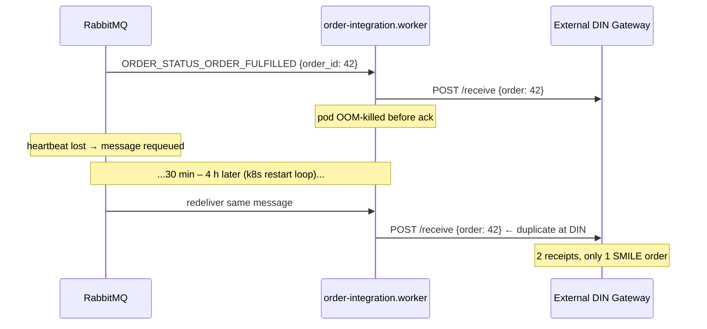

# Race Condition Analysis — Delayed / Irregular-Interval Duplication

**Date:** 2026-04-29
**Scope:** `apps/main/src/modules/` + `packages/lib/middlewares/`
**Companion to:** [`race-conditions.md`](./race-conditions.md) (RC-001 … RC-005, near-simultaneous races)
**Severity legend:** 🔴 Critical · 🟠 High · 🟡 Medium

---

## Why a separate report

The 5 races in `race-conditions.md` (RC-001 … RC-005) all assume **two near-simultaneous requests**. They cannot explain the symptom the team is actually seeing in production:

> Data sometimes appears duplicated, but the gap between the original write and the duplicate ranges from minutes to hours, with **no consistent pattern**.

That irregular-delay shape is produced by a different family of bugs: dual writes, redelivery on consumer crashes, cron overlap on multi-replica deploys, and notification crons that re-fire while the source condition is still true.

The five mechanisms that produce irregular timing:

| Mechanism | Why the delay is irregular |
|-----------|----------------------------|
| **RabbitMQ redelivery after consumer crash** | Delay = however long the pod was down (seconds → hours, depends on crash-loop / scheduler). |
| **HTTP client retries on commit-then-publish** | Delay = client/proxy retry timing (Nginx upstream timeout, mobile-network retry, user-tap-twice). |
| **Cron without distributed lock on multi-replica deploys** | Two pods fire the same cron at the same scheduled time, but DB writes interleave at slightly different points — and one replica's GC pause shifts its write minutes later. |
| **External-API workers without idempotency key** | Each redelivery hits the downstream system again; downstream creates a new record; gap = redelivery interval. |
| **Notification crons that don't track "already sent"** | Every cron tick re-emits while the source condition (low stock, near-expiry) is still true. Gap = cron schedule. |

## Summary

| # | Module | Severity | Type |
|---|--------|----------|------|
| [RC-006](#rc-006-eventmiddleware--dual-write-without-outbox-or-idempotency) | `packages/lib/middlewares/event.middleware` | 🔴 Critical | Dual-write / no outbox |
| [RC-007](#rc-007-order-integration-worker--external-api-replay-on-redelivery) | `order-integration.worker` | 🔴 Critical | Non-idempotent external call |
| [RC-008](#rc-008-crons-run-without-distributed-lock) | `stock.cron`, `export-history.cron`, `entity.cron`, `patient.cron`, report crons | 🟠 High | Multi-replica cron overlap |
| [RC-010](#rc-010-stock-notification-crons--no-already-sent-dedup) | `stock.cron` | 🟡 Medium | Repeated notification emission |
| [RC-011](#rc-011-orderintegrationworker-doretry--updates-id0-but-still-fires-external-call) | `order-integration.worker` | 🟡 Medium | Lost log + external duplicate |

---

## RC-006: EventMiddleware — Dual-Write Without Outbox or Idempotency

**File:** [`event.middleware.ts:8-18`](https://github.com/smile-health/platform/blob/main/packages/lib/middlewares/event.middleware.ts#L8)
**Caller pattern:** [`order.publisher.ts:74`](https://github.com/smile-health/platform/blob/main/apps/main/src/modules/order/order.publisher.ts#L74) (`c.addEvent(TOPIC.ORDER_CREATED, …)`) and every other publisher that uses `c.addEvent`
**Severity:** 🔴 Critical

### What happens

The middleware publishes to RabbitMQ **after** the controller has returned — i.e., after MySQL has already committed. There is no outbox table, no idempotency key on the event, and no idempotency key on the originating endpoint.

```typescript
// packages/lib/middlewares/event.middleware.ts
public handle = async (c, next) => {
  await next()                    // ← controller commits to MySQL here
  const events = c.var.events ?? []
  if (!c.var.error && events.length > 0) {
    for (const event of events) {
      await this.publisher.publish(event.topic, event.payload)   // ← publishes here
    }
  }
}
```

Two distinct failure modes, both producing **delayed duplicates with no fixed interval**:

**Mode A — Client / proxy retry on slow request**
A mobile client or Nginx upstream times out *after* MySQL committed but *before* publish completed. The client retries the same `POST /orders`. The retry runs the controller again, MySQL inserts a *second* order row, the second event is also published. Duplicate gap = client retry policy (often 30 s, 60 s, exponential backoff up to several minutes).

**Mode B — Process crash / OOM between commit and publish**
DB committed; pod restarted before `publisher.publish()` fired. The event is **lost** (different bug). Operators commonly mitigate by replaying from logs or re-triggering, and that manual replay arrives hours later → looks like a delayed duplicate of the database row.

### Diagram

```mermaid
sequenceDiagram
    participant C as Mobile Client
    participant N as Nginx
    participant API as Hono Controller
    participant DB as MySQL
    participant MQ as RabbitMQ

    C->>N: POST /orders {idempotency: none}
    N->>API: forward
    API->>DB: BEGIN; INSERT orders; COMMIT
    Note over API,MQ: slow publish (backpressure, GC pause, network)
    N--xC: 504 upstream timeout
    C->>N: retry POST /orders (same body) — minutes later
    N->>API: forward
    API->>DB: BEGIN; INSERT orders ← duplicate row, new id
    API->>MQ: publish ORDER_CREATED ← duplicate event
    Note over DB: 2 orders for 1 user intent
```

### How to Reproduce

1. Set Nginx `proxy_read_timeout` to 5 s.
2. Slow down RabbitMQ publish (e.g., simulate broker pause).
3. POST a create-order request from a client that auto-retries on 504.
4. Observe two `orders` rows + two `ORDER_CREATED` messages, separated by the client's retry delay.

### Fix

**Idempotency key at the boundary (recommended):**

Require an `Idempotency-Key` header on all mutating endpoints, persist `(idempotency_key, route, response_hash)` for 24 h, and short-circuit duplicate keys.

```typescript
const key = c.req.header("Idempotency-Key")
if (!key) throw new BadRequestError("Idempotency-Key required")

const cached = await idempotencyRepo.find(key, route)
if (cached) return c.json(JSON.parse(cached.response), cached.status)

// …run handler…
await idempotencyRepo.insert({ key, route, response, status })
```

**Transactional outbox (for the publish leg):**

Inside the same DB transaction that creates the order, insert into an `outbox` table; a separate process drains `outbox` → RabbitMQ. This makes commit-and-enqueue atomic.

```typescript
await db.transaction().execute(async (trx) => {
  await this.repo.create(trx, orderData)
  await trx.insertInto("outbox").values({
    topic: TOPIC.ORDER_CREATED,
    payload: JSON.stringify(payload),
    dedupe_key: `order_created:${createdOrderId}`,
  }).execute()
})
```

The dedupe key on the consumer side then makes redelivery + retry both safe.

---

## RC-007: Order-Integration Worker — External API Replay on Redelivery

**File:** [`order-integration.worker.ts:28-70`](https://github.com/smile-health/platform/blob/main/apps/main/src/modules/order-integration/order-integration.worker.ts#L28)
**Severity:** 🔴 Critical

### What happens

The worker handles `ORDER_STATUS_ORDER_VALIDATED`, `…_FULFILLED`, `…_CANCEL` and immediately calls the external gateway (`client.validateOrder / receiveOrder / cancelOrder`). There is **no check** whether this `(order_id, action)` was already sent. RabbitMQ provides at-least-once; on consumer crash before ack, the broker redelivers — and the external system receives a second request. Most external systems (DIN, Biofarma, etc.) don't enforce idempotency on inbound calls either, so they create a second downstream order/receipt.

The redelivery delay is bounded by the consumer's `prefetch` heartbeat / `consumer_timeout` (typically 30 min on RabbitMQ default) but in practice can be hours when:
- a pod is in a CrashLoopBackOff,
- the queue has unacked messages and the connection is reset on broker restart,
- a deploy rollover happens.

### Diagram



### How to Reproduce

1. Set the consumer to `prefetch=1`, send a single fulfill event.
2. While `client.receiveOrder` is in flight, `kill -9` the worker process.
3. Restart it. The message will redeliver. Observe the external system receives the call twice.

### Fix

Track a server-side dedupe row keyed by `(order_id, action, attempt_id)` *before* calling the external API:

```typescript
const dedupeKey = `${action}:${payload.order_id}:${payload.attempt_id}`
const inserted = await this.repo.tryInsertIntegrationLock(c, dedupeKey)
if (!inserted) {
  // already processed (or in flight); skip
  return
}

const res = await this.doAction(client, action, req)
await this.repo.markIntegrationLockDone(c, dedupeKey, res)
```

Use `INSERT … ON DUPLICATE KEY UPDATE attempts = attempts + 1` on a unique key so concurrent redeliveries collapse to one execution. Combine with RC-006's outbox so each domain event has a stable `event_id` that flows into `attempt_id`.

---

## RC-008: Crons Run Without Distributed Lock

**Files:**
- [`stock.cron.ts:27`](https://github.com/smile-health/platform/blob/main/apps/main/src/modules/stock/stock.cron.ts#L27) (`handleNotifEdStock`, `handleNotifStock`)
- [`export-history.cron.ts`](https://github.com/smile-health/platform/blob/main/apps/main/src/modules/export-history/export-history.cron.ts)
- [`entity.cron.ts`](https://github.com/smile-health/platform/blob/main/apps/main/src/modules/entity/entity.cron.ts)
- [`patient.cron.ts`](https://github.com/smile-health/platform/blob/main/apps/main/src/modules/transaction/patient/patient.cron.ts)
- [`asset-inventory.cron.ts`](https://github.com/smile-health/platform/blob/main/apps/core/src/modules/asset-inventory/asset-inventory.cron.ts)
- the 7 report crons under [`apps/warehouse-service/src/modules/download-report/cron/`](https://github.com/smile-health/platform/blob/main/apps/warehouse-service/src/modules/download-report/cron)

> The original report also cited `bias-immunization-logistics.cron`, `non-bias-immunization-logistics.cron`,
> `targets.cron` and `biofarma.cron`. Those modules were removed with the Indonesia-only cleanup —
> see [DB cleanup notes](./database/db-cleanup-indonesia-only-removal.md). The defect class below is
> unchanged and still applies to every cron listed above.

**Severity:** 🟠 High

### What happens

These cron handlers do not acquire any distributed lock (Redis, MySQL `GET_LOCK`, advisory key). When the deployment runs more than one replica of `apps/main`, the schedule fires once *per replica*. Both replicas:

- iterate the same entities / stock rows / report ranges,
- compute the same target snapshot,
- emit the same notifications and write the same report rows.

Where the write is an upsert, the writes overwrite each other — visible as flapping numbers and odd `updated_at` timing. Where the write is a plain `INSERT`, duplicate rows actually appear.

The delay between the two writes equals the scheduler skew between replicas (sub-second to minutes on clock drift) — but if one replica is slow / paused / GC'ing, the second write can land minutes-to-hours later, producing the irregular pattern the user sees.

### Diagram

```mermaid
sequenceDiagram
    participant K8s as k8s CronJob / scheduler
    participant P1 as main-pod-A
    participant P2 as main-pod-B
    participant DB as MySQL

    K8s->>P1: tick 02:00
    K8s->>P2: tick 02:00
    par
      P1->>DB: process entity #500
    and
      P2->>DB: process entity #500
    end
    Note over DB: writes interleave; later write wins
    Note over P2: GC pause 12 min
    P2->>DB: finally writes entity #500 ← arrives 12 min later
    Note over DB: looks like delayed duplicate write
```

### Fix

Wrap every cron entrypoint in a Redis lock (Redis is already imported via `@/common/infrastructure/redis`):

```typescript
public readonly handleNotifStock = async (c) => {
  const lockKey = "cron:stock:notif"
  const token = randomUUID()
  const acquired = await redis.set(lockKey, token, "EX", 1800, "NX")
  if (!acquired) {
    console.log("[StockCron] another replica holds the lock, skipping")
    return
  }
  try {
    // …existing body…
  } finally {
    // release only if we still own it
    await redis.eval(
      `if redis.call("get", KEYS[1]) == ARGV[1] then return redis.call("del", KEYS[1]) end`,
      1, lockKey, token,
    )
  }
}
```

TTL must comfortably exceed the worst-case run time. Apply uniformly to every cron entrypoint listed above.

---

## RC-010: Stock Notification Crons — No "Already Sent" Dedup

**File:** [`stock.cron.ts:27-113`](https://github.com/smile-health/platform/blob/main/apps/main/src/modules/stock/stock.cron.ts#L27) (`handleNotifEdStock`), [`stock.cron.ts:115-152`](https://github.com/smile-health/platform/blob/main/apps/main/src/modules/stock/stock.cron.ts#L115) (`handleNotifStock`)
**Severity:** 🟡 Medium

### What happens

Each cron tick iterates **all** stocks that match the condition (near expiry, below min, zero) and publishes a notification per matching `(entity, material, batch)` regardless of whether the same notification was already sent in a previous tick. The condition often persists for days. Recipients see **the same notification re-arriving** at each cron interval. Because:

- different notification channels (WA, email, FCM) have independent delivery latencies,
- batch sizes shift the per-row processing time,
- the cron can be retried after a failure,

the user-perceived gap between duplicate notifications is irregular (minutes if the cron is on a 5-minute schedule, hours if it's daily, longer when stuck on slow channels).

```typescript
// stock.cron.ts handleNotifEdStock — no last_notified_at check
for (const stock of stocks) {
  // …builds payload…
  await this.sendNotifToUser(c, …)   // fires every run
}
```

### How to Reproduce

1. Create a stock row that satisfies `getStockExpired` (expires within 30 days).
2. Run `handleNotifEdStock` twice in succession.
3. Observe the same recipient receives the same WA / email / FCM message twice; the gap equals the cron interval.

### Fix

Persist a `notification_dedupe` row keyed by `(event_type, entity_id, material_id, batch_id, day_bucket)` and check it before publishing:

```typescript
const key = `ed-${number_of_days}:${entity_id}:${material_id}:${batch_number}:${moment().format("YYYY-MM-DD")}`
const inserted = await this.repo.tryInsertNotifDedupe(c, key)   // INSERT IGNORE on unique key
if (!inserted) continue   // already sent today
await this.sendNotifToUser(c, …)
```

`day_bucket` granularity is a product decision (per-day for ED warnings, per-hour for zero-stock, etc.) but the table-level unique key + `INSERT IGNORE` is what kills the duplication.

---

## RC-011: `OrderIntegrationWorker.doRetry` — Updates id=0 but Still Fires External Call

**File:** [`order-integration.worker.ts:106-143`](https://github.com/smile-health/platform/blob/main/apps/main/src/modules/order-integration/order-integration.worker.ts#L106)
**Severity:** 🟡 Medium

### What happens

```typescript
await this.repo.updateLog(c, payload.id ?? 0, update)
```

When the retry payload doesn't include the original log `id` (or it's `0` / `undefined`), the update silently affects `id=0` (no row, or a sentinel row), and the integration log for *this* attempt is never recorded. **But `doAction` still fires the external API call beforehand.** So every retry of this kind:

1. Hits the external system again → potential downstream duplicate.
2. Leaves no audit trail → operators can't see how many duplicates were created.

Because retries are scheduled by an upstream component (often `processRetryIntegrationLog` from `order.publisher.ts`, which copies `data.id` into the payload), a misconfigured retry source produces an unbounded series of external calls separated by the retry interval — exactly the "irregular minutes-to-hours" pattern.

### Fix

```typescript
private readonly doRetry = async (c, action, payload) => {
  if (!payload.id) {
    logger.error({ payload }, "[OrderIntegration] retry without log id, refusing to fire external call")
    return
  }
  // …existing body…
}
```

And combine with RC-007's dedupe key so even a misrouted retry collapses to a no-op at the gateway boundary.

---

## Priority — combined with RC-001…RC-005

```mermaid
gantt
    title Fix Priority — including delayed-duplication races
    dateFormat  X
    axisFormat sp%s

    section 🔴 Critical — Fix first
    RC-001 Wrap fulfilled+cancel in db.transaction()      :crit, rc1, 0, 3
    RC-002 Add SELECT FOR UPDATE on stock reads           :crit, rc2, 0, 2
    RC-006 Outbox + Idempotency-Key on mutating endpoints :crit, rc6, 0, 5
    RC-007 Dedupe key on order-integration consumer       :crit, rc7, 3, 2

    section 🟠 High — Fix next sprint
    RC-004 Wrap order.create() in db.transaction()        :rc4, 5, 1
    RC-003 Unique constraint + ON DUPLICATE KEY           :rc3, 5, 2
    RC-008 Distributed cron locks (Redis)                 :rc8, 6, 2

    section 🟡 Medium — Backlog
    RC-005 Idempotent ClickHouse sync                     :rc5, 8, 2
    RC-010 Notification dedupe table                      :rc10, 8, 2
    RC-011 doRetry refuses payload.id=0                   :rc11, 9, 1
```



**Mapping the new findings back to the user-reported symptom:**

- **RC-006** is the most likely root cause for "duplicate orders, gap = minutes/hours, no pattern". The delay tracks client retry timing, not anything inside the backend.
- **RC-007** explains duplicate downstream integrations even when the SMILE DB looks correct.
- **RC-008** explains duplicates that appear at roughly cron-multiple intervals but skewed by replica timing.
- **RC-010** explains duplicate notifications specifically.
- **RC-011** explains "I clicked retry once and the customer got hit 5 times".
